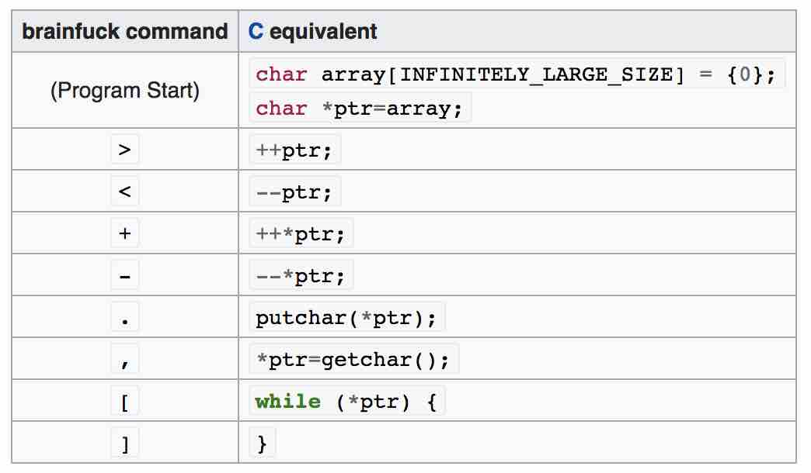
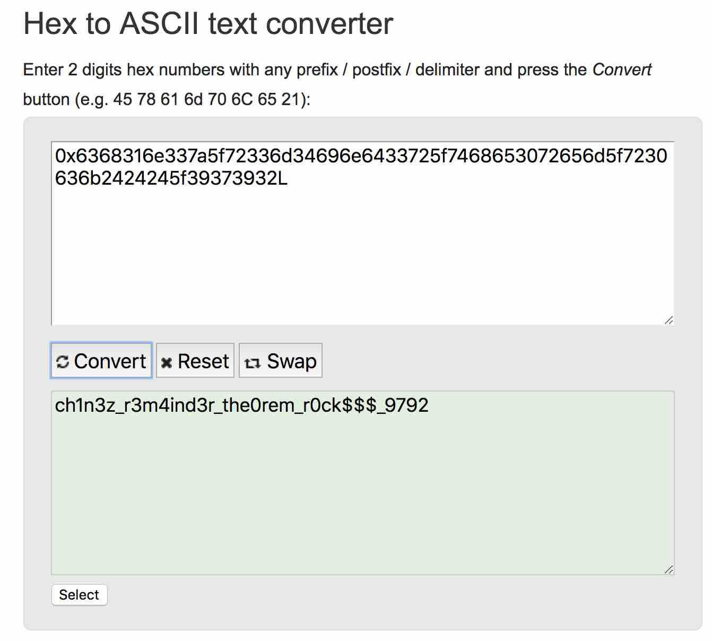

# CRYPTO CHALLENGE: WEAK RSA

## Challenge Description
Brainy likes playing around with esoteric programming. He also likes math and
has therefore encrypted his very secure password with a popular encryption
algorithm. Claiming that his password cannot be retrieved now, he has sent the
ciphertext to some of his friends. Can you prove to Brainy that his password
can actually be recovered? 

```
brainy.txt
```

### ESOTERIC PROGRAMMING LANGUAGES

Taking a look at our cipher text, we see largely what appears to be a sequence
of `-`, `+` and `.` symbols with the exception being the first few dozen symbols
where we find a few `[`, `<` and `>`.

```
$ cat brainy.txt 
++++++++++[>+>+++>+++++++>++++++++++<<<<-]>>>>+++++++++++++++++++++++.-----------.<------------.---.++.---------.+.++.-.++.+.-----.++..++++.--.++++.+..-------.+.+++.---.+.+++++.-------.+.---.+++++++.+.-------..+++.-.+++++.-------.++.+++++.-----.+++++..-----.--.++++++++.-------.--.++++.+++.---.++..+++.------.+++.--.-..++++++.-.----..+++++.------.++++++.---.---.--.+++.++++.-------.+++++..-.++..-------.++++++.---.++..+++.----.++++.-------.++++++++..----.+++.+.------.--.-.++.-.+++++.--..--.++++.-.++++.---.------.+++++.++.+.---.+++.---.----.++++.--.+++.-----.+++++.+.---.--.+++++++.---.---...---.+.++++++++.----.++++.-----.++.--.-.--.++.-.-.+++++.--..+++++.-------.-.++++.++.-----.++++++.--------.+++.+++.-.+++.----.----.++++++.----.++++++.-------.-----.>+.<++++++++++++++.---------.+.++++++.--------.++.+++++++.--------.+++++++.----.+.----.+++...----.++++..++.----..+++.+++.-----.++++.--.++..-------.+++.++++.--.---.--.++++++..-----..+++++++.-------.+++++++.--------..++++++.++.--..++.----.+++.++.------.++++.+.-..+.+.-------.++++++.-.---.---.-.++++++++..-----.---.++.+.++..-.--.+++.++++.--..------.++++++++.-------.+++++++..---.+.++..---.----.+.++++++..-.-.-----.--.++++.--.+++++++.----.++++.-----.-.+.++.+..+..--.-.---.+++++.--.--.++++++.--------.++.---.+++++++..----.---.+++++++++.-...-------.++++++++.-------.++.-.+++++.----.-.+++++.---.----.+++++.++.-----.---.+++++++.++.---------...++.+++++++.------.+++++.-------.++++.-----.+++++.----.-----.>-------------.++++++++++++.<++++++++++++++.-----..-.----.++++++.-..-----.++.++++++.--.----..--.++.-.++++++++.------.+..--.+++++++.------.---.++++++.----.++++++.-.++.------.++++...--.---.+++++++.--------.++++++++.----..+.----.+..---.++++++++.+.---.-.---.--.++++++++.-----.+++++.----.+.+++.------.--..+++++++++.-.---.++.----.++++.-.------.+++++.--.++.+++.-----.++.++.--..----.-.+++++++.+.----.---.+++++.+++.---.-----.+++++.------.++++++.-.----..++.+++.--.---.++.++++++.--------..+++++.+++.---.-----.++.++++++.---.+++.-.-------.++.+++.-.---.+++.---.+.++.-----.+++++++.---.--.-..++++.++.-------.++++.+.--.++++..+.+.-.---.-.--.+.+++++.--.+++.------..--.++++++++.-.------.++++.+++.-----.+.----.-----.>------------.+++++++++++++.<++++++++++++++.-.---------.++++++..++.+.--.----.-.--.+++.---.++++++++..-----.+.--.--.++++++.+++.----.---.+.++.++++.------.++++++..--.----.++++..---.+++.----.--..++++++++.-.-----..---.+++++++++.---------.++++++.----.+++++.-.--.---.++++++.+.+.---------.++++++.----.++++.+++.-----.+++.--.+++.----.+++.------.++++++.----.++++++.---..------.+++++++.----.++.+.+.++.-..-------.++++++.-------.++++.---.++++.+++.-----.++++++..----.-.+++++..---.---.-..+.--.+++.---.++++.++.---.-.+++++.-..-------.++..+++.++++.----.---.++.+++++.--------.++++.+.------..+++++.---.++++++.-.------.+++.++.--.---.++.+++.-----.+++++.---.+.--.-.+++++++.+.-------.--.+++++.-----..+++++.++.---.+++++.-.--.-.----.-----.>--------------.<++++++++++++++.----.----.--.+++++++.+.--------.++++++++.--..+..---.---.+++++..++.--.++.--.+.------.+++++++.-----.+++++.---.++.++.----.++.----.++.-----.+++..+++++.-----.--.+++...++.----.++++++.--------.+++++++++.--------.+.++++.+.----..++++++.-------.++..++++.--------.++++++.-.-----.++.++++.++.---.-----.++.-.+.++++.++.---.--.-.++++.-..----..+++++++.-----.++++++.---.----.--.+++++.+.--.+++++.----.++++.---.--.+.++.++.--.+.------.+.-.+++.--.---.++.--.++++++++.------.--.+++++.-.-.++++++.------.++++++.------..+++.++.------..++++.-.++..-----.++++++.--------.++.+++++.--.-----.++++++++..-.-----.+++++++.------.+++.------.++.++.-.-.+++.----.+.+++++++.---.+.++..-----.++++.--------.+++++..-.+++++..---.-.-----.++.--.+++++++++.--------.+++++.+++.----.--.+++.--..++.---.++.++++.---.-.++++.--------.+++++..------.+++++++.++.-------.+++.--..++.+.---.++++++.---------.++.+++++.--.++.++.--------.+++++++.-.---.-.++.----.+++++++.--------.++++++.------.+++++++.---.+++.--.++++.---.---..-..++.++.-.-.---.++++++..--.+++.+.----.++++.---------..++.+.+++++.---.-.+.----.+++++++.--.---.--.+..-.-.++++++.--.++++.-.+.-----.+.+++.+.----.++.++..--------.++.+++++++.--------.+++++.+..-----.--.+.++++++.--.----.+.++++++.--------.++++++++.------.--.++++++...+.-------.+++++++++.-----.+.+.----.+++.-----.++++++.+.+.--------.+++.+++++.-------.+.+++++++.--.-------.++++++++.-.------.>++++++++++++++++++++++++++.
```

As part of another challenge (`misc/art`), I recall coming across a programming
language which seemed to consist of only these types of characters. Looking up
obscure programming languages we find one that seems to fit.

```
Brainfuck is designed for extreme minimalism and leads to obfuscated code, with
programs containing only eight distinct characters. The following program
outputs "Hello World!":

++++++++++[>+++++++>++++++++++>+++<<<-]>++.>+.+++++++
 ..+++.>++.<<+++++++++++++++.>.+++.------.--------.>+.

https://en.wikipedia.org/wiki/Esoteric_programming_language
```

### BRAINFCK

So how does `brainfck` as a language work?

```
Brainfuck is an esoteric programming language created in 1993 by Urban Müller,
and notable for its extreme minimalism.

The language consists of only eight simple commands and an instruction pointer.
While it is fully Turing complete, it is not intended for practical use, but to
challenge and amuse programmers. Brainfuck simply requires one to break
commands into microscopic steps.

https://en.wikipedia.org/wiki/Brainfuck
```

We find this description of how to interpret each of the `brainfck` language
elements..



Using the online brainfck language interpreter at `http://www.bf.doleczek.pl/`,
to figure out what our particular piece of code is doing.. we get the following
output..

```
{p:7901324502264899236349230781143813838831920474669364339844939631481665770635584819958931021644265960578585153616742963330195946431321644921572803658406281,q:12802918451444044622583757703752066118180068668479378778928741088302355425977192996799623998720429594346778865275391307730988819243843851683079000293815051,dp:5540655028622021934429306287937775291955623308965208384582009857376053583575510784169616065113641391169613969813652523507421157045377898542386933198269451,dq:9066897320308834206952359399737747311983309062764178906269475847173966073567988170415839954996322314157438770225952491560052871464136163421892050057498651,c:62078086677416686867183857957350338314446280912673392448065026850212685326551183962056495964579782325302082054393933682265772802750887293602432512967994805549965020916953644635965916607925335639027579187435180607475963322465417758959002385451863122106487834784688029167720175128082066670945625067803812970871}
```

What is interesting is that we find several variables in the output: `p`, `q`,
`dp`, `dq`, `c`.. which appear to map to RSA based on my research on another
challenge (`crypto/weak_rsa`).

```
p:7901324502264899236349230781143813838831920474669364339844939631481665770635584819958931021644265960578585153616742963330195946431321644921572803658406281

q:12802918451444044622583757703752066118180068668479378778928741088302355425977192996799623998720429594346778865275391307730988819243843851683079000293815051

dp:5540655028622021934429306287937775291955623308965208384582009857376053583575510784169616065113641391169613969813652523507421157045377898542386933198269451

dq:9066897320308834206952359399737747311983309062764178906269475847173966073567988170415839954996322314157438770225952491560052871464136163421892050057498651

c:62078086677416686867183857957350338314446280912673392448065026850212685326551183962056495964579782325302082054393933682265772802750887293602432512967994805549965020916953644635965916607925335639027579187435180607475963322465417758959002385451863122106487834784688029167720175128082066670945625067803812970871
```

### RSA AND CHINESE REMAINDER THEREOM

Looking up the RSA algorithm we find references to something called the Chinese
remainder theorem which appears to be relevant to our problem since it mentions
these variables specifically.

```
Practical implementations use the Chinese remainder theorem to speed up the
calculation using modulus of factors (mod pq using mod p and mod q).

https://en.wikipedia.org/wiki/RSA_(cryptosystem)
```

So let's do some more research on how `Chinese Remainder Thereom` works with
the `RSA` algorithm. (`https://www.di-mgt.com.au/crt_rsa.html`)

```
1. Precompute the following values given p, q with p > q:

dP = (1/e) mod (p-1)
dQ = (1/e) mod (q-1)
qInv = (1/q) mod p

2. To compute the message m given c do:

m1 = c^dP mod p
m2 = c^dQ mod q
h = qInv * (m1 - m2) mod p
m = m2 + h * q
```

Writing up a little script to do the work for us..

```
$ cat crt_rsa.py 
# values that have already been given to us..
p = 7901324502264899236349230781143813838831920474669364339844939631481665770635584819958931021644265960578585153616742963330195946431321644921572803658406281
q = 12802918451444044622583757703752066118180068668479378778928741088302355425977192996799623998720429594346778865275391307730988819243843851683079000293815051
dp = 5540655028622021934429306287937775291955623308965208384582009857376053583575510784169616065113641391169613969813652523507421157045377898542386933198269451
dq = 9066897320308834206952359399737747311983309062764178906269475847173966073567988170415839954996322314157438770225952491560052871464136163421892050057498651
c = 62078086677416686867183857957350338314446280912673392448065026850212685326551183962056495964579782325302082054393933682265772802750887293602432512967994805549965020916953644635965916607925335639027579187435180607475963322465417758959002385451863122106487834784688029167720175128082066670945625067803812970871

# calculate the modular inverse
# https://www.rootnetsec.com/picoctf-weird-rsa/
def egcd(a, b):
    if a == 0:
        return (b, 0, 1)
    else:
        g, y, x = egcd(b % a, a)
        return (g, x - (b // a) * y, y)

def modinv(a, m):
    g, x, y = egcd(a, m)
    if g != 1:
        raise Exception('modular inverse does not exist')
    else:
        return x % m
qinv = modinv(q,p)

# calculate our message m..
m1 = pow(c, dp, p)
m2 = pow(c, dq, q)
h = (qinv * (m1 - m2)) % p
m = m2 + h *q
print("m:" + str(m))

# convert m to hexadecimal..
hex_m = hex(m)
print("hex_m:" + str(hex_m))
```

```
$ python crt_rsa.py 
m:49437413074993986257824490238275931180994249527518860068137626874351971280859988288289074
hex_m:0x6368316e337a5f72336d34696e6433725f7468653072656d5f7230636b2424245f39373932L
```

And finally, we convert our `HEX` message to `ASCII` to get..


