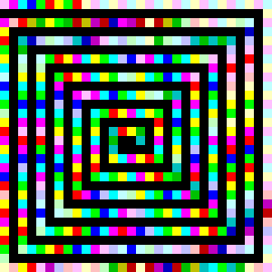
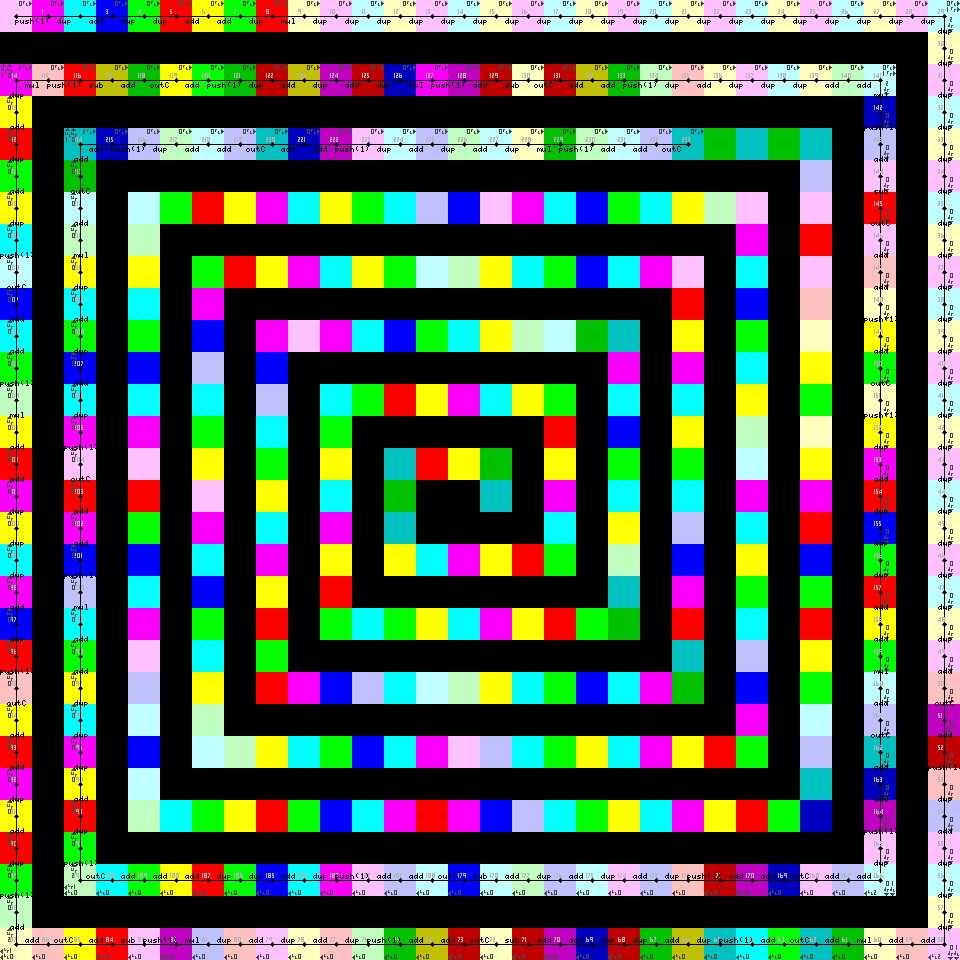

# MISC CHALLENGE: ART

## Challenge Description
Can you find the flag?



```
art.png
```

### STRING ANALYSIS

```
$ strings art.png | tail -5
+3uaN
M4Y{
AI/`{t(
~>`I
IEND
```

### PNGCHECK

```
$ pngcheck art.png 
OK: art.png (300x300, 32-bit RGB+alpha, non-interlaced, 98.5%).
```

### BINWALK

```
$ binwalk -e art.png 

DECIMAL       HEXADECIMAL     DESCRIPTION
--------------------------------------------------------------------------------
0             0x0             PNG image, 300 x 300, 8-bit/color RGBA, non-interlaced
85            0x55            Zlib compressed data, best compression
2757          0xAC5           Zlib compressed data, best compression
```

### PIET PROGRAMMING LANGUAGE

```
http://www.dangermouse.net/esoteric/piet.html
```

For those appreciative of fine art, Piet is a language that you'll surely enjoy.
Inspired by the abstract artist Piet Mondrian, Piet is a programming language
that converts programs into abstract geometric paintings. Programs are made up
of 20 different colors, and then read by the compiler based on hex values to run
a program.

#### NPIET INTERPRETER

Let's try this interpreter..

```
https://www.bertnase.de/npiet/npiet.1.html

npiet is an interpreter for the piet programming language. In this language the
programs are pictures, build out of 18 colors and black and white, where changes
in the color are stack-based commands.  If the input (supported is ppm and
optional gif and png format) includes unknown colors, they are substituted per
default by white (optional by black or leading to an error).  The input picture
is per default examined, if it is zoomed (for better ’readability’) and the zoom
factor (the codelsize) is automatically guessed (if this fails, please specify
the codelsize by the -cs option). 

Special fun gives the optional output of a trace picture. If the GD library is
compiled in, the npiet interpreter can paint the trace of the program run to a
png file, named npiet-trace.png. Different zoom factors and additional options
lead to varying detail and readability.
```

```
$ wine util/npiet.exe -tpic art.png
HTB{p137_m0ndr14n}
```


