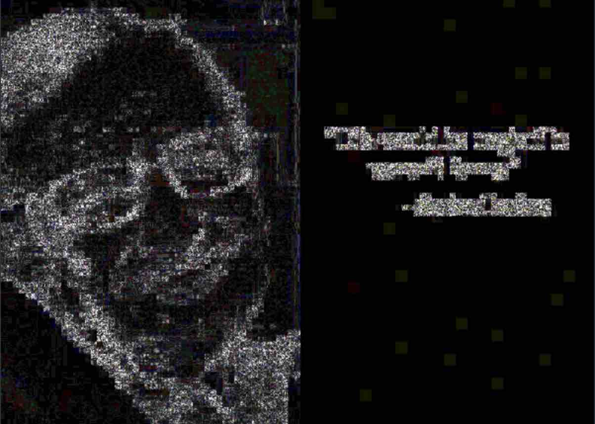
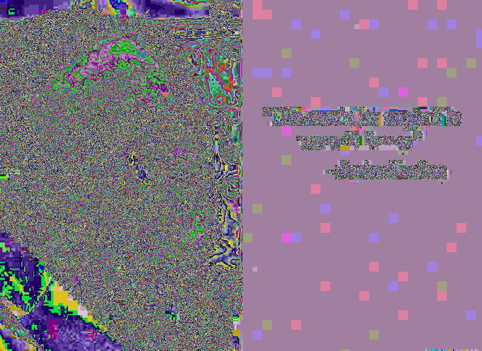
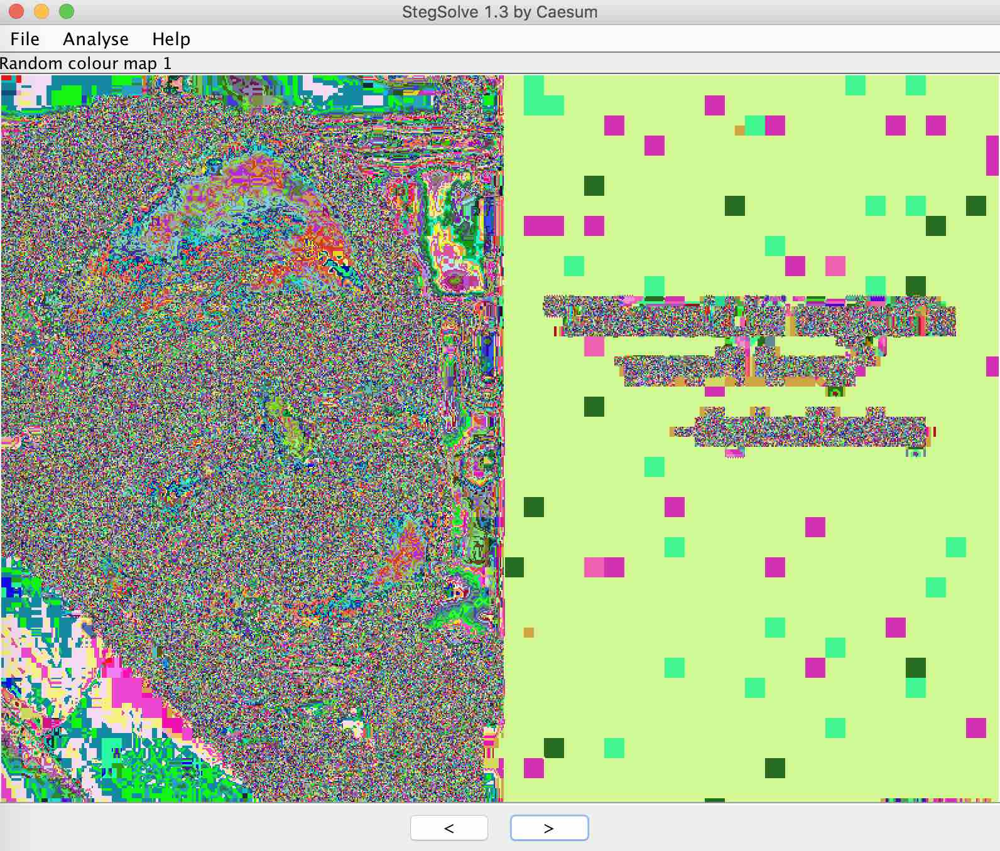
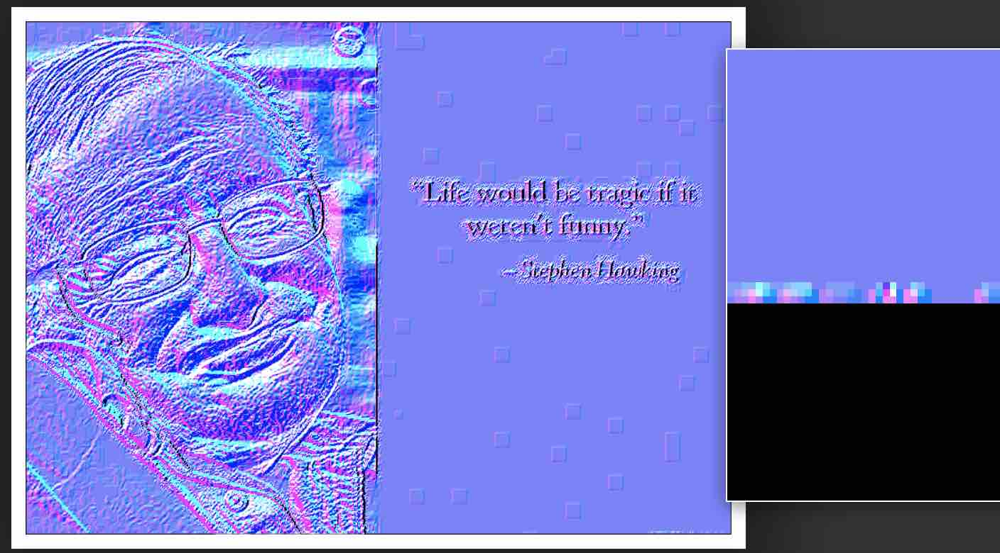

# MISC CHALLENGE: BLACKHOLE

## Challenge Description
A strange file has been discovered in Stephen Hawking's computer. Can you discover what it is? 

```
archive.zip
```

### EXTRACTING

```
$ unzip -l archive.zip 
Archive:  archive.zip
  Length      Date    Time    Name
---------  ---------- -----   ----
    60382  2018-06-16 12:47   hawking
---------                     -------
    60382                     1 file
```

### STRING ANALYSIS

Appears to be a JPEG..

```
$ strings hawking | head
JFIF
                                                  
$3br
%&'()*456789:CDEFGHIJSTUVWXYZcdefghijstuvwxyz
	#3R
&'()*56789:CDEFGHIJSTUVWXYZcdefghijstuvwxyz
g$qR&
N2+(
R"d5!
\sHV
```

```
$ mv hawking hawking.jpg
```


### VARIOUS FILE ANALYSIS

```
$ file hawking.jpg 
hawking.jpg: JPEG image data, JFIF standard 1.01, aspect ratio, density 72x72, segment length 16, baseline, precision 8, 794x579, frames 3
```

```
$ hexdump -C hawking.jpg }| head -n1
00000000  ff d8 ff e0 00 10 4a 46  49 46 00 01 01 00 00 48  |......JFIF.....H|
```

```
$ binwalk hawking.jpg 

DECIMAL       HEXADECIMAL     DESCRIPTION
--------------------------------------------------------------------------------
0             0x0             JPEG image data, JFIF standard 1.01
```

```
$ xxd hawking.jpg | tail -5
0000eb90: 00a2 8a29 8051 4514 0051 4514 0051 4514  ...).QE..QE..QE.
0000eba0: 0051 4514 0051 4514 0051 4514 0052 8a28  .QE..QE..QE..R.(
0000ebb0: a005 3d69 4d14 5031 bde9 dfc4 68a2 801b  ..=iM.P1....h...
0000ebc0: da9e 3ee8 fa9f e428 a2a8 4474 eef4 5140  ..>....(..Dt..Q@
0000ebd0: 0869 7bd1 4548 8434 9451 40cf ffd9       .i{.EH.4.Q@...
```

### ERROR LEVEL ANALYSIS

Let's see what we find with error level analysis..

```
http://fotoforensics.com/
```



Appears to be some boxes in the dark portion of the photo.. could that be what
`blackhole` is referring to?

### CLONE DETECTION

Using clone detection, we also see some patterns in the dark area that seem
unlikely to be random..

```
https://29a.ch/photo-forensics/#clone-detection
```


Reading up on what clone detection is supposed to show us, we can see that the
highlighted areas are "copied regions within an image". So what do we do with
that information?

```
http://headt.eu/detect-image-manipulations-part-ii/
```

### LEAST SIGNIFICANT BIT TECHNIQUE

```
https://github.com/RobinDavid/LSB-Steganography

.. stegonographical methods to hide files in images using the Least
Significant Bit technique
```

Trying various other tooling to look for clues..

```
lsb-steganography/steglsb.py -d hawking.jpg hawking-lsb-3bit.jpg
How many bits do you wish to use?
> 3
```



### STEGSOLVER

```
$ java -jar Stegsolve.jar
```

Running through the various filters in Stegsolve, it appears that there is
something special in the bottom left corner? (I guess the least significant
bit filters also showed us that anomoly, but wasn't as obvious..). Is there
something really there?



### LUMINANCE GRADIENT

```
https://29a.ch/photo-forensics/#luminance-gradient
```

Using different filters, we see here again the boxes scattered throughout the
black portion on the right hand side and also magnifying the bottom right hand
corner it also seems as if there is something there.. but...??



### STEGHIDE

```
$ stegcracker hawking.jpg 
StegCracker - (https://github.com/Paradoxis/StegCracker)
Copyright (c) 2018 - Luke Paris (Paradoxis)

Attacking file 'hawking.jpg' with wordlist '/usr/share/wordlists/rockyou.txt'..
Attempted: ylovey
```

Using `rockyou.txt` didn't yield a passphrase, but a wild guess of `hawking` yields something!

```
$ steghide extract -p hawking -sf hawking.jpg
wrote extracted data to "flag.txt".
$ cat flag.txt 
UldaeFluUnhlaUJKZFhoNGRXMTVJRlJ0YVhkMWVuTWdhVzFsSUcxNklGRjZjM2gxWlhRZ1puUnhZV1J4Wm5WdmJYZ2dZblJyWlhWdmRXVm1MQ0J2WVdWNVlYaGhjM1ZsWml3Z2JYcHdJRzFuWm5SaFpDd2dhWFJoSUdsdFpTQndkV1J4YjJaaFpDQmhjaUJrY1dWeGJXUnZkQ0J0WmlCbWRIRWdUM0Y2Wm1SeElISmhaQ0JHZEhGaFpIRm1kVzl0ZUNCUFlXVjVZWGhoYzJzZ2JXWWdablJ4SUVkNmRXaHhaR1YxWm1zZ1lYSWdUMjE1Ym1SMWNITnhJRzFtSUdaMGNTQm1kWGx4SUdGeUlIUjFaU0J3Y1cxbWRDNGdWSEVnYVcxbElHWjBjU0JZWjI5dFpYVnRlaUJDWkdGeWNXVmxZV1FnWVhJZ1dXMW1kSEY1YldaMWIyVWdiV1lnWm5SeElFZDZkV2h4WkdWMVptc2dZWElnVDIxNWJtUjFjSE54SUc1eFptbHhjWG9nTVRrM09TQnRlbkFnTWpBd09TNGdWRzFwZDNWNmN5QnRiM1IxY1doeGNDQnZZWGw1Y1dSdmRXMTRJR1ZuYjI5eFpXVWdhWFZtZENCbGNXaHhaRzE0SUdsaFpIZGxJR0Z5SUdKaFltZDRiV1FnWlc5MWNYcHZjU0IxZWlCcGRIVnZkQ0IwY1NCd2RXVnZaMlZsY1dVZ2RIVmxJR0ZwZWlCbWRIRmhaSFZ4WlNCdGVuQWdiMkZsZVdGNFlYTnJJSFY2SUhOeGVuRmtiWGd1SUZSMVpTQnVZV0YzSUUwZ1RtUjFjWElnVkhWbFptRmtheUJoY2lCR2RYbHhJRzFpWW5GdFpIRndJR0Y2SUdaMGNTQk9aSFZtZFdWMElFVm5lbkJ0YXlCR2RYbHhaU0J1Y1dWbUxXVnhlSGh4WkNCNGRXVm1JSEpoWkNCdElHUnhiMkZrY0MxdVpIRnRkM1Y2Y3lBeU16Y2dhWEZ4ZDJVdUlGUnRhWGQxZW5NZ2FXMWxJRzBnY25GNGVHRnBJR0Z5SUdaMGNTQkVZV3R0ZUNCRllXOTFjV1pyTENCdElIaDFjbkZtZFhseElIbHhlVzV4WkNCaGNpQm1kSEVnUW1GNlpuVnlkVzl0ZUNCTmIyMXdjWGxySUdGeUlFVnZkWEY2YjNGbExDQnRlbkFnYlNCa2NXOTFZblZ4ZW1ZZ1lYSWdablJ4SUVKa2NXVjFjSEY2Wm5WdGVDQlpjWEJ0ZUNCaGNpQlNaSEZ4Y0dGNUxDQm1kSEVnZEhWemRIRmxaaUJ2ZFdoMWVIVnRlaUJ0YVcxa2NDQjFlaUJtZEhFZ1IzcDFabkZ3SUVWbWJXWnhaUzRnVlhvZ01qQXdNaXdnVkcxcGQzVjZjeUJwYldVZ1pHMTZkM0Z3SUhwbmVXNXhaQ0F5TlNCMWVpQm1kSEVnVGs1UFhPS0FtV1VnWW1GNGVDQmhjaUJtZEhFZ01UQXdJRk5rY1cxbWNXVm1JRTVrZFdaaGVtVXVEUXBVUms1N1dqTm9jVVJmZUROR1gyWlVNMTl1TkdWR2JVUndOVjlUTTJaZlN6Qm5YM0F3YVZwOUlBPT0=
```

### CAESER CIPHER

Feeding it twice through base64 decoding yields what appears to be some cipher text..

```
$ cat flag.txt | base64 -d | base64 -d
Efqbtqz Iuxxumy Tmiwuzs ime mz Qzsxuet ftqadqfuomx btkeuouef, oaeyaxasuef, mzp mgftad, ita ime pudqofad ar dqeqmdot mf ftq Oqzfdq rad Ftqadqfuomx Oaeyaxask mf ftq Gzuhqdeufk ar Omyndupsq mf ftq fuyq ar tue pqmft. Tq ime ftq Xgomeumz Bdarqeead ar Ymftqymfuoe mf ftq Gzuhqdeufk ar Omyndupsq nqfiqqz 1979 mzp 2009. Tmiwuzs motuqhqp oayyqdoumx egooqee iuft eqhqdmx iadwe ar babgxmd eouqzoq uz ituot tq pueogeeqe tue aiz ftqaduqe mzp oaeyaxask uz sqzqdmx. Tue naaw M Nduqr Tuefadk ar Fuyq mbbqmdqp az ftq Ndufuet Egzpmk Fuyqe nqef-eqxxqd xuef rad m dqoadp-ndqmwuzs 237 iqqwe. Tmiwuzs ime m rqxxai ar ftq Dakmx Eaouqfk, m xurqfuyq yqynqd ar ftq Bazfuruomx Mompqyk ar Eouqzoqe, mzp m dqoubuqzf ar ftq Bdqeupqzfumx Yqpmx ar Rdqqpay, ftq tustqef ouhuxumz mimdp uz ftq Gzufqp Efmfqe. Uz 2002, Tmiwuzs ime dmzwqp zgynqd 25 uz ftq NNO\’e baxx ar ftq 100 Sdqmfqef Ndufaze.
TFN{Z3hqD_x3F_fT3_n4eFmDp5_S3f_K0g_p0iZ}
```

We recognize the last line appears to be in the format `HTB{s0m3_t3xt}` which we can
begin as our starting point to try `T=H` (which is a caeser cipher key of 14).

```
Stephen William Hawking was an English theoretical physicist, cosmologist, and author, who was director of research at the Centre for Theoretical Cosmology at the University of Cambridge at the time of his death. He was the Lucasian Professor of Mathematics at the University of Cambridge between 1979 and 2009. Hawking achieved commercial success with several works of popular science in which he discusses his own theories and cosmology in general. His book A Brief History of Time appeared on the British Sunday Times best-seller list for a record-breaking 237 weeks. Hawking was a fellow of the Royal Society, a lifetime member of the Pontifical Academy of Sciences, and a recipient of the Presidential Medal of Freedom, the highest civilian award in the United States. In 2002, Hawking was ranked number 25 in the BBC\’s poll of the 100 Greatest Britons. HTB{N3veR_l3T_tH3_b4sTaRd5_G3t_Y0u_d0wN}
```
