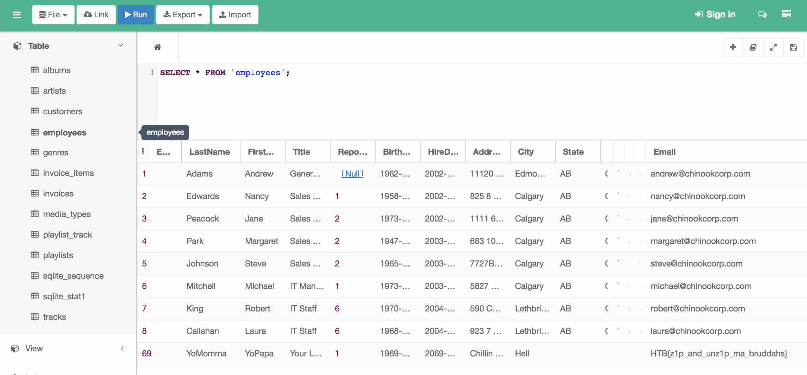

# MISC CHALLENGE: ETERNAL LOOP

## Challenge Description
Can you find a way out of this loop? 

```
37366.zip
```

### UNZIP

We are given a zip file, so let's see what we have inside..

```
$ unzip -l 37366.zip 
Archive:  37366.zip
  Length      Date    Time    Name
---------  ---------- -----   ----
   460340  05-23-2018 10:02   5900.zip
---------                     -------
   460340                     1 file
```

I get the feeling we have a seemingly endless series of embedded zip files, but
probably the solution isn't to brute force unzip down to the core. Wonder if
the file names `37366` and `5900` mean anything?

Just a few other checks before we attempt to unzip any further.

```
$ file 37366.zip 
37366.zip: Zip archive data, at least v2.0 to extract
$ binwalk 37366.zip 

DECIMAL       HEXADECIMAL     DESCRIPTION
--------------------------------------------------------------------------------
0             0x0             Zip archive data, encrypted at least v2.0 to extract, compressed size: 460497, uncompressed size: 460340, name: 5900.zip
460589        0x7072D         End of Zip archive
```

Looks normal, so let's proceed to unzip another level.

```
$ unzip 37366.zip 
Archive:  37366.zip
[37366.zip] 5900.zip password: 
password incorrect--reenter: 
  inflating: 5900.zip                
```

Oooh.. we hit a password. First tried `37366` as the password, but that didn't
work. Next tried `5900` as the password and that did work.

```
$ unzip -l 5900.zip 
Archive:  5900.zip
  Length      Date    Time    Name
---------  ---------- -----   ----
   460067  2018-05-23 10:02   49805.zip
---------                     -------
   460067                     1 file
$ binwalk 5900.zip 

DECIMAL       HEXADECIMAL     DESCRIPTION
--------------------------------------------------------------------------------
0             0x0             Zip archive data, encrypted at least v2.0 to extract, compressed size: 460224, uncompressed size: 460067, name: 49805.zip
460318        0x7061E         End of Zip archive
```

Oh boy. Wonder if I should start writing a script for this.

### SCRIPT IT!

Wrote the following little script to get to the bottom of the zip hole..

```
$ cat myunzip.sh 
#! /bin/bash

echo "hello world"

# initialize to our first zip file..
file=37366.zip

while [ true ];
do

  if [[ $file =~ .*\.zip ]];
  then
    echo "zip file: $file"
    nextfile=$(unzip -l $file | grep -v $file | grep zip | awk '{print $4}')
    passwd=$(echo $nextfile | tr ".zip" "\n")
    if [[ -z "$passwd" ]];
    then
      echo "WARNING: no password pattern found"
      unzip $file
    else
      unzip -P $passwd $file
    fi
    if [[ $? -ne 0 ]];
    then
      echo "ERROR: something went wrong with unzip"
      exit;
    fi
    file=$nextfile
  else
    echo "$file is NOT a zip file";
    exit
  fi

done
```

And ran it.. (thank goodness I didn't try to manually unwrap the layers..)

```
$ myunzip.sh 
hello world
zip file: 37366.zip
Archive:  37366.zip
  inflating: 5900.zip                
zip file: 5900.zip
Archive:  5900.zip
  inflating: 49805.zip               
zip file: 49805.zip
Archive:  49805.zip
  inflating: 13811.zip               

<...>

zip file: 10595.zip
Archive:  10595.zip
  inflating: 27833.zip               
zip file: 27833.zip
Archive:  27833.zip
  inflating: 6969.zip                
zip file: 6969.zip
WARNING: no password pattern found
Archive:  6969.zip
[6969.zip] DoNotTouch password: 
```

And eventually the script stopped at what appears to be the last layer where
we find a zip file `6969.zip` with a file `DoNotTouch` inside. Now we just need
to solve what the password for this final layer is..

```
$ unzip -l 6969.zip 
Archive:  6969.zip
  Length      Date    Time    Name
---------  ---------- -----   ----
   884736  2018-03-31 01:54   DoNotTouch
---------                     -------
   884736                     1 file
$ binwalk 6969.zip 

DECIMAL       HEXADECIMAL     DESCRIPTION
--------------------------------------------------------------------------------
0             0x0             Zip archive data, encrypted at least v2.0 to extract, compressed size: 335181, uncompressed size: 884736, name: DoNotTouch
335345        0x51DF1         End of Zip archive
```

### FCRACKZIP

Recalling the challenge `misc/fs0ciety` where we had to crack a zip file, we
can try the same approach..

```
$ fcrackzip -u -D -p /usr/share/wordlists/rockyou.txt 6969.zip 


PASSWORD FOUND!!!!: pw == letmeinplease
```

```
$ unzip -P letmeinplease 6969.zip
Archive:  6969.zip
  inflating: DoNotTouch              
```

```
$ file DoNotTouch 
DoNotTouch: SQLite 3.x database, last written using SQLite version 3021000
```

Okay.. interesting, not a text file but a DB file? Another hoop we have to
jump through.

### SQLITE

Let's see if we can find an online reader for our DB file..

```
https://sqliteonline.com/
```

Browsing through the various tables, we eventually find what we are looking for
in the email field of the `employees` table for `YoPapa YoMomma`.



Running the `strings` command against the DB file would have also worked..

```
$ strings DoNotTouch | grep HTB
1969-01-01 00:00:002069-01-01 00:00:00Chillin with SatanHellHTB{z1p_and_unz1p_ma_bruddahs}
```
