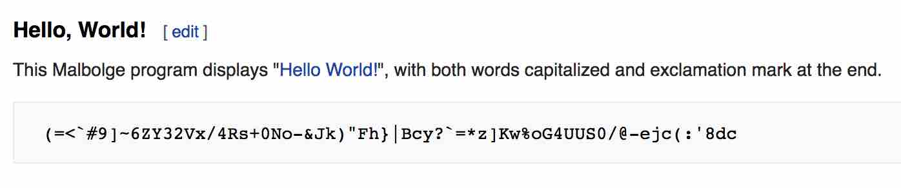
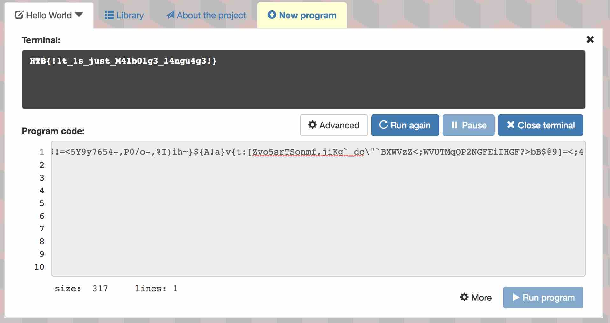

# MISC CHALLENGE: INFERNO

## Challenge Description
Find the flag.

```
inferno.txt
```

```
$ cat inferno.txt 
RCdgXyReIjdtNVgzMlZ4ZnZ1PzFOTXBMbWwkakdGZ2dVZFNiYn08eyldeHFwdW5tM3Fwb2htZmUrTGJnZl9eXSNhYFleV1Z6PTxYV1ZPTnJMUUpJTkdrRWlJSEcpP2MmQkE6Pz49PDVZenk3NjU0MzIrTy8uJyYlJEgoIWclJCN6QH59dnU7c3JxdnVuNFVxamlubWxlK2NLYWZfZF0jW2BfWHxcW1pZWFdWVVRTUlFQMk5NRktKQ0JmRkU+JjxgQDkhPTw1WTl5NzY1NC0sUDAvby0sJUkpaWh+fSR7QSFhfXZ7dDpbWnZvNXNyVFNvbm1mLGppS2dgX2RjXCJgQlhXVnpaPDtXVlVUTXFRUDJOR0ZFaUlIR0Y/PmJCJEA5XT08OzQzODFVdnUtMiswLygnSysqKSgnfmZ8Qi8=
```

### BASE64

Looking at our file, appears to be `base64` encoded string?

```
$ cat inferno.txt | base64 -D
D'`_$^"7m5X32Vxfvu?1NMpLml$jGFggUdSbb}<{)]xqpunm3qpohmfe+Lbgf_^]#a`Y^WVz=<XWVONrLQJINGkEiIHG)?c&BA:?>=<5Yzy765432+O/.'&%$H(!g%$#z@~}vu;srqvun4Uqjinmle+cKaf_d]#[`_X|\[ZYXWVUTSRQP2NMFKJCBfFE>&<`@9!=<5Y9y7654-,P0/o-,%I)ih~}${A!a}v{t:[Zvo5srTSonmf,jiKg`_dc\"`BXWVzZ<;WVUTMqQP2NGFEiIHGF?>bB$@9]=<;4381Uvu-2+0/('K+*)('~f|B/
```

Okay.. so now what?

### LIMBO?

After some internet-ing around based on the challenge name `inferno`, we come
across a programming language called `Limbo` used to write applications for the
`Inferno` operating system.

```
Limbo is a programming language for writing distributed systems and is the
language used to write applications for the Inferno operating system. It was
designed at Bell Labs by Sean Dorward, Phil Winterbottom, and Rob Pike.

https://en.wikipedia.org/wiki/Limbo_(programming_language)
```

```
Inferno is a distributed operating system started at Bell Labs and now
developed and maintained by Vita Nuova Holdings as free software. Inferno was
based on the experience gained with Plan 9 from Bell Labs, and the further
research of Bell Labs into operating systems, languages, on-the-fly compilers,
graphics, security, networking and portability. The name of the operating
system and many of its associated programs, as well as that of the current
company, were inspired by Dante Alighieri's Divine Comedy.

https://en.wikipedia.org/wiki/Inferno_(operating_system)
```

.. but an examination of the programming language doesn't seem to match what we
have here.

### MALBOLGE

After some more internet-ing for esoteric programming languages and the
challenge name `inferno`, we come across another language called `malbolge`.


```
Malbolge was created in 1998 by Ben Olmstead, an American student at the
Colorado School of Mines at the time. In the documentation, he explicitly
mentions that he did not know of an esoteric programming language that made
programming in it specifically hard. In his opinion, languages like Brainfuck
and Intercal were indeed hard to read and to write, but were created with other
goals in mind: To be minimal, and to be weird. He also considered both being
too useful. Hence, he created Malbolge, with the goal to make it as difficult
to use, and to be as incomprehensible as possible.  The language’s name stems
from an epic poem of the Italian poet Dante, Divina Commedia, whose first part
describes the main character’s descent into the nine circles of Hell. The
eighth circle is reserved for sinners who committed conscious fraud or
treachery, and is called Malebolge (which roughly translates from Italian to
“evil pockets”). It is one of the most unpleasant places to be in Dante’s
description of Hell, and the people in it are punished for all eternity.

https://morr.cc/esolangs/esolangs.pdf
```

A brief look at what `hello world` looks like in Malbolge seems promising as a
match for what we are dealing with here:

```
https://en.wikipedia.org/wiki/Malbolge
```



So since there is no way I want to try and decode this horrible programming
language by hand, let's seek an online interpreter..

```
http://www.malbolge.doleczek.pl/
```



```
HTB{!1t_1s_just_M4lb0lg3_l4ngu4g3!}
```
