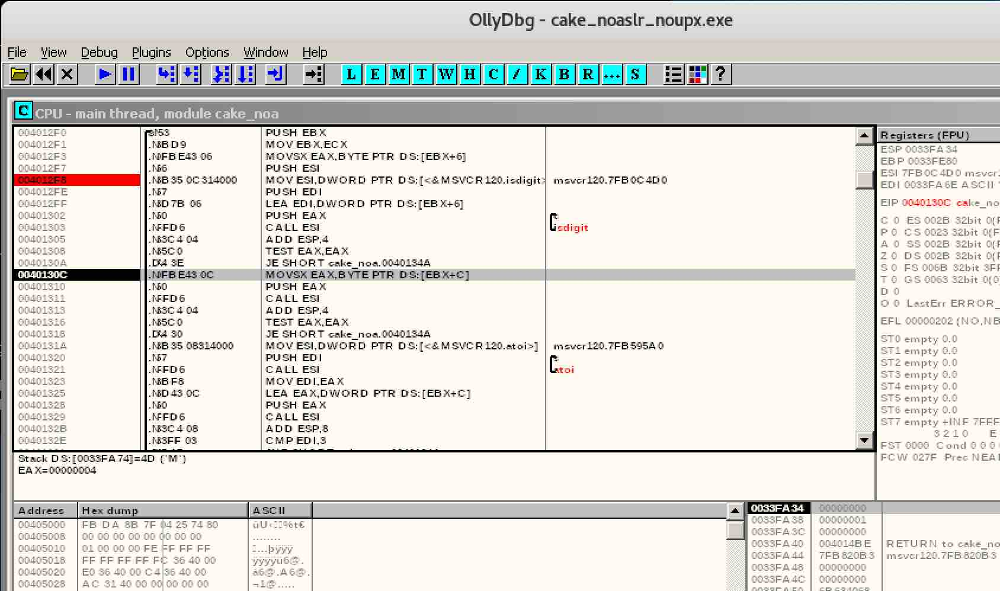

# REVERSING CHALLENGE: EAT THE CAKE!

## Challenge Description

Find the Password and enter it in the form HTB{password}

```
cake.exe
```

### FILE

```
$ file cake.exe 
cake.exe: PE32 executable (console) Intel 80386, for MS Windows, UPX compressed
```

Obviously.

### STRINGS

```
$ strings cake.exe | tail -20
XPTPSW
<?xml version='1.0' encoding='UTF-8' standalone='yes'?>
<assembly xmlns='urn:schemas-microsoft-com:asm.v1' manifestVersion='1.0'>
  <trustInfo xmlns="urn:schemas-microsoft-com:asm.v3">
    <security>
      <requestedPrivileges>
        <requestedExecutionLevel level='asInvoker' uiAccess='false' />
      </requestedPrivileges>
    </security>
  </trustInfo>
</assembly>
KERNEL32.DLL
MSVCP120.dll
MSVCR120.dll
ExitProcess
GetProcAddress
LoadLibraryA
VirtualProtect
??1_Lockit@std@@QAE@XZ
exit
```

Hm.. wonder if that little bit of XML will come in handy. Certainly seems to
be important.

### EXECUTION

```
$ wine cake.exe 

                      $
                    /  \ 
                  /  |  !
                /   /    !
              /    /      !
           _/ ____/        \ 
          /                 !
         !                  !
         \                  / 
    _-----\ _ _ _ _ _ _ _ _/----- 
   /  			         \ 
   !	      	  ____	  ____	 !
  _\       ======|    |~~|    |=/_ 
 /		  ````	  ````	   \ 
 !                  )--------(     !
 !       			   !
  \				  / 
   !---------------------------$-!
    !	 !	  |	   !  $$$ 
    !	 !	  |	   !  $$$
    !	 !	  |	   !   $$$
    !	 !	  |	   !   $$$
     !	  !	  |	  !    $$$
     !	  !	  |	  !     $$
     !	  !	  |	  !    !$$
     !    !	  |	  !    ! *
      !	   !	  |	 !    !
      !	   !	  |	 !    !
      !----!-------------!----!
         |  ii_\         |  ii_\ 
         |______\        |______\ 


A challenge brought to you by little_pwnie ;)

Please enter the 10-digit password (Only numbers and capital letters): hello
Please enter the 15-digit password (Only numbers and capital letters): hello
Please enter the 15-digit password (Only numbers and capital letters): hello
Please enter the 15-digit password (Only numbers and capital letters): hello
Please enter the 15-digit password (Only numbers and capital letters): hello
Please enter the 15-digit password (Only numbers and capital letters): hello
Please enter the 15-digit password (Only numbers and capital letters): hello
Please enter the 15-digit password (Only numbers and capital letters): hello
Please enter the 15-digit password (Only numbers and capital letters): hello
Please enter the 15-digit password (Only numbers and capital letters): hello
Please enter the 15-digit password (Only numbers and capital letters): 
```

So.. weird that the first ask is for a 10-digit password and it seems to
accept the random string we provided, but then we seem to be in some sort
of loop asking for a 15-digit password.

### DEBUGGER

Loading up the executable into `ollydbg` and doing a string search surprisingly
doesn't find any reference to the "Please enter.." prompt which I was hoping
to set a break point at..


### PEiD

Quick analysis of our executable with PEiD which helps detects PE packers,
cryptors and compilers found in executable files indicates the use of `UPX`
to obfuscate the executable (found using either "deep scan" or "hard core
scan").


Actually, if I was paying more attention.. I would have realized that the `file`
command actually told me this already when I was doing my initial analysis.

```
$ file cake.exe 
cake.exe: PE32 executable (console) Intel 80386, for MS Windows, UPX compressed
```

So what is `UPX`? I was able to download the tool from `https://upx.github.io/`
and found it stands for `Ultimate Packer for eXecutables`.

```
https://upx.github.io/

UPX is a free, portable, extendable, high-performance executable packer for
several executable formats.
```

Searching around for more information on what "Packers" are..

```
Packers
The primary type of tool used to obfuscate and ‘protect’ compiled binaries are
packers. Traditional packers are effectively self-extracting archives – or at
least they work in broadly analogous terms. Along with the compressed/obfuscated
data (the original binary in obfuscated form) they contain a deobfuscator ‘stub’
which, upon execution, deobfuscates the binary and jumps to its restored entry
point.

An important commonality shared by this category is that the original binary is
completely recovered upon deobfuscation and available for further reverse
engineering. Thus, this type of packer is easily defeated by a well-placed
breakpoint in a debugger just after deobfuscation is complete when execution
control is transferred to the original binary.

One of the most basic packers in use today is the open-source UPX developed in
the 1990s, which uses an extremely simple compression algorithm not designed
for obfuscation. Unmodified UPX packed binaries are trivial to unpack with the
UPX command line tool and such binaries are often automatically unpacked by
most AV products. In order to avoid automatic unpacking, malware authors
sometimes modify the packer.

https://www.forcepoint.com/blog/security-labs/part-one-security-performance-obfuscation-and-compression
```

### ASLR (ADDRESS SPACE LAYOUT RANDOMIZATION)

While reading several articles and blogs about reverse engineering on Windows,
I also read about a tool written to help reverse engineer windows files that
seemed like an important first step to take before trying to debug further..

```
https://blog.didierstevens.com/2010/10/17/setdllcharacteristics/
```

An examination of the DLL characteristics of our executable with this tool
indicates that `ASLR` (address space layout randomization as indicated by the
`DYNAMIC_BASE` property)..

```
$ wine setdllcharacteristics.exe cake.exe
Original DLLCHARACTERISTICS = 0x8140
 DYNAMIC_BASE    = 1
 NX_COMPAT       = 1
 FORCE_INTEGRITY = 0
```

.. so we'll disable that to make our lives easier..

```
$ wine  ../../scripts/reverse-tools/setdllcharacteristics/setdllcharacteristics.exe -d cake.exe
Original DLLCHARACTERISTICS = 0x8140
 DYNAMIC_BASE    = 1
 NX_COMPAT       = 1
 FORCE_INTEGRITY = 0
Updated  DLLCHARACTERISTICS = 0x8100
 DYNAMIC_BASE    = 0
 NX_COMPAT       = 1
 FORCE_INTEGRITY = 0
$ mv cake.exe cake_noaslr.exe
```

### UNPACKING

So let's now try and unpack / decompress our executable using `UPX`..

```
$ wine upx.exe -d cake_noaslr_noupx.exe 
$ ls -l cake*.exe
total 228
-rwxr-xr-x 1 fortyfunbobby fortyfunbobby   9216 Aug 10 15:45 cake.exe
-rwxrwxr-x 1 fortyfunbobby fortyfunbobby   9216 Aug 10 16:20 cake_noaslr.exe
-rwxr-xr-x 1 fortyfunbobby fortyfunbobby  15872 Aug 10 16:23 cake_noaslr_noupx.exe
```

### DEBUGGER AFTER DECOMPRESSION

We launch the debugger again and we do a string search and we can now see
some of the strings we were expecting!


The instructions at `00401446` ("Please enter the 15-digit..") and `0040152D`
("Congratulations!..") are the first points of interest.


After the "Please enter the 15-digit.." prompt, we see the program go into a
series of compare statements to probably validate the password.. and eventually
we get to a failed compare at `0401527` (using `012345678912345` as input) and
get bounced to `00401536` that gives us the "Better luck next time..".


The program is filled with `JNZ` (JUMP) instructions as well which was done to
make understanding the program flow more confusing and less straight forward.

### DEBUGGER LOOKING FOR CMP

Now that we have a rough feel for the program flow and can see some of the
important landmarks, let's go through the program again but this time with a
more useful test input that will help us recognize our string within the
debugger. I choose `ABCDEFGHIJKLMNO` as my 15-digit "password".

At `004014BE` we hit our first interesting result where we seem to see our
letter `D` being compared to `0x6B`.


```
004014BE   CMP BYTE PTR SS:[ESP+27],6B  // our "D" compared to "0x6B"
```

Pulling up an ASCII table, we can see that our HEX `0x6B` maps to the char `k`.


So can we look at each compare and build a "map" of what our password should be
against our `ABCDEFGHIJKLMNO` template? We recursively modify our test input
with each letter of the correct password we discover to get further..

The first sweep of our tracing yielded the following series of compares which
gets us 11 of the 15 digits..

```
004014BE   CMP BYTE PTR SS:[ESP+27],6B  // 01.) D -> k
004014C7   CMP BYTE PTR SS:[ESP+2C],61  // 02.) I -> a
004014CE   CMP BYTE PTR SS:[ESP+24],68  // 03.) A -> h
004014D5   CMP BYTE PTR SS:[ESP+2E],61  // 04.) K -> a
004014DC   CMP BYTE PTR SS:[ESP+29],68  // 05.) F -> h
004014E3   CMP BYTE PTR SS:[ESP+2D],72  // 06.) J -> r
004014EA   CMP BYTE PTR SS:[ESP+2F],64  // 07.) L -> d
004014FD   CMP BYTE PTR SS:[ESP+25],40  // 08.) B -> @
00401504   CMP BYTE PTR SS:[ESP+32],45  // 09.) O -> E
0040150B   CMP BYTE PTR SS:[ESP+26],63  // 10.) C -> c
00401512   CMP BYTE PTR SS:[ESP+31],24  // 11.) N -> $
```

.. but after that, I ran into the "Better luck next time" message without
finding any further `CMP`.

Going back to the start to see if I missed anything, I noticed a function call
at `004014B9`..

```
004014B9   CALL 004012F0
```

Walking through the instructions, we notice that at instruction `00401302` we
are loading our `G` onto the stack and calling what appears to be the
`isdigit()` function.. where if it doesn't hold true we abort and kick out
of this function. That seems to imply our letter `G` (7th character) should be
numeric?


Let's replace with a number (e.g. `h@ckEh9HaradM$E`) and see if that gets us
any further.

Ooh.. it worked! Not sure what the digit should be, but it got us further into
the function and now we see we are now doing something with our letter `M` (the
13th character)..



It looks like we are doing another `isdigit()` check against `M`, so let's just 
plug in another digit and see if that gets us further (e.g. `h@ckEh9Harad8$E`).

.. and it does! Here we can see we get all the way to `0040132E` where our `9`
(which used to be our `G`) is now being compared to `3`! (which tells us what
digit the password is expecting in that position).


Continuing to trace through that function allows us to uncover the remaining
characters of the password!

```
0040132E   CMP EDI,3                    // 12.) G -> 3 (inside func @ 004014BE)
00401333   CMP EAX,1                    // 13.) M -> 1 (inside func @ 004014BE)
00401338   CMP BYTE PTR DS:[EBX+4],74   // 14.) E -> t (inside func @ 004014BE)
0040133E   CMP BYTE PTR DS:[EBX+7],70   // 15.) H -> p (inside func @ 004014BE)
```

After the iterations of passwords below, we finally arrive at `h@ckth3parad1$E`.

```
01.) ABCkEFGHIJKLMNO
02.) ABCkEFGHaJKLMNO
03.) hBCkEFGHaJKLMNO
04.) hBCkEFGHaJaLMNO
05.) hBCkEhGHaJaLMNO
06.) hBCkEhGHaraLMNO
07.) hBCkEhGHaradMNO
08.) h@CkEhGHaradMNO
09.) h@CkEhGHaradMNE
10.) h@ckEhGHaradMNE
11.) h@ckEhGHaradM$E
12.) h@ckEh3HaradM$E
13.) h@ckEh3Harad1$E
14.) h@ckth3Harad1$E
15.) h@ckth3parad1$E
```

Feeding that back into the program gives..

```
$ wine cake.exe

                      $
                    /  \ 
                  /  |  !
                /   /    !
              /    /      !
           _/ ____/        \ 
          /                 !
         !                  !
         \                  / 
    _-----\ _ _ _ _ _ _ _ _/----- 
   /  			         \ 
   !	      	  ____	  ____	 !
  _\       ======|    |~~|    |=/_ 
 /		  ````	  ````	   \ 
 !                  )--------(     !
 !       			   !
  \				  / 
   !---------------------------$-!
    !	 !	  |	   !  $$$ 
    !	 !	  |	   !  $$$
    !	 !	  |	   !   $$$
    !	 !	  |	   !   $$$
     !	  !	  |	  !    $$$
     !	  !	  |	  !     $$
     !	  !	  |	  !    !$$
     !    !	  |	  !    ! *
      !	   !	  |	 !    !
      !	   !	  |	 !    !
      !----!-------------!----!
         |  ii_\         |  ii_\ 
         |______\        |______\ 


A challenge brought to you by little_pwnie ;)

Please enter the 10-digit password (Only numbers and capital letters): h@ckth3parad1$E
Congratulations! Now go validate your flag!
Press any key to continue... 
```
