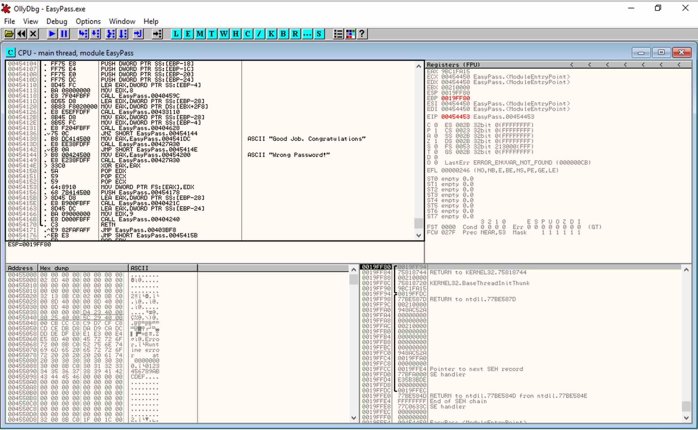

# REVERSING CHALLENGE: FIND THE EASY PASS

## Challenge Description
Find the password (say PASS) and enter the flag in the form HTB{PASS} 

```
EasyPass.exe
```

### FILE

```
$ file EasyPass.exe 
EasyPass.exe: PE32 executable (GUI) Intel 80386, for MS Windows
```

Okay.. Windows 32-bit executable.

### STRINGS

```
$ strings EasyPass.exe > strings.out
This program must be run under Win32
CODE
`DATA
.idata
.tls
<...>
OnPopup
TPopupList
TMenuItemStack
1234567890ABCDEFGHIJKLMNOPQRSTUVWXYZ
ZYYd
SVW3
<...>
ZYYd
hxAE
Good Job. Congratulations
Wrong Password!
Uh5BE
ZYYd
<...>
hnBE
Error
Runtime error     at 00000000
0123456789ABCDEF
@v:k
%.*ddp@
<...>
```

Found some interesting landmarks such as "Good Job. Congratualations" and "Wrong
Password!" that could help us navigate the binary. Also found potential
passwords like "1234567890ABCDEFGHIJKLMNOPQRSTUVWXYZ".

### EXECUTION - TEST

```
$ chmod +x EasyPass.exe 
$ wine EasyPass.exe 
```

Execution shows a dialog box that prompts for a password. 


Trying some of the strings found in string analysis, doesn't yield the correct
passphrase..


### DEBUGGER

Loading our executable into a debugger to see what we can discover. Let's
search for the strings we found in our previous analysis..


Here we see references to the strings "Good Job. Congratulations" and
"Wrong Password!" at instructions `00454138` and `00454144` respectively. Let's
go take a look at that section of code..



Of particular interest, the `CALL EasyPass.00404628` at `00454131` followed by
`JNZ SHORT EasyPass.00454144` is interesting as the return value from the
function call determines whether the program proceeds to to "Good Job" (if
the return value is non-zero) or "Wrong Password" (for return value of zero).
Let's set a break point there and see what happens.

Stepping into that function call, we eventually come across the code
`CMP EAX, EDX` that does the compare of the string we provided (in register
EAX) with the secret passphrase in register EDX).


We can see from the register content of EDX that the string it is expecting
is "fortran!".

Trying to program again and entering our new found passphrase yields the
expected "Good Job" message..


.. so we submit the flag `HTB{fortran!}` :-)
