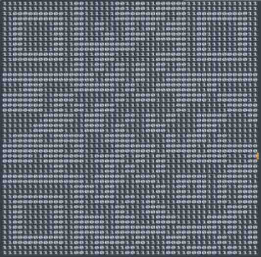
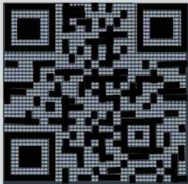
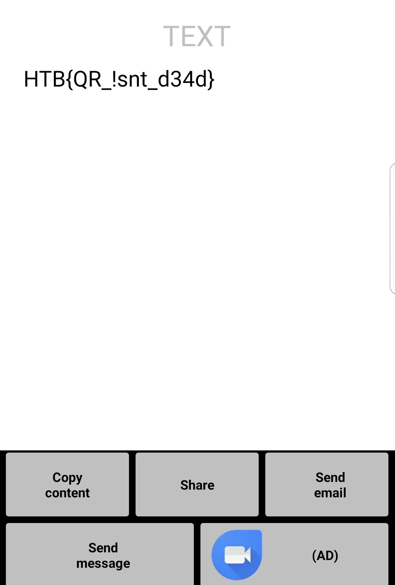

# STEGO CHALLENGE: DIGITAL CUBE

## Challenge Description
...Strathmore leaned forward and rotated his monitor toward Susan. The screen
was black except for a small, white text box blinking in the middle. TIME
ELAPSED: 50:50"

TRANSLTR, the single best crypto-machine, could not crack this code. Maybe you
can... 

```
digitalcube.txt
```

Inside the file is a series of 0's and 1's.. binary? Hex?

### WHAT NEXT?

My current thoughts to try is to decode as binary, hex or maybe it is ascii
art?

http://multiencoder.com/

### BINARY ENCODED ASCII?

If we assume this is ascii text encoded as binary, we get garbage..

```
255 252 252 204 15 255 255 255 63 51 3 255 252 0 207 192 12 192 15 0 51 240 3 48 3 207 204 207 51 12 252 243 243 51 204 195 63 60 252 207 48 192 207 207 63 51 204 48 51 243 207 204 0 63 204 252 243 243 0 15 243 63 60 0 204 63 192 192 15 0 51 15 240 48 3 255 252 204 204 207 255 255 255 51 51 51 255 240 0 3 12 240 0 0 0 0 195 60 0 0 240 252 3 60 3 63 252 63 0 207 0 207 240 12 63 204 60 12 12 3 15 243 15 3 3 0 204 195 255 207 240 0 51 48 255 243 252 15 240 48 243 51 192 243 252 12 60 204 240 60 252 15 12 240 252 63 255 3 195 60 63 15 252 12 15 3 243 12 255 3 3 192 252 195 63 0 12 252 3 3 0 0 3 63 0 192 192 0 48 12 12 207 0 240 12 3 3 51 192 60 255 207 243 60 255 240 63 243 252 207 63 252 0 0 12 12 60 12 12 0 3 3 15 3 3 255 252 51 252 204 204 63 255 12 255 51 51 12 0 204 51 60 12 195 0 51 12 207 3 48 207 204 252 240 255 240 243 243 63 60 63 252 60 252 192 195 195 240 63 63 48 48 240 252 15 207 204 12 0 192 51 51 243 3 0 48 12 204 0 204 12 240 252 243 0 51 3 60 63 60 255 252 207 63 48 51 255 255 51 207 204 12 15
```

### MORSE CODE?

If we assume this is morse code, we also get nothing meaningful..

```
...__ ...__ _____ ...__ ...__ _____ ...__ _____ ...__ ...__ _____ ...__ ...__ ...__ ...__ _____ _____ ...__ _____ ...__ ...__ ...__ ...__ ...__ ...__ _____ _____ _____ ...__ ...__ _____ ...__ _____ ...__ ...__
```

```
https://morsecode.scphillips.com/translator.html
33033030330333300303333330003303033
```

### ASCII ART?

There are 2500 characters, so if we use the "cube" from the challenge title as
a hint, we can have a 50x50 cube (possible combinations are: 1x2500, 2x1250,
4x625, 5x500, 10x250, 20x125, 25x100, 50x50, 100x25, 125x20, 250x10, 500x5, 
625x4, 1250x2, 2500x1).

At 50x50 layout.. it looks like a QRCode??



Using an editor to clean up the lines and contrast..



and scanning with a QRCode reader on my mobile phone.. we get..


