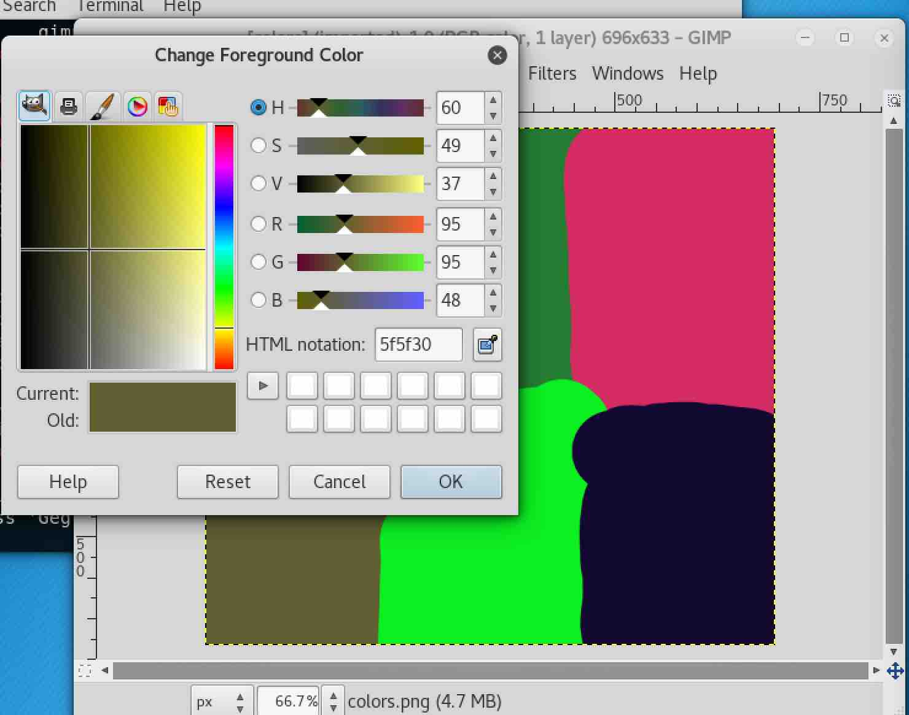

# STEGO CHALLENGE: HIDDEN IN COLORS

## Challenge Description
We intercepted this weird image coming from a person of interest, can you figure
it out because we sure can't.  What we overheard is "the last two digits are of
great importance". 

```
colors.png
```


### STRING ANALYSIS

```
$ strings colors.png  | tail -5
`\*lu
{"8C
\Ia5
"x9!
IEND
```

Nothing interesting..

### PHOTO FORENSICS

Using a magnifier we see some anomoly in the upper left corner..

```
https://29a.ch/photo-forensics/#forensic-magnifier
```


Using principal components analysis also yields an interesting pattern hidden
within the red blotch also in the top left corner.

```
https://29a.ch/photo-forensics/#pca
```


Let's zoom up really close on that anomoly in the top left..


```
01110100 01110010 01101111 01101100 01101100 01100101 01100100 0001010
```

### BINARY TO ASCII

```
01110100 01110010 01101111 01101100 01101100 01100101 01100100
```

.. maps to `trolled`.. geez..


But those swirling lines really do look like they were done on purpose. Was it
only to draw our attention to the top left corner to make us discover the troll
message??


### GIMP

So given that the challenge is called "colors", what if we tried examining the
actual color codes of the image? Maybe the color codes of those colors might
give us a hint?

Loading up the image in `gimp`, we use the color picker to to see what we might
find with the red in the upper left..


What if we capture the `RGB` code for each color?





Combining all of the `RGB` codes for each of the six colors, we get:

```
(159,38,36) (36,124,51) (212,43,99) (95,95,48) (12,239,33) (17,7,49)
```

If we recall the clue in our original problem description "last two digits are
of great importance", let's see if the last two digits (the "B" of "RGB") mean
anything?


Looking at an `ASCII` table, the numbers don't fit with a HEX interpretation,
but it could work if we took them to be DECIMALS..

```
(159,38,36) (36,124,51) (212,43,99) (95,95,48) (12,239,33) (17,7,49)
        $           3           c          0           !         1
```

Using that conversion we end up with the string `$3c0!1`. No idea what that
means, but it works as the flag.. huh..
