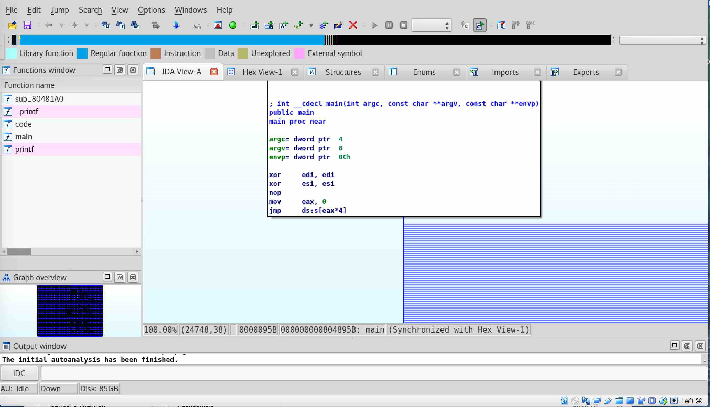

# STEGO CHALLENGE: HIDDEN IN COLORS

## Challenge Description

Pusheen just loves graphs, Graphs and IDA. Did you know cats are weirdly controlling about their reverse engineering tools? Pusheen just won't use anything except IDA. 

```
Pusheen
```

### FILE

```
$ file Pusheen 
Pusheen: ELF 32-bit LSB executable, Intel 80386, version 1 (SYSV), dynamically linked, interpreter /lib/ld-linux.so.2, not stripped
```

Interesting to have an executable as part of steganography challenge.

### STRING ANALYSIS

```
$ strings Pusheen | head
tdXO
/lib/ld-linux.so.2
libc.so.6
printf
GLIBC_2.0
      
             
          
        
      
$ strings Pusheen | tail
.dynsym
.dynstr
.gnu.version
.gnu.version_r
.rel.plt
.text
.eh_frame
.dynamic
.got.plt
.data
```

Nothing immediately interesting about our string analysis.

### EXECUTION

```
$ chmod +x Pusheen 
$ ./Pusheen 
   ▐▀▄      ▄▀▌   ▄▄▄▄▄▄▄             
   ▌▒▒▀▄▄▄▄▀▒▒▐▄▀▀▒██▒██▒▀▀▄          
  ▐▒▒▒▒▒▒▒▒▒▒▒▒▒▒▒▒▒▒▒▒▒▒▒▒▒▀▄        
  ▌▒▒▒▒▒▒▒▒▒▒▒▒▒▄▒▒▒▒▒▒▒▒▒▒▒▒▒▀▄      
▀█▒▒█▌▒▒█▒▒▐█▒▒▀▒▒▒▒▒▒▒▒▒▒▒▒▒▒▒▒▌     
▀▌▒▒▒▒▒▀▒▀▒▒▒▒▒▀▀▒▒▒▒▒▒▒▒▒▒▒▒▒▒▒▐   ▄▄
▐▒▒▒▒▒▒▒▒▒▒▒▒▒▒▒▒▒▒▒▒▒▒▒▒▒▒▒▒▒▒▒▒▌▄█▒█
▐▒▒▒▒▒▒▒▒▒▒▒▒▒▒▒▒▒▒▒▒▒▒▒▒▒▒▒▒▒▒▒▒▐▒█▀ 
▐▒▒▒▒▒▒▒▒▒▒▒▒▒▒▒▒▒▒▒▒▒▒▒▒▒▒▒▒▒▒▒▒▐▀   
▐▒▒▒▒▒▒▒▒▒▒▒▒▒▒▒▒▒▒▒▒▒▒▒▒▒▒▒▒▒▒▒▒▌    
 ▌▒▒▒▒▒▒▒▒▒▒▒▒▒▒▒▒▒▒▒▒▒▒▒▒▒▒▒▒▒▒▐     
 ▐▒▒▒▒▒▒▒▒▒▒▒▒▒▒▒▒▒▒▒▒▒▒▒▒▒▒▒▒▒▒▌     
  ▌▒▒▒▒▒▒▒▒▒▒▒▒▒▒▒▒▒▒▒▒▒▒▒▒▒▒▒▒▐      
  ▐▄▒▒▒▒▒▒▒▒▒▒▒▒▒▒▒▒▒▒▒▒▒▒▒▒▒▒▄▌      
    ▀▄▄▀▀▀▀▄▄▀▀▀▀▀▀▄▄▀▀▀▀▀▀▄▄▀       
 

```

Cute.

### Interactive Disassembler (IDA)

Using the hint in the challenge description "Pusheen just won't use anything
except IDA.", I suppose let's go figure out what IDA is.

```
https://www.hex-rays.com/products/ida/support/links.shtml
```

When we tried to load our executable file in `IDA`, we are with a warning
message about the graph being too big to display..


Since this is a steganography challenge, being able to see anything involving a
display is probably important.. so let's go fix that.


After adjusting our setting and bumping up our "max nodes" from `1000` to
`10000`, we reload the executable and find what appears to be text formed from
the graph preview (bottom left corner).



Zooming in so we can get a better look..


`fUn_w17h_CFGz`
