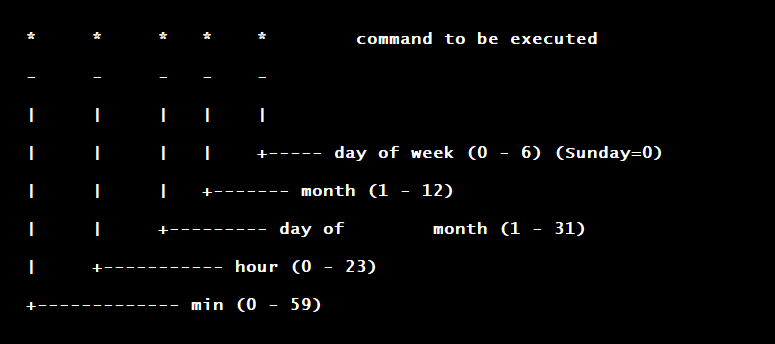

# BANDIT LEVEL 21 --> LEVEL 22

```
http://overthewire.org/wargames/bandit/bandit22.html
```

### Level Goal

A program is running automatically at regular intervals from cron, the time-based job
scheduler. Look in `/etc/cron.d/` for the configuration and see what command is being
executed.

### Commands you may need to solve this level

```
cron, crontab, crontab(5) (use “man 5 crontab” to access this)
```

### SOLUTION

```
CRONTAB(1)                        General Commands Manual                       CRONTAB(1)

NAME
       crontab - maintain crontab files for individual users (Vixie Cron)

SYNOPSIS
       crontab [ -u user ] file
       crontab [ -u user ] [ -i ] { -e | -l | -r }

DESCRIPTION
       crontab  is the program used to install, deinstall or list the tables used to drive
       the cron(8) daemon in Vixie Cron.  Each user can have their own crontab, and though
       these  are  files  in  /var/spool/cron/crontabs, they are not intended to be edited
       directly.
```

```
bandit21@bandit:~$ whoami
bandit21
bandit21@bandit:~$ pwd
/home/bandit21
bandit21@bandit:~$ ls -a
.  ..  .bash_logout  .bashrc  .prevpass  .profile
bandit21@bandit:~$ crontab -l
crontabs/bandit21/: fopen: Permission denied
bandit21@bandit:~$ ls -l /etc/cron.d/
total 12
-rw-r--r-- 1 root root 120 Oct 16 14:00 cronjob_bandit22
-rw-r--r-- 1 root root 122 Oct 16 14:00 cronjob_bandit23
-rw-r--r-- 1 root root 120 Oct 16 14:00 cronjob_bandit24
bandit21@bandit:~$ cat /etc/cron.d/cronjob_bandit22
@reboot bandit22 /usr/bin/cronjob_bandit22.sh &> /dev/null
* * * * * bandit22 /usr/bin/cronjob_bandit22.sh &> /dev/null
bandit21@bandit:~$ ls -l /usr/bin/cronjob_bandit22.sh
-rwxr-x--- 1 bandit22 bandit21 130 Oct 16 14:00 /usr/bin/cronjob_bandit22.sh
```

Format of `crontab` entry..



Okay.. looks like there is a script `/usr/bin/cronjob_bandit22.sh` that is run every minute
as `bandit22`. The script itself has read/execute permissions for group `bandit21`.. so let's
take a look..

```
bandit21@bandit:~$ cat /usr/bin/cronjob_bandit22.sh
#!/bin/bash
chmod 644 /tmp/t7O6lds9S0RqQh9aMcz6ShpAoZKF7fgv
cat /etc/bandit_pass/bandit22 > /tmp/t7O6lds9S0RqQh9aMcz6ShpAoZKF7fgv
```

```
bandit21@bandit:~$ cat /tmp/t7O6lds9S0RqQh9aMcz6ShpAoZKF7fgv
Yk7owGAcWjwMVRwrTesJEwB7WVOiILLI
```
