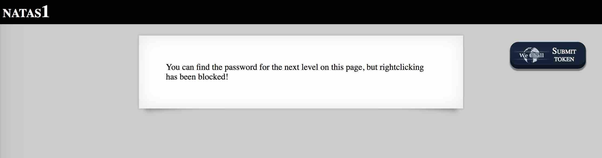
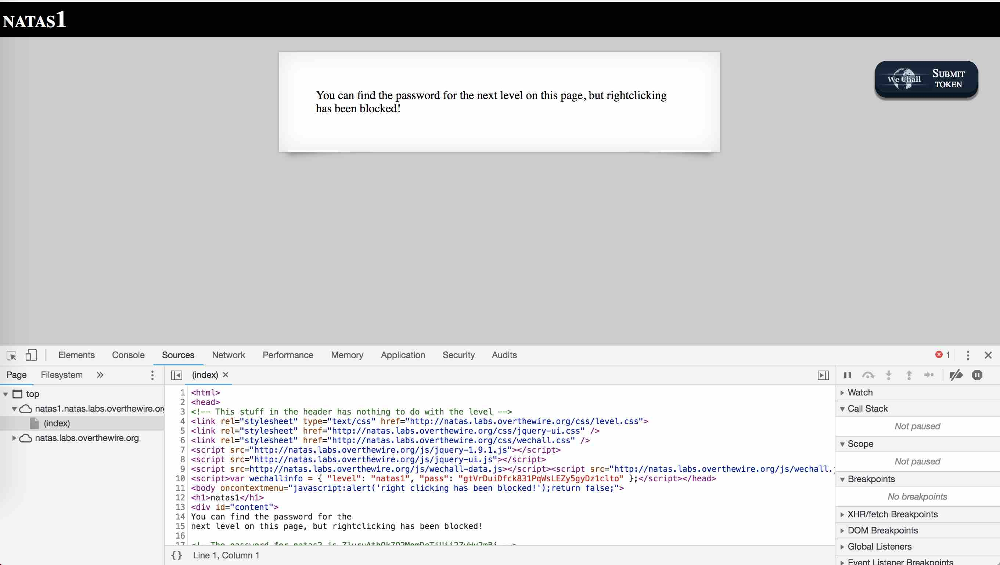

# BANDIT LEVEL 1

```
http://overthewire.org/wargames/natas/natas1.html
```

```
Username: natas1
Password: gtVrDuiDfck831PqWsLEZy5gyDz1clto
URL:      http://natas1.natas.labs.overthewire.org
```



### SOLUTION

We can't bring up the `View Page Source` menu by right clicking, but we can still view
the page source using the Chrome Developer Tools..



```
<html>
<head>
<!-- This stuff in the header has nothing to do with the level -->
<link rel="stylesheet" type="text/css" href="http://natas.labs.overthewire.org/css/level.css">
<link rel="stylesheet" href="http://natas.labs.overthewire.org/css/jquery-ui.css" />
<link rel="stylesheet" href="http://natas.labs.overthewire.org/css/wechall.css" />
<script src="http://natas.labs.overthewire.org/js/jquery-1.9.1.js"></script>
<script src="http://natas.labs.overthewire.org/js/jquery-ui.js"></script>
<script src=http://natas.labs.overthewire.org/js/wechall-data.js></script><script src="http://natas.labs.overthewire.org/js/wechall.js"></script>
<script>var wechallinfo = { "level": "natas1", "pass": "gtVrDuiDfck831PqWsLEZy5gyDz1clto" };</script></head>
<body oncontextmenu="javascript:alert('right clicking has been blocked!');return false;">
<h1>natas1</h1>
<div id="content">
You can find the password for the
next level on this page, but rightclicking has been blocked!

<!--The password for natas2 is ZluruAthQk7Q2MqmDeTiUij2ZvWy2mBi -->
</div>
</body>
</html>
```
