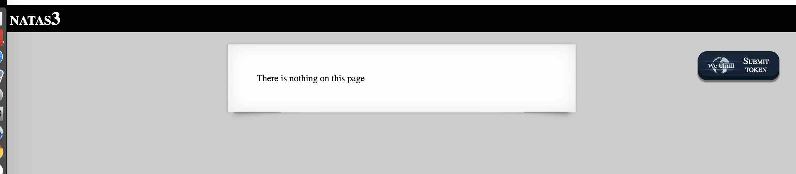

# BANDIT LEVEL 3

```
http://overthewire.org/wargames/natas/natas3.html
```

```
Username: natas3
Password: sJIJNW6ucpu6HPZ1ZAchaDtwd7oGrD14
URL:      http://natas3.natas.labs.overthewire.org
```



### SOLUTION

Peak at page source for hints..

```
<html>
<head>
<!-- This stuff in the header has nothing to do with the level -->
<link rel="stylesheet" type="text/css" href="http://natas.labs.overthewire.org/css/level.css">
<link rel="stylesheet" href="http://natas.labs.overthewire.org/css/jquery-ui.css" />
<link rel="stylesheet" href="http://natas.labs.overthewire.org/css/wechall.css" />
<script src="http://natas.labs.overthewire.org/js/jquery-1.9.1.js"></script>
<script src="http://natas.labs.overthewire.org/js/jquery-ui.js"></script>
<script src=http://natas.labs.overthewire.org/js/wechall-data.js></script><script src="http://natas.labs.overthewire.org/js/wechall.js"></script>
<script>var wechallinfo = { "level": "natas3", "pass": "sJIJNW6ucpu6HPZ1ZAchaDtwd7oGrD14" };</script></head>
<body>
<h1>natas3</h1>
<div id="content">
There is nothing on this page
<!-- No more information leaks!! Not even Google will find it this time... -->
</div>
</body></html>
```

Only a comment about "Not even Google will find it.." which seems to imply at a `robot.txt`
file.

```
http://www.robotstxt.org/robotstxt.html

About /robots.txt
In a nutshell
Web site owners use the /robots.txt file to give instructions about their site to web
robots; this is called The Robots Exclusion Protocol.
```

Looking into the site's `robots.txt`, we find it instructs web crawlers to ignore a
directory called `s3cr3t/`.

```
http://natas3.natas.labs.overthewire.org/robots.txt

User-agent: *
Disallow: /s3cr3t/
```

In that directory, we find a `users.txt` file..

```
http://natas3.natas.labs.overthewire.org/s3cr3t/users.txt

natas4:Z9tkRkWmpt9Qr7XrR5jWRkgOU901swEZ
```
