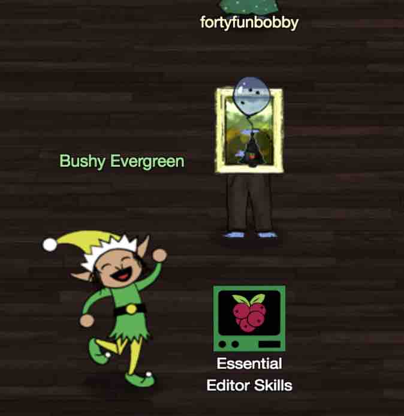
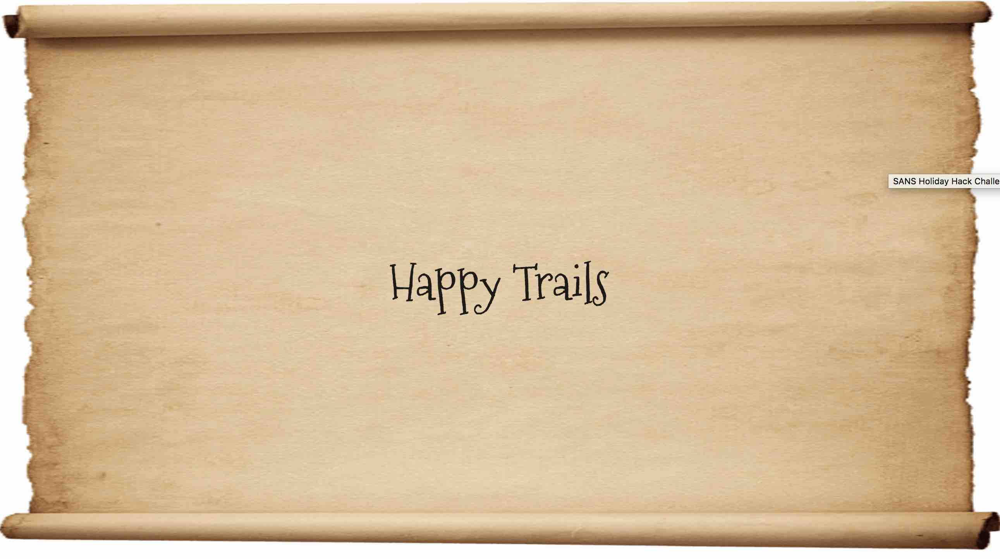
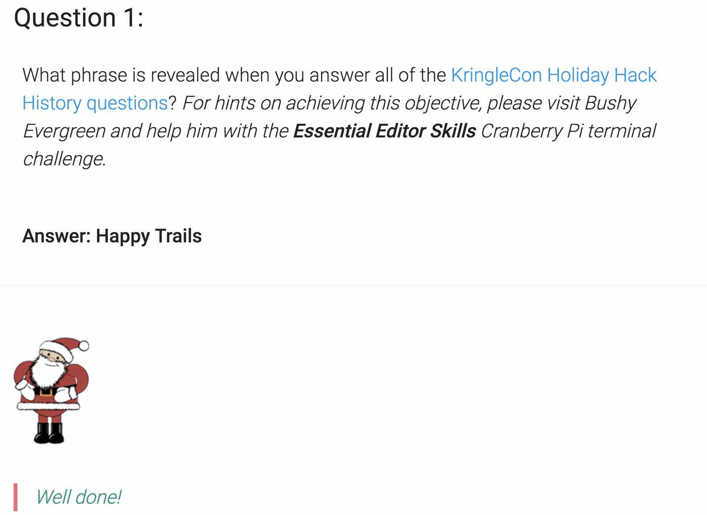

# SANS HOLIDAY HACK CHALLENGE - 2018 - QUESTION 1

```
https://holidayhackchallenge.com/2018/story.html
```

### DESCRIPTION

What phrase is revealed when you answer all of the KringleCon Holiday Hack History questions? For hints on achieving this objective, please visit Bushy Evergreen and help him with the Essential Editor Skills Cranberry Pi terminal challenge.

### CRANBERRY PI CHALLENGE



```
<Bushy>

Hi, I'm Bushy Evergreen.

I'm glad you're here, I'm the target of a terrible trick.

Pepper says his editor is the best, but I don't understand why.

He's forcing me to learn vi.

He gave me a link, I'm supposed to learn the basics.

Can you assist me with one of the simple cases?

</Bushy>
```

##### ESSENTIAL EDITOR SKILLS

```
                  ........................................
               .;oooooooooooool;,,,,,,,,:loooooooooooooll:
             .:oooooooooooooc;,,,,,,,,:ooooooooooooollooo:
           .';;;;;;;;;;;;;;,''''''''';;;;;;;;;;;;;,;ooooo:
         .''''''''''''''''''''''''''''''''''''''''';ooooo:
       ;oooooooooooool;''''''',:loooooooooooolc;',,;ooooo:
    .:oooooooooooooc;',,,,,,,:ooooooooooooolccoc,,,;ooooo:
  .cooooooooooooo:,''''''',:ooooooooooooolcloooc,,,;ooooo,
  coooooooooooooo,,,,,,,,,;ooooooooooooooloooooc,,,;ooo,
  coooooooooooooo,,,,,,,,,;ooooooooooooooloooooc,,,;l'
  coooooooooooooo,,,,,,,,,;ooooooooooooooloooooc,,..
  coooooooooooooo,,,,,,,,,;ooooooooooooooloooooc.
  coooooooooooooo,,,,,,,,,;ooooooooooooooloooo:.
  coooooooooooooo,,,,,,,,,;ooooooooooooooloo;
  :llllllllllllll,'''''''';llllllllllllllc,
I'm in quite a fix, I need a quick escape.
Pepper is quite pleased, while I watch here, agape.
Her editor's confusing, though "best" she says - she yells!
My lesson one and your role is exit back to shellz.
-Bushy Evergreen
Exit vi.
```

###### ELF HINT

```
https://kb.iu.edu/d/afcz

Quit the vi editor without saving your changes
```

###### CRANBERRY PI ENUMERATION

```
:q!
```

```
Loading, please wait......
You did it! Congratulations!
elf@5f8e1476dd2f:~$ ls
elf@5f8e1476dd2f:~$ pwd
/home/elf
elf@5f8e1476dd2f:~$ ls /
bin   dev  home  lib64  mnt  proc  run   srv  tmp  var
boot  etc  lib   media  opt  root  sbin  sys  usr
elf@5f8e1476dd2f:~$ 
```

```
<Bushy>

Wow, it seems so easy now that you've shown me how!

To thank you, I'd like to share some other tips with you.

Have you taken a look at the Orientation Challenge?

This challenge is limited to past SANS Holiday Hack Challenges from 2015, 2016, and 2017. You DO NOT need to play those challenges.

If you listen closely to Ed Skoudis' talk at the con, you might even pick up all the answers you need...

It may take a little poking around, but with your skills, I'm sure it'll be a wintergreen breeze!

</Bushy>
```

```
- Welcome To KringleCon 2018: Start Here
  Ed Skoudis
  https://www.youtube.com/watch?v=31JsKzsbFUo
```

#### HOLIDAY HACK HISTORY QUESTIONS

```
https://www.holidayhackchallenge.com/2018/challenges/osint_challenge_windows.html
```
Answer all questions correctly to get the secret phrase!

##### Question 1
In 2015, the Dosis siblings asked for help understanding what piece of their "Gnome in Your Home" toy?
````
Firmware
````

##### Question 2
In 2015, the Dosis siblings disassembled the conspiracy dreamt up by which corporation?
````
ATNAS
````

##### Question 3
In 2016, participants were sent off on a problem-solving quest based on what artifact that Santa left?
```
Business card
```

##### Question 4
In 2016, Linux terminals at the North Pole could be accessed with what kind of computer?
```
Cranberry Pi
```

##### Question 5
In 2017, the North Pole was being bombarded by giant objects. What were they?
```
Snowballs
```

##### Question 6
In 2017, Sam the snowman needed help reassembling pages torn from what?
```
The Great Book
```



### SOLUTION



