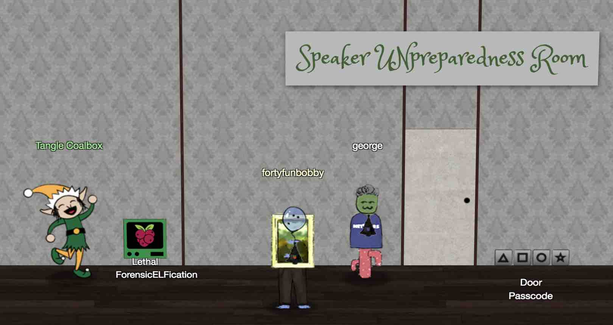
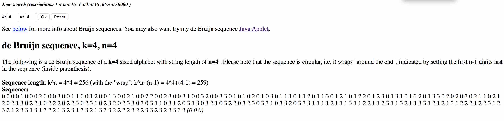
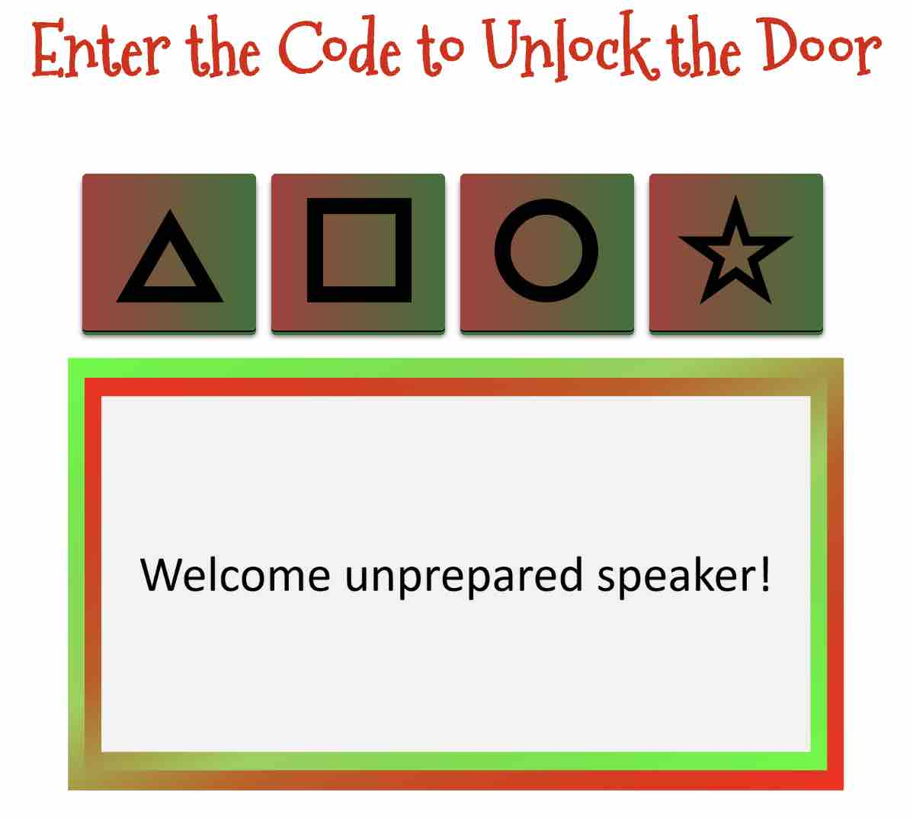
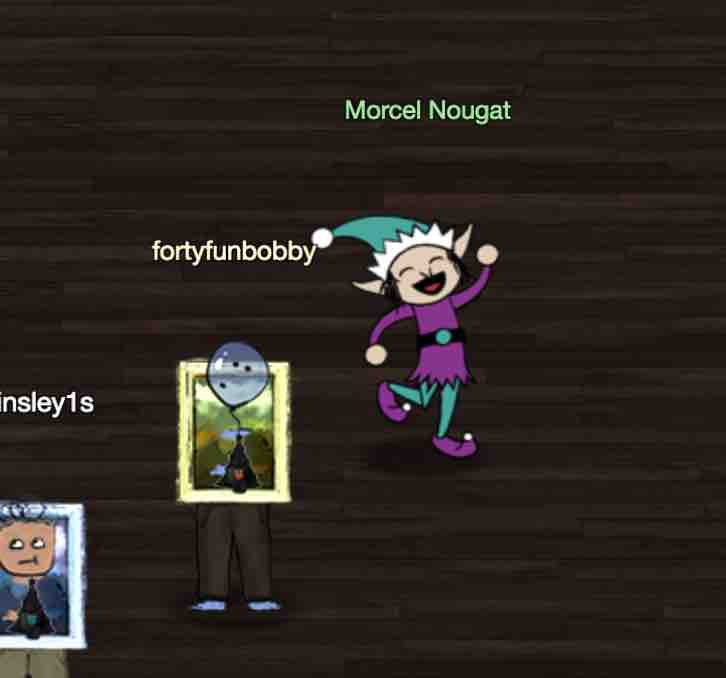
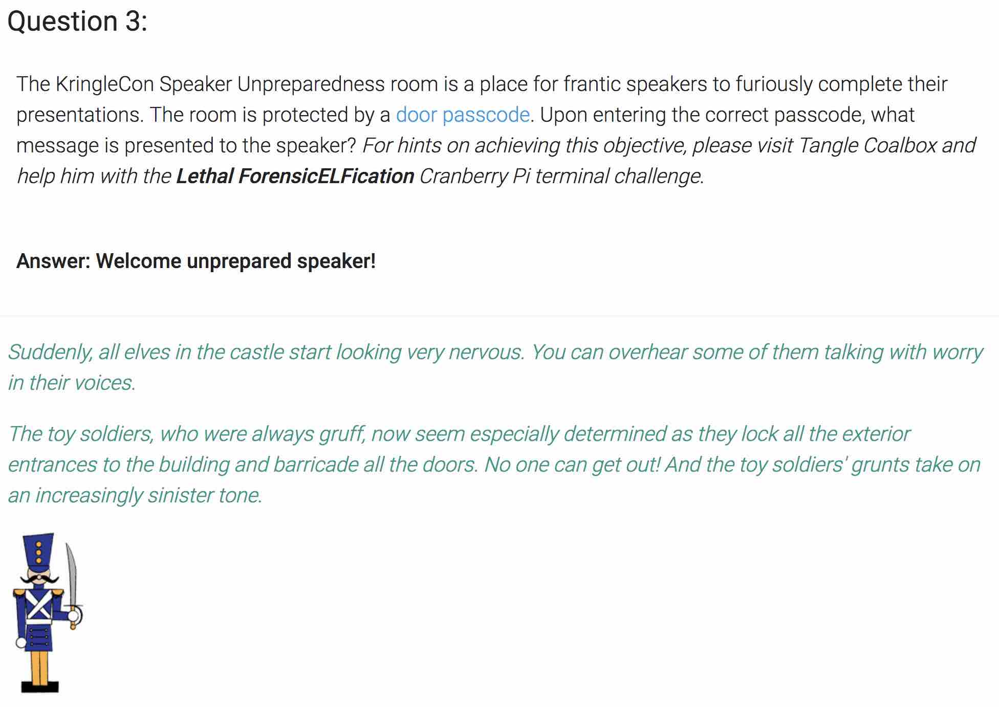

# SANS HOLIDAY HACK CHALLENGE - 2018 - QUESTION 3

```
https://holidayhackchallenge.com/2018/story.html
```

### DESCRIPTION

The KringleCon Speaker Unpreparedness room is a place for frantic speakers to furiously complete their presentations. The room is protected by a door passcode. Upon entering the correct passcode, what message is presented to the speaker? For hints on achieving this objective, please visit Tangle Coalbox and help him with the Lethal ForensicELFication Cranberry Pi terminal challenge.

### CRANBERRY PI CHALLENGE



```
<Tangle>

Hi, I'm Tangle Coalbox.

Any chance you can help me with an investigation?

Elf Resources assigned me to look into a case, but it seems to require digital forensic skills.

Do you know anything about Linux terminal editors and digital traces they leave behind?

Apparently editors can leave traces of data behind, but where and how escapes me!

</Tangle>
```

##### LETHAL FORENSICELFICATION

```
                       ............'''',,,;;;::ccclloooddxxkkOO00KKXXNNWWMMMMMM
                       ............'''',,,;;;::ccclloooddxxkkOO00KKXXNNWWMMMMMM
   .,.   ,. .......,.  .',..'',,..:::::,,;:c:::ccooooodxkkOOkOO0KKXXXNNWMMMMMMM
   ldd: .d' ';... .o:  .d;.;:....'dl,;do,:lloc:codddodOOxxk0KOOKKKKXNNNWMMMMMMM
   lo.ol.d' ';'..  ,d'.lc..;:,,,.'docod:,:l:locldlddokOxdxxOK0OKKKXXXNNWMMMMMMM
   lo  lod' ';      co:o...;:....'dl':dl,:l::oodlcddoxOkxxk0KOOKKKKXNNNWMMMMMMM
   ,,   ,;. ......  .;:....',,,,''c:'':l;;c:;:llccoooodkkOOOkOO0KKKXNNNWMMMMMMM
                       ............'''',,,;;;::ccclloooddxxkkOO00KKXXNNWWMMMMMM
                       ............'''',,,;;;::ccclloooddxxkkOO00KKXXNNWWMMMMMM
Christmas is coming, and so it would seem,
ER (Elf Resources) crushes elves' dreams.
One tells me she was disturbed by a bloke.
He tells me this must be some kind of joke.
Please do your best to determine what's real.
Has this jamoke, for this elf, got some feels?
Lethal forensics ain't my cup of tea;
If YOU can fake it, my hero you'll be.
One more quick note that might help you complete,
Clearing this mess up that's now at your feet.
Certain text editors can leave some clue.
Did our young Romeo leave one for you?
- Tangle Coalbox, ER Investigator
  Find the first name of the elf of whom a love poem 
  was written.  Complete this challenge by submitting 
  that name to runtoanswer.
```

###### ELF HINT

```
https://tm4n6.com/2017/11/15/forensic-relevance-of-vim-artifacts/

Forensic Relevance of Vim Artifacts
```

###### CRANBERRY PI ENUMERATION

```
elf@8825485716bb:~$ pwd 
/home/elf
elf@8825485716bb:~$ ls -al
total 5460
drwxr-xr-x 1 elf  elf     4096 Dec 14 16:28 .
drwxr-xr-x 1 root root    4096 Dec 14 16:28 ..
-rw-r--r-- 1 elf  elf      419 Dec 14 16:13 .bash_history
-rw-r--r-- 1 elf  elf      220 May 15  2017 .bash_logout
-rw-r--r-- 1 elf  elf     3540 Dec 14 16:28 .bashrc
-rw-r--r-- 1 elf  elf      675 May 15  2017 .profile
drwxr-xr-x 1 elf  elf     4096 Dec 14 16:28 .secrets
-rw-r--r-- 1 elf  elf     5063 Dec 14 16:13 .viminfo
-rwxr-xr-x 1 elf  elf  5551072 Dec 14 16:13 runtoanswer
```

So we notice the `.viminfo` file which was hinted by the elf and the obviously
suspicious `.secrets` directory.

The `.secrets` directory contains the love poem we are looking for, but the name
of the elf has been replaced by `NEVERMORE`..o

```
elf@8825485716bb:~$ tail .secrets/her/poem.txt 
Smile, she did, when he suggested that their future surely rested,
Up in flight above their cohort flying high like ne'er before!
  So he harnessed two young reindeer, bold and fresh and bearing no fear.
In they jumped and seated so near, off they flew - broke through the door!
Up and up climbed team and humor, Morcel being so adored,
  By his lovely NEVERMORE!
-Morcel Nougat
```

Inspecting `.viminfo`, we are able to find the command line history of the
editor which reveals that the original text was `Elinore`..

```
# Command Line History (newest to oldest):
:wq
|2,0,1536607231,,"wq"
:%s/Elinore/NEVERMORE/g
|2,0,1536607217,,"%s/Elinore/NEVERMORE/g"
:r .secrets/her/poem.txt
|2,0,1536607201,,"r .secrets/her/poem.txt"
```

```
elf@8825485716bb:~$ ./runtoanswer 
Loading, please wait......
Who was the poem written about? Elinore
WWNXXK00OOkkxddoolllcc::;;;,,,'''.............                                 
WWNXXK00OOkkxddoolllcc::;;;,,,'''.............                                 
WWNXXK00OOkkxddoolllcc::;;;,,,'''.............                                 
WWNXXKK00OOOxddddollcccll:;,;:;,'...,,.....'',,''.    .......    .''''''       
WWNXXXKK0OOkxdxxxollcccoo:;,ccc:;...:;...,:;'...,:;.  ,,....,,.  ::'....       
WWNXXXKK0OOkxdxxxollcccoo:;,cc;::;..:;..,::...   ;:,  ,,.  .,,.  ::'...        
WWNXXXKK0OOkxdxxxollcccoo:;,cc,';:;':;..,::...   ,:;  ,,,',,'    ::,'''.       
WWNXXXK0OOkkxdxxxollcccoo:;,cc,'';:;:;..'::'..  .;:.  ,,.  ','   ::.           
WWNXXXKK00OOkdxxxddooccoo:;,cc,''.,::;....;:;,,;:,.   ,,.   ','  ::;;;;;       
WWNXXKK0OOkkxdddoollcc:::;;,,,'''...............                               
WWNXXK00OOkkxddoolllcc::;;;,,,'''.............                                 
WWNXXK00OOkkxddoolllcc::;;;,,,'''.............                                 
Thank you for solving this mystery, Slick.
Reading the .viminfo sure did the trick.
Leave it to me; I will handle the rest.
Thank you for giving this challenge your best.
-Tangle Coalbox
-ER Investigator
Congratulations!
```

```
<Tangle>

Hey, thanks for the help with the investigation, gumshoe.

Have you been able to solve the lock with the funny shapes?

It reminds me of something called "de Bruijn Sequences."

You can optimize the guesses because there is no start and stop -- each new value is added to the end and the first is removed.

I've even seen de Bruijn sequence generators online.

Here the length of the alphabet is 4 (only 4 buttons) and the length of the PIN is 4 as well.

Mathematically this is k=4, n=4 to generate the de Bruijn sequence.

Math is like your notepad and pencil - can't leave home without it!

I heard Alabaster lost his badge! That's pretty bad. What do you think someone could do with that?

</Tangle>
```

###### MORE ELF HINTS

```
https://hackaday.com/2018/06/18/opening-a-ford-with-a-robot-and-the-de-bruijn-sequence/

Opening a Ford Lock Code
```

```
http://www.hakank.org/comb/debruijn.cgi

de Bruijn Sequence Generator

```

### SOLUTION

```
https://doorpasscoden.kringlecastle.com/
```

Using the elf hint regarding "de Bruijn" sequence generator, we come up with
the following combinations to try for the door lock.



The table below shows a more structured version of the sequence: 

```
0
0 0 0 1
0 0 0 2
0 0 0 3
0 0 1 1
0 0 1 2
0 0 1 3 <--- 0120

<...>
```

We hit the passcode quickly discovering it is "0120" or "triangle",
"square", "circle", "triangle".




Door is unlocked and we find the elf inside to speak to..



```
<Morcel>

Welcome unprepared speaker!

</Morcel>
```


