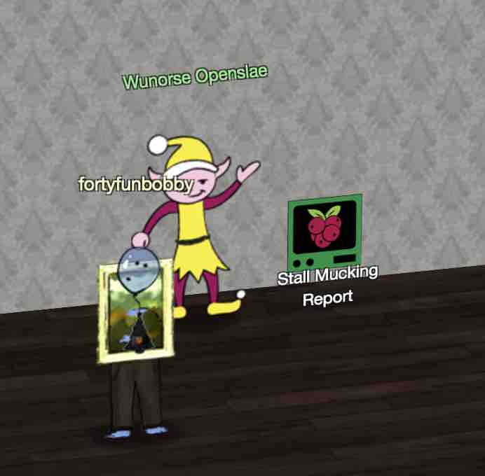
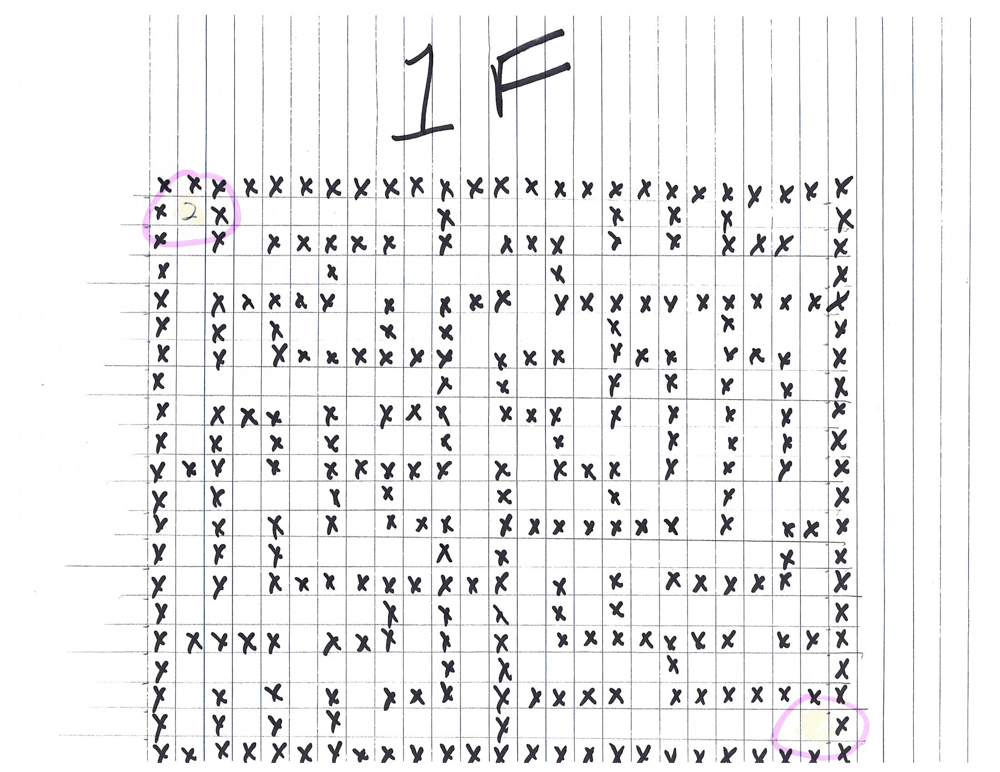
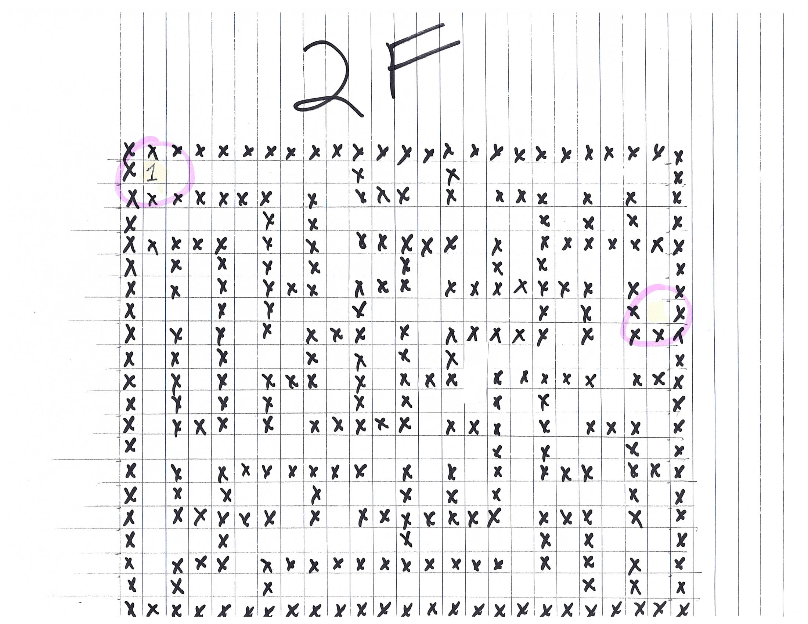
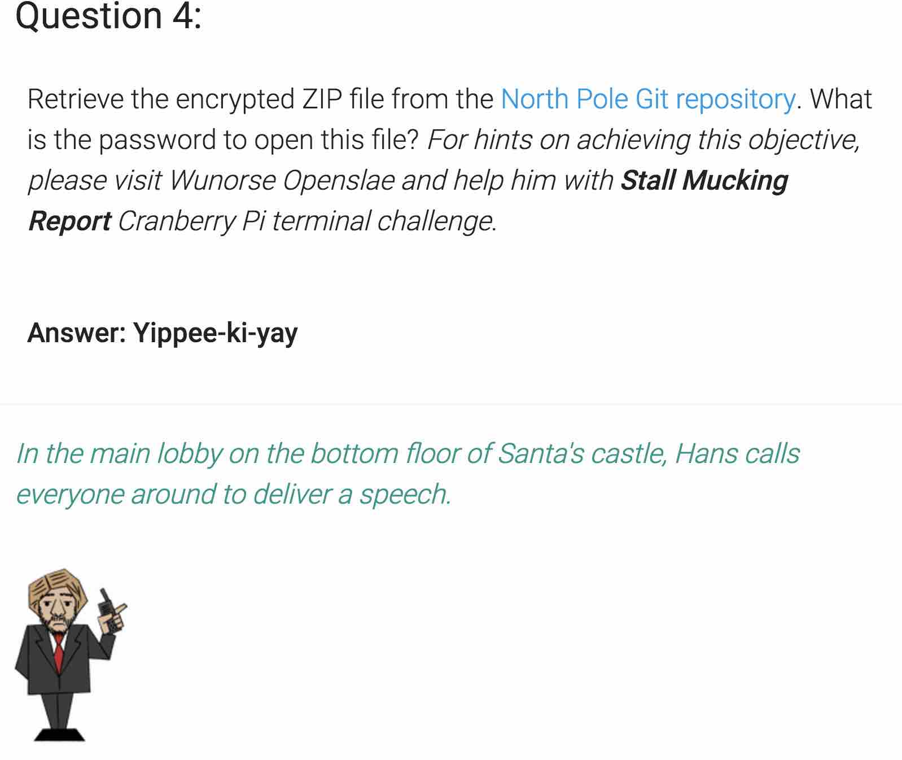

# SANS HOLIDAY HACK CHALLENGE - 2018 - QUESTION 4

```
https://holidayhackchallenge.com/2018/story.html
```

### DESCRIPTION

Retrieve the encrypted ZIP file from the North Pole Git repository. What is the password to open this file? For hints on achieving this objective, please visit Wunorse Openslae and help him with Stall Mucking Report Cranberry Pi terminal challenge.

### CRANBERRY PI CHALLENGE



```
<Wunorse>

Hi, I'm Wunorse Openslae

What was that password?

Golly, passwords may be the end of all of us. Good guys can't remember them, and bad guess can guess them!

I've got to upload my chore report to my manager's inbox, but I can't remember my password.

Still, with all the automated tasks we use, I'll bet there's a way to find it in memory...

</Wunorse>
```

##### STALL MUCKING REPORT

```
Thank you Madam or Sir for the help that you bring!
I was wondering how I might rescue my day.
Finished mucking out stalls of those pulling the sleigh,
My report is now due or my KRINGLE's in a sling!
There's a samba share here on this terminal screen.
What I normally do is to upload the file,
With our network credentials (we've shared for a while).
When I try to remember, my memory's clean!
Be it last night's nog bender or just lack of rest,
For the life of me I can't send in my report.
Could there be buried hints or some way to contort,
Gaining access - oh please now do give it your best!
-Wunorse Openslae
Complete this challenge by uploading the elf's report.txt
file to the samba share at //localhost/report-upload/
```

###### ELF HINT

```
https://blog.rackspace.com/passwords-on-the-command-line-visible-to-ps

Plaintext Credentials in Commands
```

###### CRANBERRY PI ENUMERATION

```
elf@caa4df9fed54:~$ ls
report.txt
elf@caa4df9fed54:~$ cat report.txt 
Stall mucking report
Dasher - routine
Dancer - routine
Prancer - confiscated second salt lick
Vixen - minor repair/adjustment to water system
Comet - routine
Cupid - routine
Donner - routine
Blitzen - refilled headache medicine
Thrasher - routine
Thunder - requested hay! oats! hay! oats!
Blaster - stall... took extra mucking
Blunder - caught with excessive carrot contraband again
Blogger - discussed social media policies again
Bragger - what appeared to be a prosthetic red nose
Tue Dec 25 06:35:06 UTC 2018
elf@aa4ff7e387bd:~$ ls ..
elf  manager  report-upload
elf@aa4ff7e387bd:~$ ps -ef | more
UID        PID  PPID  C STIME TTY          TIME CMD
root         1     0  0 06:38 pts/0    00:00:00 /bin/bash /sbin/init
root        11     1  0 06:38 pts/0    00:00:00 sudo -u manager /home/manager/samba-wrapper.sh --verbosity=none --no-check-certificate --extraneous-command-argument --do-not-run-as-tyler --accept-sage-advice -a 42 -d~ --ignore-sw-holiday-special --suppress --suppress //localhost/report-upload/ directreindeerflatterystable -U report-upload
root        12     1  0 06:38 pts/0    00:00:00 sudo -E -u manager /usr/bin/python /home/manager/report-check.py
root        16     1  0 06:38 pts/0    00:00:00 sudo -u elf /bin/bash
manager     17    11  0 06:38 pts/0    00:00:00 /bin/bash /home/manager/samba-wrapper.sh --verbosity=none --no-check-certificate --extraneous-command-argument --do-not-run-as-tyler --accept-sage-advice -a 42 -d~ --ignore-sw-holiday-special --suppress --suppress //localhost/report-upload/ directreindeerflatterystable -U report-upload
manager     18    12  0 06:38 pts/0    00:00:00 /usr/bin/python /home/manager/report-check.py
elf         20    16  0 06:38 pts/0    00:00:00 /bin/bash
root        24     1  0 06:38 ?        00:00:00 /usr/sbin/smbd
root        25    24  0 06:38 ?        00:00:00 /usr/sbin/smbd
root        26    24  0 06:38 ?        00:00:00 /usr/sbin/smbd
root        28    24  0 06:38 ?        00:00:00 /usr/sbin/smbd
manager     49    17  0 06:41 pts/0    00:00:00 sleep 60
elf         52    20  0 06:42 pts/0    00:00:00 ps -ef
elf         53    20  0 06:42 pts/0    00:00:00 more
```

So it seems like there is a job running which reveals what appears to be a user
name and password of report-upload:directreindeerflatterystable.

```
elf@ea5bfce0d350:~$ /usr/bin/smbclient //localhost/report-upload -U report-upload directrein
deerflatterystable
WARNING: The "syslog" option is deprecated
Domain=[WORKGROUP] OS=[Windows 6.1] Server=[Samba 4.5.12-Debian]
smb: \> 
smb: \> ls
  .                                   D        0  Fri Dec 14 16:32:57 2018
  ..                                  D        0  Fri Dec 14 16:32:57 2018
  .profile                            H      675  Mon May 15 19:45:32 2017
  .bashrc                             H     3526  Mon May 15 19:45:32 2017
  .bash_logout                        H      220  Mon May 15 19:45:32 2017
                103144356 blocks of size 1024. 92801488 blocks available
smb: \> put report.txt
putting file report.txt as \report.txt (500.9 kb/s) (average 501.0 kb/s)
smb: \> Terminated
elf@ea5bfce0d350:~$ 
                                                                               
                               .;;;;;;;;;;;;;;;'                               
                             ,NWOkkkkkkkkkkkkkkNN;                             
                           ..KM; Stall Mucking ,MN..                           
                         OMNXNMd.             .oMWXXM0.                        
                        ;MO   l0NNNNNNNNNNNNNNN0o   xMc                        
                        :MO                         xMl             '.         
                        :MO   dOOOOOOOOOOOOOOOOOd.  xMl             :l:.       
 .cc::::::::;;;;;;;;;;;,oMO  .0NNNNNNNNNNNNNNNNN0.  xMd,,,,,,,,,,,,,clll:.     
 'kkkkxxxxxddddddoooooooxMO   ..'''''''''''.        xMkcccccccllllllllllooc.   
 'kkkkxxxxxddddddoooooooxMO  .MMMMMMMMMMMMMM,       xMkcccccccllllllllllooool  
 'kkkkxxxxxddddddoooooooxMO   '::::::::::::,        xMkcccccccllllllllllool,   
 .ooooollllllccccccccc::dMO                         xMx;;;;;::::::::lllll'     
                        :MO  .ONNNNNNNNXk           xMl             :lc'       
                        :MO   dOOOOOOOOOo           xMl             ;.         
                        :MO   'cccccccccccccc:'     xMl                        
                        :MO  .WMMMMMMMMMMMMMMMW.    xMl                        
                        :MO    ...............      xMl                        
                        .NWxddddddddddddddddddddddddNW'                        
                          ;ccccccccccccccccccccccccc;                          
                                                                               
You have found the credentials I just had forgot,
And in doing so you've saved me trouble untold.
Going forward we'll leave behind policies old,
Building separate accounts for each elf in the lot.
-Wunorse Openslae
```

```
<Wunorse>

Thank goodness for command line passwords - and thanks for your help!

Speaking of good ways to find credentials, have you heard of Trufflehog?

It's a cool way to dig through repositories for passwords, RSA keys, and more.

I mean, no one EVER uploads sensitive credentials to public repositories, right? But if they did, this would be a great tool for finding them.

But hey, listen to me ramble. If you're interested in Trufflehog, you should check out Brian Hostetler's talk!

Have you tried the entropy=True option when running Trufflehog? It is amazing how much deeper it will dig!

Oh my! Santa’s castle… it’s under siege!

We’re trapped inside and can’t leave.

The toy soldiers are blocking all of the exits!

We are all prisoners!

</Wunorse>
```

###### MORE ELF HINTS

```
Trufflehog Tool

https://github.com/dxa4481/truffleHog
```

```
Trufflehog Talk

Buried Secrets: Digging Deep Through Cloud Repositories
Brian Hostetler
https://www.youtube.com/watch?v=myKrWVaq3Cw
```

### SOLUTION

```
https://git.kringlecastle.com/Upatree/santas_castle_automation
```

First let's pull down the git repository and look for that zip file..

```
$ git clone https://git.kringlecastle.com/Upatree/santas_castle_automation
Cloning into 'santas_castle_automation'...
warning: redirecting to https://git.kringlecastle.com/Upatree/santas_castle_automation.git/
remote: Enumerating objects: 949, done.
remote: Counting objects: 100% (949/949), done.
remote: Compressing objects: 100% (545/545), done.
remote: Total 949 (delta 258), reused 879 (delta 205)
Receiving objects: 100% (949/949), 4.27 MiB | 4.91 MiB/s, done.
Resolving deltas: 100% (258/258), done.
$ find santas_castle_automation/ -name "*.zip"
santas_castle_automation//schematics/ventilation_diagram.zip
$ unzip -l santas_castle_automation//schematics/ventilation_diagram.zip
Archive:  santas_castle_automation//schematics/ventilation_diagram.zip
  Length      Date    Time    Name
---------  ---------- -----   ----
        0  12-07-2018 14:01   ventilation_diagram/
   415586  12-07-2018 13:37   ventilation_diagram/ventilation_diagram_2F.jpg
   421604  12-07-2018 13:37   ventilation_diagram/ventilation_diagram_1F.jpg
```

Using the elf's hint regarding truffleHog, let's give that tool a try against
our repository..

```
$ python /mnt/host/Development/security-projects/hackthebox/scripts/enum-tools/password/truffleHog/truffleHog/truffleHog.py --regex --entropy=true https://git.kringlecastle.com/Upatree/santas_castle_automation > truffleHog.out
```

Sifting through the output of truffleHog, we find a password committed as a
comment..

```
+Hopefully this is the last time we have to change our password again until next Christmas.
+
+
+
+
+Password = 'Yippee-ki-yay'
+
```

And indeed we find it is the password to the zip file!

```
$ unzip -P Yippee-ki-yay santas_castle_automation/schematics/ventilation_diagram.zip
Archive:  santas_castle_automation/schematics/ventilation_diagram.zip
  inflating: ventilation_diagram/ventilation_diagram_2F.jpg
  inflating: ventilation_diagram/ventilation_diagram_1F.jpg
```




Looks like we have a map of the ventilation system that will help us at a
later level?



```
<Hans>

Ladies and Gentlemen…

Due to the North Pole’s legacy of providing coal as presents around the globe ...

... they are about to be taught a lesson in the real use of POWER.

You will be witnesses.

Now, Santa… that's a nice suit… John Philips, North Pole. I have two myself. Rumor has it Alabaster buys his there.

I have comrades in arms around the world who are languishing in prison.

The Elvin State Department enjoys rattling its saber for its own ends. Now it can rattle it for ME.

The following people are to be released from their captors.

In the Dungeon for Errant Reindeer, the seven members of the New Arietes Front.

In Whoville Prison, the imprisoned leader of ATNAS Corporation, Miss Cindy Lou Who.

In the Land of Oz, Glinda the Good Witch.

</Hans>
```
