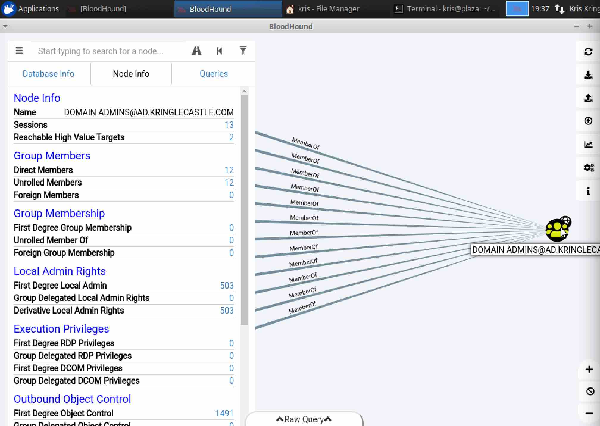

# SANS HOLIDAY HACK CHALLENGE - 2018 - QUESTION 5

```
https://holidayhackchallenge.com/2018/story.html
```

### DESCRIPTION

Using the data set contained in this SANS Slingshot Linux image, find a reliable path from a Kerberoastable user to the Domain Admins group. What’s the user’s logon name? Remember to avoid RDP as a control path as it depends on separate local privilege escalation flaws. For hints on achieving this objective, please visit Holly Evergreen and help her with the CURLing Master Cranberry Pi terminal challenge.

### CRANBERRY PI CHALLENGE


```
<Holly>

Hi, I'm Holly Everygreen.

...

Oh that Bushy!

Sorry to vent, but that brother of mine did something strange.

The trigger to restart the Candy Striper is apparently an arcane HTTP call or 2.

I sometimes wonder if all IT folk do strange things with their home networks...

</Holly>
```

##### CURLING MASTER

```
I am Holly Evergreen, and now you won't believe:
Once again the striper stopped; I think I might just leave!
Bushy set it up to start upon a website call.
Darned if I can CURL it on - my Linux skills apall.
Could you be our CURLing master - fixing up this mess?
If you are, there's one concern you surely must address.
Something's off about the conf that Bushy put in place.
Can you overcome this snag and save us all some face?
  Complete this challenge by submitting the right HTTP 
  request to the server at http://localhost:8080/ to 
  get the candy striper started again. You may view 
  the contents of the nginx.conf file in 
  /etc/nginx/, if helpful.
elf@ee9d2bfacdca:~$ 
```

###### ELF HINT

```
HTTP/2.0 Basics

https://developers.google.com/web/fundamentals/performance/http2/
```

###### CRANBERRY PI ENUMERATION

Just trying a straight up `curl` command against the server doesn't quite seem
to work since the response is garbled. This is likely related to the hint the
elf gave us regarding HTTP/2 ("HTTP/2 modifies how the data is formatted (framed) and transported between the client and server, both of which manage the entire process, and hides all the complexity from our applications within the new framing layer.")

```
lf@ee9d2bfacdca:/etc/nginx$ curl --http2 http://localhost:8080/index.php
   ����
elf@ee9d2bfacdca:/etc/nginx$
```

Poking around to see what else we can find..

```
elf@ee9d2bfacdca:~$ ls -a
.  ..  .bash_history  .bash_logout  .bashrc  .profile
elf@ee9d2bfacdca:~$ pwd
/home/elf
elf@ee9d2bfacdca:~$ cat .bash_history 
netstat -ant
ncat --broker -nlvp 9090
echo "\302\257\_(\343\203\204)_/\302\257" >> /tmp/shruggins
cat /tmp/shruggins
curl --http2-prior-knowledge http://localhost:8080/index.php
telnet towel.blinkenlights.nl
fortune | cowsay | lolcat
ps -aux
sl
figlet I am your father
echo 'goHangasaLAmIimalaSAgnaHoG' | rev
aptitude moo
aptitude -v moo
aptitude -vv moo
aptitude -vvv moo
aptitude -vvvv moo
aptitude -vvvvv moo
aptitude -vvvvvv moo
yes Giddyup
factor 512
aafire
```

We see some interesting commands in the history file that we can revisit. For
now, let's use the hint and go check out `/etc/nginx`.

```
elf@ee9d2bfacdca:~$ cd /etc/nginx
elf@ee9d2bfacdca:/etc/nginx$ ls
conf.d          koi-utf     modules-available  proxy_params     sites-enabled  win-utf
fastcgi.conf    koi-win     modules-enabled    scgi_params      snippets
fastcgi_params  mime.types  nginx.conf         sites-available  uwsgi_params
```

In `nginx.conf`, we find a comment from "Bushy" that is likely a hint for us..

```
       include /etc/nginx/mime.types;
        default_type application/octet-stream;
        server {
        # love using the new stuff! -Bushy
                listen                  8080 http2;
                # server_name           localhost 127.0.0.1;
                root /var/www/html;
```

Looking at some online examples of `nginx` configurations to enable `http2`,
it seems like the format is usually..

```
  listen 443 ssl http2 default_server;
```

.. but in our case, we are missing the `443 ssl` which implies we are not 
setting up our server to supportHTTPS to encrypt our connections? Referring
to the bash history curl command that we found that has the `--http2-prior-knowledge`
parameter, we see that it is necessary to communicate with the unique config
of this server..

```
       --http2-prior-knowledge
              (HTTP) Tells curl to issue its non-TLS HTTP requests
              using HTTP/2 without HTTP/1.1 Upgrade.  It  requires
              prior  knowledge  that  the  server  supports HTTP/2
              straight away. HTTPS requests will still  do  HTTP/2
              the standard way with negotiated protocol version in
              the TLS handshake.
```

```
elf@ee9d2bfacdca:~$ curl --http2-prior-knowledge http://localhost:8080/index.php
<html>
 <head>
  <title>Candy Striper Turner-On'er</title>
 </head>
 <body>
 <p>To turn the machine on, simply POST to this URL with parameter "status=on"
 
 </body>
</html>
```

```
elf@ee9d2bfacdca:~$ curl --http2-prior-knowledge http://localhost:8080/index.php --data 'status=on'
<html>
 <head>
  <title>Candy Striper Turner-On'er</title>
 </head>
 <body>
 <p>To turn the machine on, simply POST to this URL with parameter "status=on"
                                                                                
                                                                okkd,          
                                                               OXXXXX,         
                                                              oXXXXXXo         
                                                             ;XXXXXXX;         
                                                            ;KXXXXXXx          
                                                           oXXXXXXXO           
                                                        .lKXXXXXXX0.           
  ''''''       .''''''       .''''''       .:::;   ':okKXXXXXXXX0Oxcooddool,   
 'MMMMMO',,,,,;WMMMMM0',,,,,;WMMMMMK',,,,,,occccoOXXXXXXXXXXXXXxxXXXXXXXXXXX.  
 'MMMMN;,,,,,'0MMMMMW;,,,,,'OMMMMMW:,,,,,'kxcccc0XXXXXXXXXXXXXXxx0KKKKK000d;   
 'MMMMl,,,,,,oMMMMMMo,,,,,,lMMMMMMd,,,,,,cMxcccc0XXXXXXXXXXXXXXOdkO000KKKKK0x. 
 'MMMO',,,,,;WMMMMMO',,,,,,NMMMMMK',,,,,,XMxcccc0XXXXXXXXXXXXXXxxXXXXXXXXXXXX: 
 'MMN,,,,,,'OMMMMMW;,,,,,'kMMMMMW;,,,,,'xMMxcccc0XXXXXXXXXXXXKkkxxO00000OOx;.  
 'MMl,,,,,,lMMMMMMo,,,,,,cMMMMMMd,,,,,,:MMMxcccc0XXXXXXXXXXKOOkd0XXXXXXXXXXO.  
 'M0',,,,,;WMMMMM0',,,,,,NMMMMMK,,,,,,,XMMMxcccckXXXXXXXXXX0KXKxOKKKXXXXXXXk.  
 .c.......'cccccc.......'cccccc.......'cccc:ccc: .c0XXXXXXXXXX0xO0000000Oc     
                                                    ;xKXXXXXXX0xKXXXXXXXXK.    
                                                       ..,:ccllc:cccccc:'      
                                                                               
Unencrypted 2.0? He's such a silly guy.
That's the kind of stunt that makes my OWASP friends all cry.
Truth be told: most major sites are speaking 2.0;
TLS connections are in place when they do so.
-Holly Evergreen
<p>Congratulations! You've won and have successfully completed this challenge.
<p>POSTing data in HTTP/2.0.
 </body>
</html>
elf@ee9d2bfacdca:~$ 
```

```
<Holly>

Unencrypted HTTP/2? What was he thinking? Oh well.

Have you ever used Bloodhound for testing Active Directory implementations?

It's a merry little tool that can sniff AD and find paths to reaching privileged status on specific machines.

AD implementations can get so complicated that administrators may not even know what paths they've set up that attackers might exploit.

Have you seen anyone demo the tool before?

</Holly>
```

###### MORE ELF HINTS

```
BloodHound Tool

https://github.com/BloodHoundAD/BloodHound
```

```
BloodHoud Demo

BloodHound - Analyzing Active Directory Trust Relationships
Raphael Mudge
https://www.youtube.com/watch?v=gOpsLiJFI1o&feature=youtu.be
```

### SOLUTION

```
SANS Slingshot Linux Image

https://download.holidayhackchallenge.com/HHC2018-DomainHack_2018-12-19.ova
```

After downloading the VM image and launching it in VirtualBox, we find ourselves
in a system called "plaza" logged in as user "kris" (presumably kris kringle).
On the system `BloodHound` already appears to be installed and launching it we
see..



Browsing the default queries BloodHound has, we find one called "Shortest Paths
to Domain Admins from Kerberosatable Users" which sounds almost like what we
are being asked to find.


In the graph, it shows us the following kerberosatable users with a path to
the Domain Admin `DOMAIN ADMINS@AD.KRINGLECASTLE.COM`..

```
RHEYDEL00118@AD.KRINGLECASTLE.COM
JFOX00132@AD.KRINGLECASTLE.COM
SMARCELLA00089@AD.KRINGLECASTLE.COM
RLOEFFELHOLZ00451@AD.KRINGLECASTLE.COM
LDUBEJ00320@AD.KRINGLECASTLE.COM
```

The first four users have a path which includes "CanRDP", but in the challenge
description it explicitly told us to find a "reliable" path and to avoid `RDP`
as a control path.. so that must mean "LDUBEJ00320@AD.KRINGLECASTLE.COM" is
what we are looking for.


```
Suddenly, one of the toy soldiers appears wearing a grey sweatshirt that has written on it in red pen, "NOW I HAVE A ZERO-DAY. HO-HO-HO."

A rumor spreads among the elves that Alabaster has lost his badge. Several elves say, "What do you think someone could do with that?"
```
